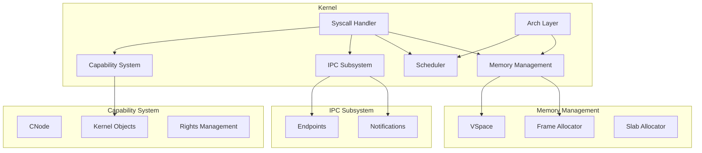
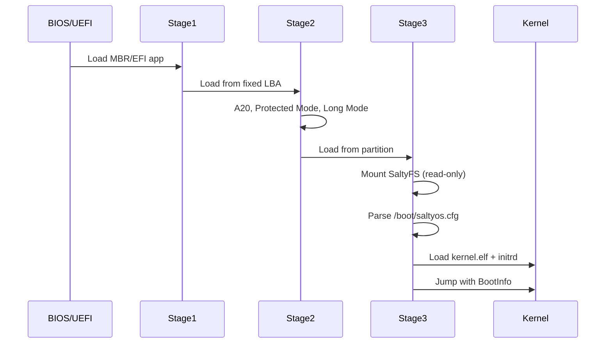
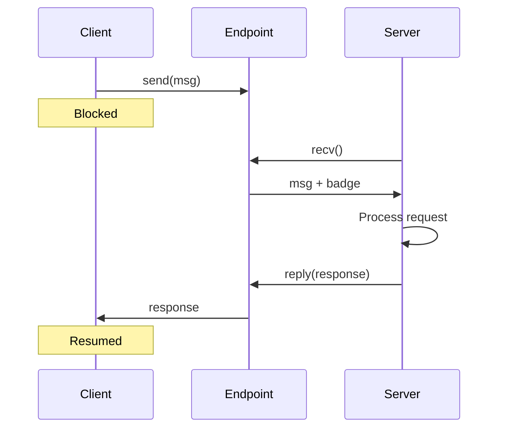
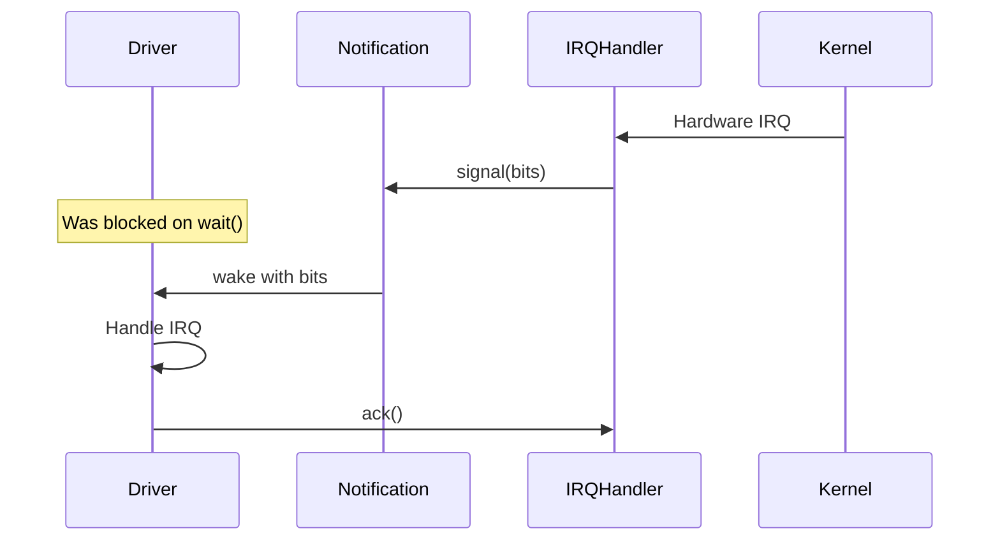
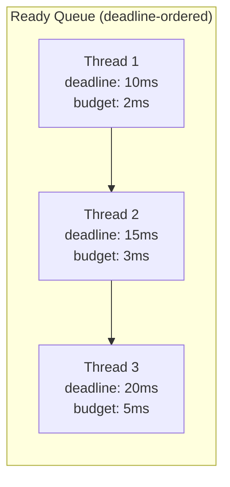
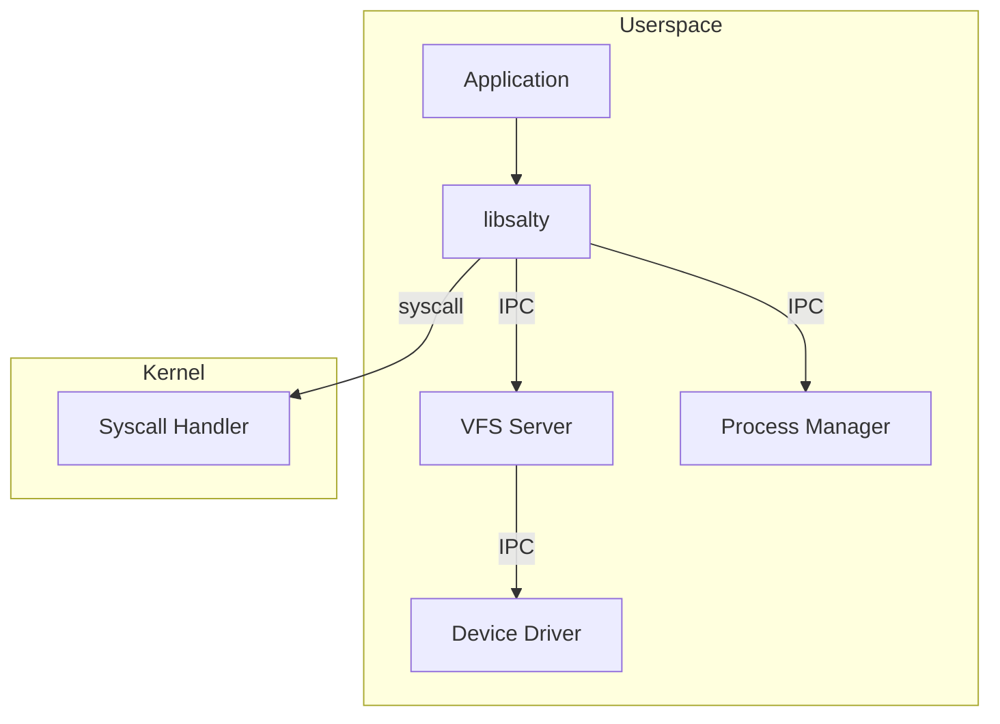

# SaltyOS Architecture

This document provides a technical overview of the SaltyOS system architecture.

## System Layers

```
┌─────────────────────────────────────────────────────────────────────────────┐
│                              Applications                                    │
│                         (shell, utilities, etc.)                            │
├─────────────────────────────────────────────────────────────────────────────┤
│                           System Libraries                                   │
│              (libsalty, POSIX libc, protocol libs)                          │
├─────────────┬─────────────┬─────────────┬─────────────┬─────────────────────┤
│    init     │   procmgr   │     vfs     │  nameserv   │      drivers        │
│             │             │   saltyfs   │             │  (pci,nvme,usb)     │
├─────────────┴─────────────┴─────────────┴─────────────┴─────────────────────┤
│                              Userspace                                       │
╠═════════════════════════════════════════════════════════════════════════════╣
│                          System Call Interface                               │
╠═════════════════════════════════════════════════════════════════════════════╣
│                                                                              │
│                          SaltyOS Microkernel                                 │
│                                                                              │
│  ┌────────────┐  ┌────────────┐  ┌────────────┐  ┌────────────┐             │
│  │ Capability │  │    IPC     │  │ Scheduler  │  │   Memory   │             │
│  │   System   │  │  Subsystem │  │   (EDF)    │  │ Management │             │
│  └────────────┘  └────────────┘  └────────────┘  └────────────┘             │
│                                                                              │
│  ┌────────────────────────────────────────────────────────────┐             │
│  │                  Architecture Layer (x86_64)               │             │
│  │     GDT │ IDT │ Paging │ Interrupts │ Context Switch       │             │
│  └────────────────────────────────────────────────────────────┘             │
│                                                                              │
╠═════════════════════════════════════════════════════════════════════════════╣
│                             Hardware                                         │
│              CPU │ Memory │ Devices │ Timers │ IOMMU                        │
└─────────────────────────────────────────────────────────────────────────────┘
```

## Kernel Architecture

### Component Diagram



### Kernel Object Types

| Type | Description | Key Operations |
|------|-------------|----------------|
| `Endpoint` | Synchronous IPC channel | send, recv, call |
| `Notification` | Async signaling primitive | signal, wait |
| `TCB` | Thread control block | configure, suspend, resume |
| `CNode` | Capability storage | insert, delete, copy |
| `VSpace` | Virtual address space | map, unmap |
| `Frame` | Physical memory page | retype, map |
| `Untyped` | Raw physical memory | retype |
| `IRQHandler` | Interrupt handler | ack, set_notification |

### Address Space Layout (x86_64)

```
┌─────────────────────────────────────────┐ 0xFFFFFFFFFFFFFFFF
│              Kernel Space               │
│         (Higher Half Mapping)           │
├─────────────────────────────────────────┤ 0xFFFFFFFF80000000
│            Kernel Heap                  │
├─────────────────────────────────────────┤ 0xFFFFFFFF00000000
│        Direct Physical Mapping          │
│      (all physical memory mapped)       │
├─────────────────────────────────────────┤ 0xFFFF800000000000
│                                         │
│              Hole (Unused)              │
│                                         │
├─────────────────────────────────────────┤ 0x0000800000000000
│                                         │
│            User Space                   │
│                                         │
│  ┌─────────────────────────────────┐    │
│  │           Stack                 │    │ (grows down)
│  ├─────────────────────────────────┤    │
│  │           Heap                  │    │ (grows up)
│  ├─────────────────────────────────┤    │
│  │        Shared Memory            │    │
│  ├─────────────────────────────────┤    │
│  │          .bss                   │    │
│  ├─────────────────────────────────┤    │
│  │          .data                  │    │
│  ├─────────────────────────────────┤    │
│  │          .rodata                │    │
│  ├─────────────────────────────────┤    │
│  │          .text                  │    │
│  └─────────────────────────────────┘    │
│                                         │
└─────────────────────────────────────────┘ 0x0000000000000000
```

## Boot Architecture

### 3-Stage Bootloader



### Disk Layout

```
┌─────────────────────────────────────────────────────────────┐
│ MBR (Stage 1)                                     512 bytes │
├─────────────────────────────────────────────────────────────┤
│ Stage 2 (raw, LBA 1-128)                           64 KB    │
├─────────────────────────────────────────────────────────────┤
│ GPT Header (if GPT)                                         │
├─────────────────────────────────────────────────────────────┤
│ Partition 1: EFI System Partition (FAT32)         200 MB    │
│   └── /EFI/SALTYOS/BOOTX64.EFI                              │
│   └── /EFI/SALTYOS/stage3.bin                               │
├─────────────────────────────────────────────────────────────┤
│ Partition 2: SaltyFS (Root)                       Rest      │
│   ├── /boot/kernel.elf                                      │
│   ├── /boot/initrd.img                                      │
│   ├── /boot/saltyos.cfg                                     │
│   └── ...                                                   │
└─────────────────────────────────────────────────────────────┘
```

## IPC Architecture

### Endpoint-based IPC



### Notification-based Async



## Capability Architecture

### CSpace Structure

```
                        ┌───────────────────┐
                        │   Root CNode      │
                        │   (Task's CSpace) │
                        └─────────┬─────────┘
                                  │
        ┌─────────────────────────┼─────────────────────────┐
        │                         │                         │
        ▼                         ▼                         ▼
┌───────────────┐       ┌───────────────┐       ┌───────────────┐
│   CNode 0     │       │   CNode 1     │       │   CNode 2     │
│ (Endpoints)   │       │ (Memory)      │       │ (Devices)     │
├───────────────┤       ├───────────────┤       ├───────────────┤
│ [0] VFS EP    │       │ [0] Untyped   │       │ [0] IRQ 0     │
│ [1] Proc EP   │       │ [1] Frame     │       │ [1] IRQ 1     │
│ [2] Net EP    │       │ [2] Frame     │       │ [2] IOPort    │
│ [3] ...       │       │ [3] ...       │       │ [3] ...       │
└───────────────┘       └───────────────┘       └───────────────┘
```

### Capability Derivation

```
    ┌─────────────────────────────────────────────────────────┐
    │                  Untyped Capability                     │
    │            (Physical memory region)                     │
    └───────────────────────┬─────────────────────────────────┘
                            │ retype
            ┌───────────────┼───────────────┐
            ▼               ▼               ▼
    ┌───────────────┐ ┌───────────────┐ ┌───────────────┐
    │  Frame Cap    │ │   TCB Cap     │ │ Endpoint Cap  │
    │ (rights: RW)  │ │ (rights: all) │ │ (rights: all) │
    └───────┬───────┘ └───────────────┘ └───────┬───────┘
            │ derive                            │ mint (badge)
            ▼                                   ▼
    ┌───────────────┐                   ┌───────────────┐
    │  Frame Cap    │                   │ Endpoint Cap  │
    │ (rights: R)   │                   │ (badge: 0x42) │
    └───────────────┘                   └───────────────┘
```

## Scheduler Architecture

### EDF with Budgets



### Scheduling Context

```
┌─────────────────────────────────────────────────────────────┐
│                    Scheduling Context                        │
├─────────────────┬───────────────────────────────────────────┤
│ Budget          │ Time units allocated per period           │
├─────────────────┼───────────────────────────────────────────┤
│ Remaining       │ Time remaining in current period          │
├─────────────────┼───────────────────────────────────────────┤
│ Period          │ Budget replenishment interval             │
├─────────────────┼───────────────────────────────────────────┤
│ Deadline        │ Absolute time by which work must complete │
├─────────────────┼───────────────────────────────────────────┤
│ Bound TCB       │ Thread using this scheduling context      │
└─────────────────┴───────────────────────────────────────────┘
```

## Memory Architecture

### Physical Memory Management

```
┌─────────────────────────────────────────────────────────────┐
│                    Physical Memory                           │
├───────────────────────────────────────────────┬─────────────┤
│              Usable Memory                    │  Reserved   │
│        (tracked by frame allocator)           │  (MMIO)     │
└───────────────────────────────────────────────┴─────────────┘
                        │
                        ▼
┌─────────────────────────────────────────────────────────────┐
│                   Frame Allocator                            │
│               (Buddy or Bitmap based)                        │
├─────────────────────────────────────────────────────────────┤
│  Free list: [Frame 0] -> [Frame 1] -> [Frame 2] -> ...      │
└─────────────────────────────────────────────────────────────┘
                        │
                        ▼
┌─────────────────────────────────────────────────────────────┐
│                  Untyped Capabilities                        │
│          (handed to root task at boot)                       │
└─────────────────────────────────────────────────────────────┘
```

### Page Table Hierarchy (x86_64)

```
┌─────────┐     ┌─────────┐     ┌─────────┐     ┌─────────┐
│  PML4   │────►│  PDPT   │────►│   PD    │────►│   PT    │────► Page
│  (512)  │     │  (512)  │     │  (512)  │     │  (512)  │     Frame
└─────────┘     └─────────┘     └─────────┘     └─────────┘

Virtual Address (48-bit):
┌────────┬────────┬────────┬────────┬────────────┐
│ PML4   │ PDPT   │  PD    │  PT    │   Offset   │
│ (9bit) │ (9bit) │ (9bit) │ (9bit) │  (12bit)   │
└────────┴────────┴────────┴────────┴────────────┘
```

## Userspace Architecture

### Server Communication



### Init Process Responsibilities

1. Receive all initial capabilities from kernel
2. Create and configure system servers
3. Distribute capabilities to servers
4. Start the process manager
5. Optionally start a shell

## File Tree

```
SaltyOS/
├── boot/
│   ├── stage1/
│   │   ├── bios/
│   │   │   ├── mbr.asm           # BIOS MBR entry
│   │   │   └── vbr.asm           # Volume boot record
│   │   └── uefi/
│   │       └── entry.c           # UEFI application
│   ├── stage2/
│   │   ├── loader.c              # Stage 3 loader
│   │   ├── long_mode.asm         # x86_64 mode switch
│   │   └── paging_early.c        # Early page tables
│   ├── stage3/
│   │   ├── main.c                # Kernel loader
│   │   ├── elf.c                 # ELF parser
│   │   └── fs/
│   │       ├── saltyfs.c         # SaltyFS read-only driver
│   │       └── fat32.c           # FAT32 for ESP
│   └── common/
│       ├── print.c               # Debug output
│       └── types.h               # Basic types
│
├── kernel/
│   └── src/
│       ├── lib.rs                # Kernel entry
│       ├── arch/
│       │   ├── mod.rs
│       │   └── x86_64/
│       │       ├── mod.rs
│       │       ├── boot.rs       # Arch init
│       │       ├── gdt.rs        # GDT setup
│       │       ├── idt.rs        # IDT/interrupts
│       │       └── paging.rs     # Page tables
│       ├── cap/
│       │   ├── mod.rs
│       │   ├── cnode.rs          # CNode implementation
│       │   └── object.rs         # Kernel objects
│       ├── ipc/
│       │   ├── mod.rs
│       │   ├── endpoint.rs       # Sync IPC
│       │   └── notification.rs   # Async signals
│       ├── mm/
│       │   ├── mod.rs
│       │   ├── frame.rs          # Physical allocator
│       │   ├── vspace.rs         # Virtual spaces
│       │   └── slab.rs           # Kernel allocator
│       ├── sched/
│       │   ├── mod.rs
│       │   ├── thread.rs         # TCB
│       │   └── scheduler.rs      # EDF scheduler
│       └── syscall/
│           └── mod.rs            # Syscall dispatch
│
├── userland/
│   ├── init/                     # First process
│   ├── procmgr/                  # Process manager
│   ├── vfs/                      # VFS server
│   ├── console/                  # Console driver
│   ├── nameserv/                 # Name service
│   └── drivers/                  # Device drivers
│
├── lib/
│   ├── libsalty/                 # Syscall wrappers
│   └── libc/                     # POSIX C library
│
├── tools/
│   ├── mkimage.py                # Disk image creator
│   └── cross/
│       └── x86_64.txt            # Meson cross file
│
└── docs/
    ├── ARCHITECTURE.md           # This file
    ├── BUILDING.md               # Build instructions
    ├── design/                   # Design documents
    └── spec/                     # Specifications
```
