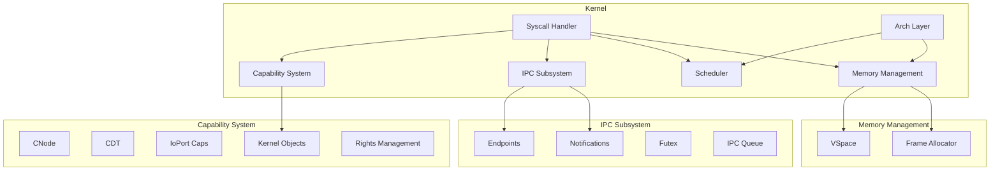
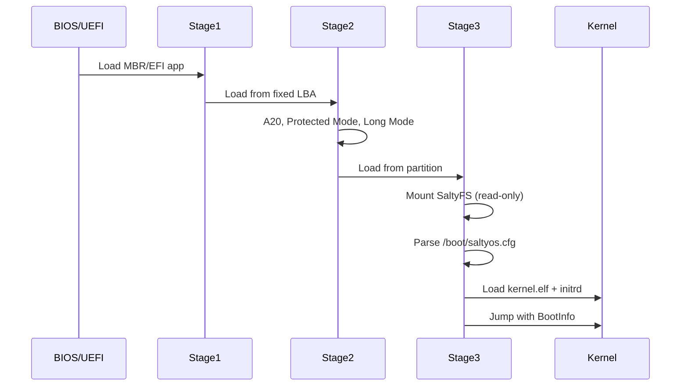
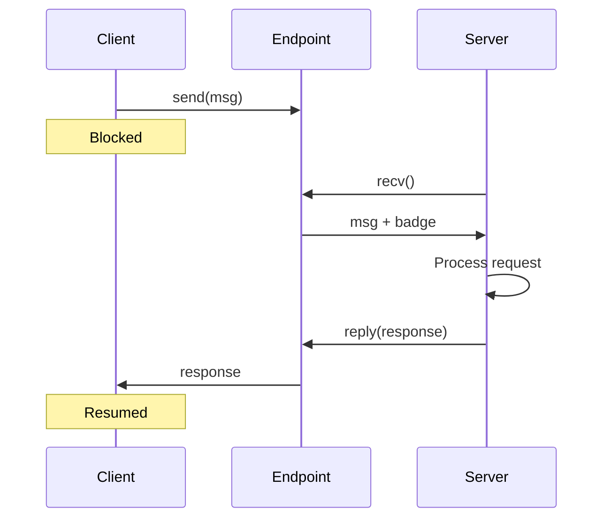
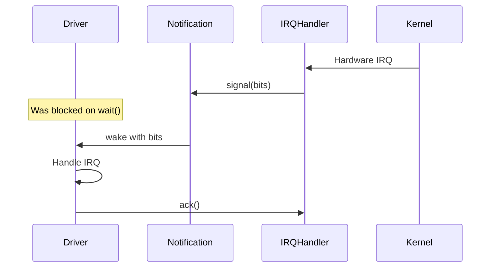
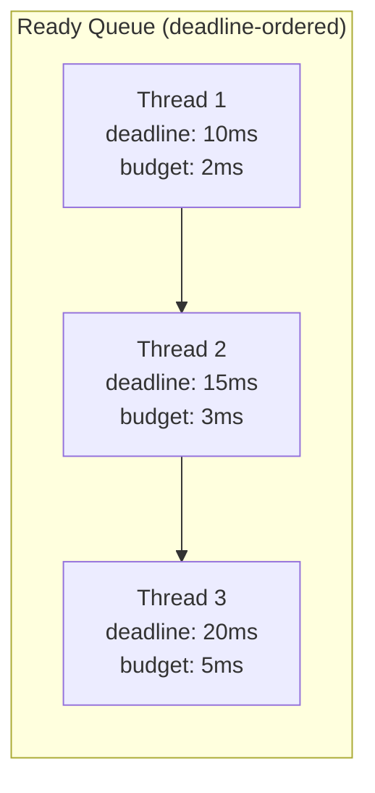
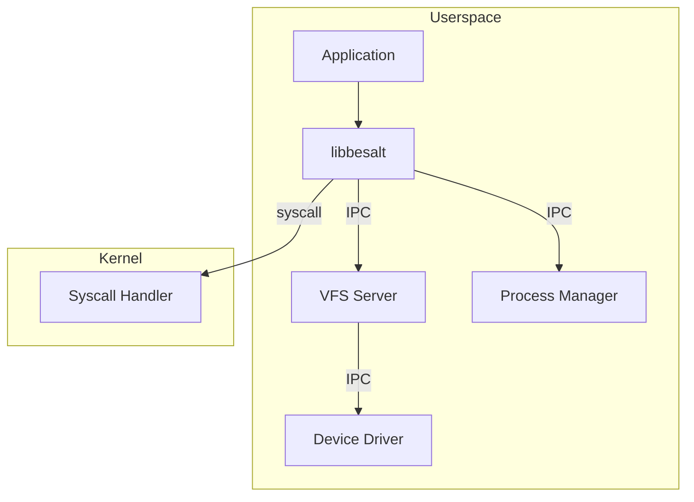

# SaltyOS Architecture

This document provides a technical overview of the SaltyOS system architecture.

## System Layers

```
┌─────────────────────────────────────────────────────────────────────────────┐
│                              Applications                                    │
│                         (shell, utilities, etc.)                            │
├─────────────────────────────────────────────────────────────────────────────┤
│                           System Libraries                                   │
│              (libbesalt, POSIX libc, protocol libs)                          │
├─────────────┬─────────────┬─────────────┬─────────────┬─────────────────────┤
│    init     │   procmgr   │     vfs     │  nameserv   │      drivers        │
│             │             │   saltyfs   │             │  (pci,nvme,usb)     │
├─────────────┴─────────────┴─────────────┴─────────────┴─────────────────────┤
│                              Userspace                                       │
╠═════════════════════════════════════════════════════════════════════════════╣
│                          System Call Interface                               │
╠═════════════════════════════════════════════════════════════════════════════╣
│                                                                              │
│                          SaltyOS Microkernel                                 │
│                                                                              │
│  ┌────────────┐  ┌────────────┐  ┌────────────┐  ┌────────────┐             │
│  │ Capability │  │    IPC     │  │ Scheduler  │  │   Memory   │             │
│  │   System   │  │  Subsystem │  │   (EDF)    │  │ Management │             │
│  └────────────┘  └────────────┘  └────────────┘  └────────────┘             │
│                                                                              │
│  ┌────────────────────────────────────────────────────────────┐             │
│  │                  Architecture Layer (x86_64)               │             │
│  │     GDT │ IDT │ Paging │ Interrupts │ Context Switch       │             │
│  └────────────────────────────────────────────────────────────┘             │
│                                                                              │
╠═════════════════════════════════════════════════════════════════════════════╣
│                             Hardware                                         │
│              CPU │ Memory │ Devices │ Timers │ IOMMU                        │
└─────────────────────────────────────────────────────────────────────────────┘
```

## Kernel Architecture

### Component Diagram



### Kernel Object Types

| Type | Description | Key Operations |
|------|-------------|----------------|
| `Endpoint` | Synchronous IPC channel | send, recv, call |
| `Notification` | Async signaling primitive | signal, wait |
| `TCB` | Thread control block | configure, suspend, resume |
| `CNode` | Capability storage | insert, delete, copy |
| `VSpace` | Virtual address space | map, unmap |
| `Frame` | Physical memory page | retype, map |
| `Untyped` | Raw physical memory | retype |
| `IRQHandler` | Interrupt handler | ack, set_notification |
| `IoPort` | I/O port range access | in, out |
| `SchedContext` | Scheduling context | bind, set_params |

### Address Space Layout (x86_64)

```
┌─────────────────────────────────────────┐ 0xFFFFFFFFFFFFFFFF
│              Kernel Space               │
│         (Higher Half Mapping)           │
├─────────────────────────────────────────┤ 0xFFFFFFFF80000000
│        Direct Physical Mapping          │
│      (all physical memory mapped)       │
├─────────────────────────────────────────┤ 0xFFFF800000000000
│                                         │
│              Hole (Unused)              │
│                                         │
├─────────────────────────────────────────┤ 0x0000800000000000
│                                         │
│            User Space                   │
│                                         │
│  ┌─────────────────────────────────┐    │
│  │           Stack                 │    │ (grows down)
│  ├─────────────────────────────────┤    │
│  │           Heap                  │    │ (grows up)
│  ├─────────────────────────────────┤    │
│  │        Shared Memory            │    │
│  ├─────────────────────────────────┤    │
│  │          .bss                   │    │
│  ├─────────────────────────────────┤    │
│  │          .data                  │    │
│  ├─────────────────────────────────┤    │
│  │          .rodata                │    │
│  ├─────────────────────────────────┤    │
│  │          .text                  │    │
│  └─────────────────────────────────┘    │
│                                         │
└─────────────────────────────────────────┘ 0x0000000000000000
```

## Boot Architecture

### 3-Stage Bootloader



### Disk Layout

```
┌─────────────────────────────────────────────────────────────┐
│ MBR (Stage 1)                                     512 bytes │
├─────────────────────────────────────────────────────────────┤
│ Stage 2 (raw, LBA 1-128)                           64 KB    │
├─────────────────────────────────────────────────────────────┤
│ GPT Header (if GPT)                                         │
├─────────────────────────────────────────────────────────────┤
│ Partition 1: EFI System Partition (FAT32)         200 MB    │
│   └── /EFI/SALTYOS/BOOTX64.EFI                              │
│   └── /EFI/SALTYOS/stage3.bin                               │
├─────────────────────────────────────────────────────────────┤
│ Partition 2: SaltyFS (Root)                       Rest      │
│   ├── /boot/kernel.elf                                      │
│   ├── /boot/initrd.img                                      │
│   ├── /boot/saltyos.cfg                                     │
│   └── ...                                                   │
└─────────────────────────────────────────────────────────────┘
```

## IPC Architecture

### Endpoint-based IPC



### Notification-based Async



## Capability Architecture

### CSpace Structure

```
                        ┌───────────────────┐
                        │   Root CNode      │
                        │   (Task's CSpace) │
                        └─────────┬─────────┘
                                  │
        ┌─────────────────────────┼─────────────────────────┐
        │                         │                         │
        ▼                         ▼                         ▼
┌───────────────┐       ┌───────────────┐       ┌───────────────┐
│   CNode 0     │       │   CNode 1     │       │   CNode 2     │
│ (Endpoints)   │       │ (Memory)      │       │ (Devices)     │
├───────────────┤       ├───────────────┤       ├───────────────┤
│ [0] VFS EP    │       │ [0] Untyped   │       │ [0] IRQ 0     │
│ [1] Proc EP   │       │ [1] Frame     │       │ [1] IRQ 1     │
│ [2] Net EP    │       │ [2] Frame     │       │ [2] IOPort    │
│ [3] ...       │       │ [3] ...       │       │ [3] ...       │
└───────────────┘       └───────────────┘       └───────────────┘
```

### Capability Derivation

```
    ┌─────────────────────────────────────────────────────────┐
    │                  Untyped Capability                     │
    │            (Physical memory region)                     │
    └───────────────────────┬─────────────────────────────────┘
                            │ retype
            ┌───────────────┼───────────────┐
            ▼               ▼               ▼
    ┌───────────────┐ ┌───────────────┐ ┌───────────────┐
    │  Frame Cap    │ │   TCB Cap     │ │ Endpoint Cap  │
    │ (rights: RW)  │ │ (rights: all) │ │ (rights: all) │
    └───────┬───────┘ └───────────────┘ └───────┬───────┘
            │ derive                            │ mint (badge)
            ▼                                   ▼
    ┌───────────────┐                   ┌───────────────┐
    │  Frame Cap    │                   │ Endpoint Cap  │
    │ (rights: R)   │                   │ (badge: 0x42) │
    └───────────────┘                   └───────────────┘
```

## Scheduler Architecture

### EDF with Budgets



### Scheduling Context

```
┌─────────────────────────────────────────────────────────────┐
│                    Scheduling Context                        │
├─────────────────┬───────────────────────────────────────────┤
│ Budget          │ Time units allocated per period           │
├─────────────────┼───────────────────────────────────────────┤
│ Remaining       │ Time remaining in current period          │
├─────────────────┼───────────────────────────────────────────┤
│ Period          │ Budget replenishment interval             │
├─────────────────┼───────────────────────────────────────────┤
│ Deadline        │ Absolute time by which work must complete │
├─────────────────┼───────────────────────────────────────────┤
│ Bound TCB       │ Thread using this scheduling context      │
└─────────────────┴───────────────────────────────────────────┘
```

## Memory Architecture

### Physical Memory Management

```
┌─────────────────────────────────────────────────────────────┐
│                    Physical Memory                           │
├───────────────────────────────────────────────┬─────────────┤
│              Usable Memory                    │  Reserved   │
│        (tracked by frame allocator)           │  (MMIO)     │
└───────────────────────────────────────────────┴─────────────┘
                        │
                        ▼
┌─────────────────────────────────────────────────────────────┐
│                   Frame Allocator                            │
│                    (Bitmap based)                             │
├─────────────────────────────────────────────────────────────┤
│  Bitmap: [1][1][0][0][1][0][0][0][0][1] ...  (1=used)       │
└─────────────────────────────────────────────────────────────┘
                        │
                        ▼
┌─────────────────────────────────────────────────────────────┐
│                  Untyped Capabilities                        │
│          (handed to root task at boot)                       │
└─────────────────────────────────────────────────────────────┘
```

### Page Table Hierarchy (x86_64)

```
┌─────────┐     ┌─────────┐     ┌─────────┐     ┌─────────┐
│  PML4   │────►│  PDPT   │────►│   PD    │────►│   PT    │────► Page
│  (512)  │     │  (512)  │     │  (512)  │     │  (512)  │     Frame
└─────────┘     └─────────┘     └─────────┘     └─────────┘

Virtual Address (48-bit):
┌────────┬────────┬────────┬────────┬────────────┐
│ PML4   │ PDPT   │  PD    │  PT    │   Offset   │
│ (9bit) │ (9bit) │ (9bit) │ (9bit) │  (12bit)   │
└────────┴────────┴────────┴────────┴────────────┘
```

## Userspace Architecture

### Server Communication



### Init Process Responsibilities

1. Receive all initial capabilities from kernel
2. Create and configure system servers
3. Distribute capabilities to servers
4. Start the process manager
5. Optionally start a shell

## File Tree

```
SaltyOS/
├── boot/
│   ├── meson.build
│   ├── common/
│   │   ├── bootinfo_tlv.h, manifest.h, types.h
│   │   ├── string.c/h, print.c/h, udiv64.c
│   │   ├── fb_console.c/h, font_8x16.c/h, stage2_info.h
│   │   ├── arch/x86/bios/
│   │   │   ├── btx.asm, btx.h, v86.c, v86.h
│   │   └── efi/
│   │       ├── efi_types.h, efi_protocol.h, print.c/h
│   ├── stage1/arch/x86/
│   │   ├── bios/
│   │   │   ├── mbr.asm, mbr         # BIOS MBR entry
│   │   └── uefi/
│   │       └── entry.c, efi.ld      # UEFI PE/COFF entry
│   ├── stage2/arch/x86/
│   │   ├── bios/
│   │   │   ├── entry.asm, a20.c/h, gdt.c/h, memory.c/h, stage2.ld
│   │   └── uefi/
│   │       ├── main.c, stage2.ld
│   └── stage3/
│       ├── bios_main.c, boot_alloc.c/h, config.h, elf.c/h, handoff.c/h
│       ├── arch/x86/
│       │   ├── cpu.h, paging.c, paging_impl.h
│       │   ├── bios/
│       │   │   ├── entry.asm, mode_switch.asm/h, stage3.ld
│       │   └── uefi/
│       │       ├── entry_uefi.asm, stage3.ld
│       ├── disk/
│       │   ├── disk.h, bios_disk.c, memory_disk.c
│       └── fs/
│           ├── fs.h, fat32.c, raw.c, saltyfs.c
│
├── kernel/
│   └── src/
│       ├── lib.rs                # Kernel entry (kmain), serial I/O, panic handler
│       ├── bootinfo.rs           # Boot info TLV parsing
│       ├── builtins.rs           # Compiler built-in stubs (memcpy, memset)
│       ├── cpio.rs               # CPIO archive parser for initrd
│       ├── elf.rs                # ELF binary loader
│       ├── init.rs               # Init task bootstrap, CSpace setup
│       ├── rng.rs                # RDRAND-based random number generator
│       ├── arch/
│       │   ├── mod.rs
│       │   └── x86_64/
│       │       ├── mod.rs, acpi.rs, ap_boot.rs, ap_tramp.S, apic.rs
│       │       ├── boot.rs, context.rs, cpu.rs, cpuid.rs
│       │       ├── exceptions.S, fpu.rs, gdt.rs, idt.rs
│       │       ├── paging.rs, pit.rs, smap.rs, syscall.S
│       ├── cap/
│       │   ├── mod.rs, cdt.rs, cnode.rs, ioport.rs
│       │   ├── object.rs, refcount.rs, slot.rs, untyped.rs
│       ├── console/
│       │   ├── mod.rs, fb.rs, font.rs
│       ├── ipc/
│       │   ├── mod.rs, endpoint.rs, futex.rs
│       │   ├── irq.rs, notification.rs, queue.rs
│       ├── mm/
│       │   ├── mod.rs, frame.rs, vspace.rs
│       ├── sched/
│       │   ├── mod.rs, pip.rs, scheduler.rs
│       │   ├── sleep_queue.rs, thread.rs
│       └── syscall/
│           ├── mod.rs, fastpath.rs
│
├── userland/
│   ├── core/
│   │   ├── init/                 # First process (service-based bootstrap)
│   │   │   └── src/ (main.rs, ini.rs, selftest.rs, spawn.rs, svc_mgr.rs)
│   │   ├── rtld/                 # Runtime dynamic linker
│   │   ├── mmsrv/               # Memory manager server
│   │   │   └── src/ (main.rs)
│   │   ├── procmgr/             # Process manager (spawn/exit/waitpid)
│   │   │   └── src/ (main.rs, alloc.rs, proc_table.rs, spawn_tx.rs)
│   │   └── nameserv/            # Name service (endpoint lookup)
│   │       └── src/ (main.rs)
│   ├── servers/
│   │   ├── vfs/                  # VFS server (ramfs + devfs + sockets + shm + poll)
│   │   │   └── src/ (main.rs, at_ops.rs, client.rs, consts.rs, fileops.rs,
│   │   │            misc.rs, mount.rs, path.rs, pipe.rs, poll.rs,
│   │   │            procfs.rs, ramfs.rs, socket.rs, types.rs)
│   │   ├── console/              # Serial console server
│   │   │   └── src/ (main.rs, kbd.rs)
│   │   ├── ttyd/                 # TTY daemon
│   │   │   └── src/ (main.rs, handlers.rs, input.rs, types.rs)
│   │   └── getty/                # Getty (login prompt)
│   │       └── src/ (main.rs)
│   ├── drivers/
│   │   ├── blkdrv/               # Block device driver (virtio)
│   │   │   └── src/ (main.rs, handlers.rs, virtio.rs)
│   │   ├── pcisrv/               # PCI server
│   │   │   └── src/ (main.rs)
│   │   └── display/              # Display driver
│   │       └── src/ (main.rs, font.rs)
│   ├── fs/
│   │   └── saltyfs/              # SaltyFS filesystem server
│   │       └── src/ (main.rs, alloc.rs, block.rs, btree.rs, consts.rs,
│   │                crc.rs, handlers.rs, types.rs)
│   ├── tests/
│   │   ├── test_runner/          # Automated test suite
│   │   │   └── src/ (main.rs + test_*.rs modules)
│   │   └── hello/                # Hello world test
│   └── services/                 # .service files for boot ordering
│
├── lib/
│   └── libbesalt/                 # Userspace system library
│       └── src/ (consts.rs, cpio.rs, elf_dynamic.rs, elf_loader.rs,
│                framebuffer.rs, invoke.rs, ipc.rs, layout.rs, lib.rs,
│                posix/ (mod.rs, at.rs, file.rs, misc.rs, pipe.rs,
│                        poll.rs, proc.rs, socket.rs),
│                posix_mm.rs, serial.rs, signals.rs, slot_alloc.rs,
│                pthread.rs, sync.rs, syscall.rs, tls.rs, types.rs,
│                fork.S)
│
├── tools/
│   ├── cross/x86_64.txt          # Meson cross file
│   ├── mkcpio.py                 # CPIO initrd packer
│   ├── mkimage.py                # Disk image creator
│   ├── mksaltyfs.py              # SaltyFS image builder
│   └── portbuild/                # Port build system
│       ├── main.rs, build.rs, config.rs, deps.rs, extract.rs
│       ├── fetch.rs, meson.build, parser.rs, stamps.rs, vars.rs
│
└── docs/
    ├── ARCHITECTURE.md           # This file
    ├── design/                   # Design documents
    └── spec/                     # Specifications
```
