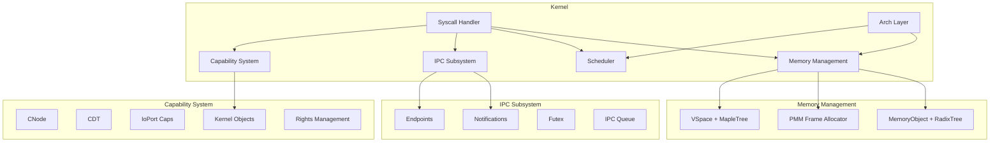
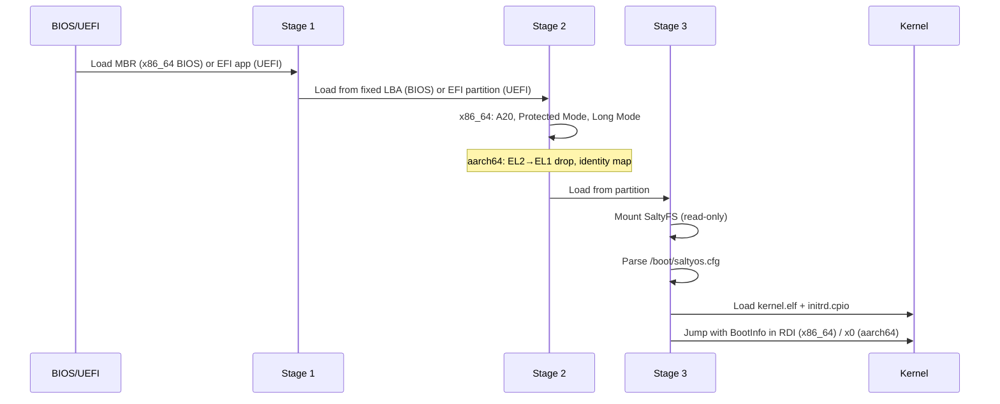
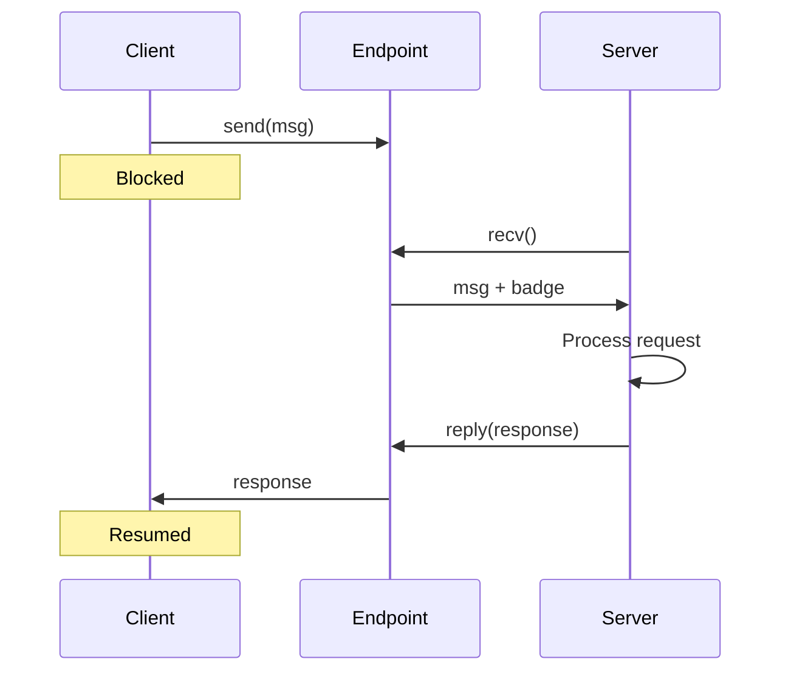
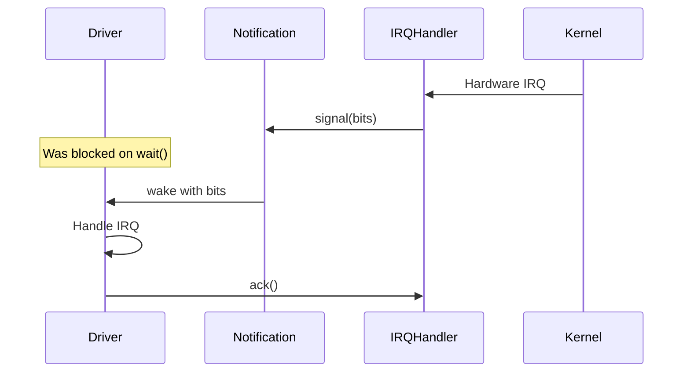
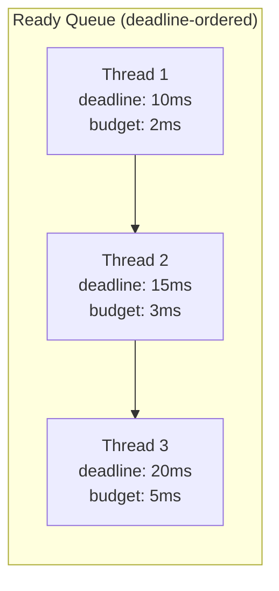
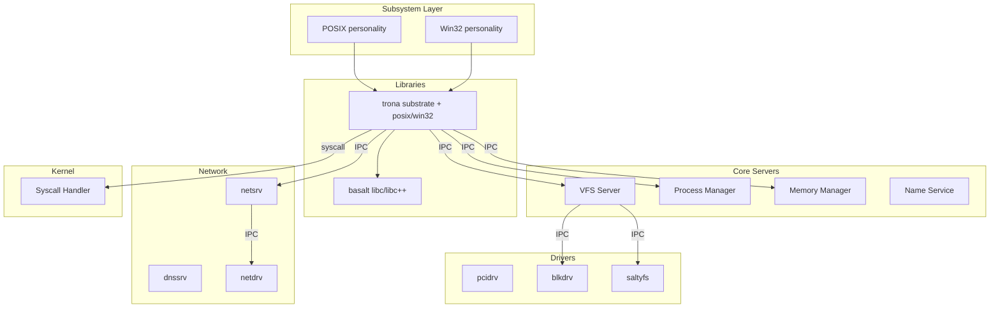

# SaltyOS Architecture

This document provides a technical overview of the SaltyOS system architecture.

## System Layers

```
┌─────────────────────────────────────────────────────────────────────────────┐
│                              Applications                                   │
│                  (shell, utilities, ports, hello_pe)                        │
├──────────────────────────────┬──────────────────────────────────────────────┤
│     POSIX Personality        │          Win32 Personality                   │
│  (posix_ttysrv, posix_getty) │  (win32_csrss, PE loader)                    │
├──────────────────────────────┴──────────────────────────────────────────────┤
│                           System Libraries                                  │
│      trona (substrate/posix/loader/uapi/win32) + basalt (libc/libc++)       │
├──────┬────────┬──────┬────────┬────────┬────────┬────────┬──────────────────┤
│ init │procmgr │ vfs  │namesrv │ mmsrv  │netsrv  │ dnssrv │    drivers       │
│      │        │      │        │        │        │        │(pcidrv, blkdrv,  │
│      │        │      │        │        │        │        │netdrv, dispdrv,  │
│      │        │      │        │        │        │        │saltyfs)          │
├──────┴────────┴──────┴────────┴────────┴────────┴────────┴──────────────────┤
│                              Userspace                                      │
╠═════════════════════════════════════════════════════════════════════════════╣
│                          System Call Interface                              │
│                  28 syscalls (IPC, memory, scheduling)                      │
╠═════════════════════════════════════════════════════════════════════════════╣
│                                                                             │
│                          SaltyOS Microkernel                                │
│                                                                             │
│  ┌────────────┐  ┌────────────┐  ┌────────────┐  ┌────────────────────┐     │
│  │ Capability │  │    IPC     │  │ Scheduler  │  │      Memory        │     │
│  │   System   │  │  Subsystem │  │   (EDF)    │  │    Management      │     │
│  │            │  │            │  │            │  │ (PMM, Untyped, MO, │     │
│  │            │  │            │  │            │  │  VSpace+MapleTree) │     │
│  └────────────┘  └────────────┘  └────────────┘  └────────────────────┘     │
│                                                                             │
│  ┌────────────────────────────────────────────────────────────────────┐     │
│  │              Architecture Layer (x86_64 / aarch64)                 │     │
│  │  x86_64: GDT │ IDT │ APIC │ Paging │ ACPI │ PIT │ SMAP/SMEP        │     │
│  │  aarch64: GICv3 │ PSCI │ PL011 │ Paging │ Generic Timer            │     │
│  └────────────────────────────────────────────────────────────────────┘     │
│                                                                             │
╠═════════════════════════════════════════════════════════════════════════════╣
│                             Hardware                                        │
│              CPU │ Memory │ Devices │ Timers │ IOMMU                        │
└─────────────────────────────────────────────────────────────────────────────┘
```

## Kernel Architecture

### Component Diagram



### Kernel Object Types

| Type | Description | Key Operations |
|------|-------------|----------------|
| `Endpoint` | Synchronous IPC channel | send, recv, call |
| `Notification` | Async signaling primitive | signal, wait |
| `TCB` | Thread control block | configure, suspend, resume |
| `CNode` | Capability storage | insert, delete, copy |
| `VSpace` | Virtual address space | map, unmap, map_mo |
| `Frame` | Physical memory page | retype, map |
| `Untyped` | Raw physical memory | retype |
| `IRQHandler` | Interrupt handler | ack, set_notification |
| `IoPort` | I/O port range access | in, out |
| `SchedContext` | Scheduling context | bind, set_params, yield_to |
| `MemoryObject` | User page container | commit, decommit, clone, resize |

### Address Space Layout (x86_64)

```
┌─────────────────────────────────────────┐ 0xFFFFFFFFFFFFFFFF
│              Kernel Space               │
│         (Higher Half Mapping)           │
├─────────────────────────────────────────┤ 0xFFFFFFFF80000000
│        Direct Physical Mapping          │
│      (all physical memory mapped)       │
├─────────────────────────────────────────┤ 0xFFFF800000000000
│                                         │
│              Hole (Unused)              │
│                                         │
├─────────────────────────────────────────┤ 0x0000800000000000
│                                         │
│            User Space                   │
│                                         │
│  ┌─────────────────────────────────┐    │
│  │           Stack                 │    │ (grows down)
│  ├─────────────────────────────────┤    │
│  │           Heap                  │    │ (grows up)
│  ├─────────────────────────────────┤    │
│  │        Shared Memory            │    │
│  ├─────────────────────────────────┤    │
│  │          .bss                   │    │
│  ├─────────────────────────────────┤    │
│  │          .data                  │    │
│  ├─────────────────────────────────┤    │
│  │          .rodata                │    │
│  ├─────────────────────────────────┤    │
│  │          .text                  │    │
│  └─────────────────────────────────┘    │
│                                         │
└─────────────────────────────────────────┘ 0x0000000000000000
```

## Boot Architecture

### 3-Stage Bootloader



**Architecture-specific boot paths:**

- **x86_64 BIOS**: MBR → real mode → protected mode → long mode → SaltyFS → kernel
- **x86_64 UEFI**: UEFI PE/COFF entry → long mode → SaltyFS/FAT32 → kernel
- **aarch64 UEFI** (UEFI-only, no BIOS): UEFI PE/COFF → EL2→EL1 drop → PSCI for SMP → kernel

### Disk Layout

```
┌─────────────────────────────────────────────────────────────┐
│ MBR (Stage 1)                                     512 bytes │
├─────────────────────────────────────────────────────────────┤
│ Stage 2 (raw, LBA 1-128)                           64 KB    │
├─────────────────────────────────────────────────────────────┤
│ GPT Header (if GPT)                                         │
├─────────────────────────────────────────────────────────────┤
│ Partition 1: EFI System Partition (FAT32)         200 MB    │
│   └── /EFI/SALTYOS/BOOTX64.EFI                              │
│   └── /EFI/SALTYOS/stage3.bin                               │
├─────────────────────────────────────────────────────────────┤
│ Partition 2: SaltyFS (Root)                       Rest      │
│   ├── /boot/kernel.elf                                      │
│   ├── /boot/initrd.img                                      │
│   ├── /boot/saltyos.cfg                                     │
│   └── ...                                                   │
└─────────────────────────────────────────────────────────────┘
```

## IPC Architecture

### Endpoint-based IPC



### Notification-based Async



## Capability Architecture

### CSpace Structure

```
                        ┌───────────────────┐
                        │   Root CNode      │
                        │   (Task's CSpace) │
                        └─────────┬─────────┘
                                  │
        ┌─────────────────────────┼─────────────────────────┐
        │                         │                         │
        ▼                         ▼                         ▼
┌───────────────┐       ┌───────────────┐       ┌───────────────┐
│   CNode 0     │       │   CNode 1     │       │   CNode 2     │
│ (Endpoints)   │       │ (Memory)      │       │ (Devices)     │
├───────────────┤       ├───────────────┤       ├───────────────┤
│ [0] VFS EP    │       │ [0] Untyped   │       │ [0] IRQ 0     │
│ [1] Proc EP   │       │ [1] Frame     │       │ [1] IRQ 1     │
│ [2] Net EP    │       │ [2] Frame     │       │ [2] IOPort    │
│ [3] ...       │       │ [3] ...       │       │ [3] ...       │
└───────────────┘       └───────────────┘       └───────────────┘
```

### Capability Derivation

```
    ┌─────────────────────────────────────────────────────────┐
    │                  Untyped Capability                     │
    │            (Physical memory region)                     │
    └───────────────────────┬─────────────────────────────────┘
                            │ retype
            ┌───────────────┼───────────────┐
            ▼               ▼               ▼
    ┌───────────────┐ ┌───────────────┐ ┌───────────────┐
    │  Frame Cap    │ │   TCB Cap     │ │ Endpoint Cap  │
    │ (rights: RW)  │ │ (rights: all) │ │ (rights: all) │
    └───────┬───────┘ └───────────────┘ └───────┬───────┘
            │ derive                            │ mint (badge)
            ▼                                   ▼
    ┌───────────────┐                   ┌───────────────┐
    │  Frame Cap    │                   │ Endpoint Cap  │
    │ (rights: R)   │                   │ (badge: 0x42) │
    └───────────────┘                   └───────────────┘
```

## Scheduler Architecture

### EDF with Budgets



### Scheduling Context

```
┌─────────────────────────────────────────────────────────────┐
│                    Scheduling Context                        │
├─────────────────┬───────────────────────────────────────────┤
│ Budget          │ Time units allocated per period           │
├─────────────────┼───────────────────────────────────────────┤
│ Remaining       │ Time remaining in current period          │
├─────────────────┼───────────────────────────────────────────┤
│ Period          │ Budget replenishment interval             │
├─────────────────┼───────────────────────────────────────────┤
│ Deadline        │ Absolute time by which work must complete │
├─────────────────┼───────────────────────────────────────────┤
│ Bound TCB       │ Thread using this scheduling context      │
└─────────────────┴───────────────────────────────────────────┘
```

## Memory Architecture

### Four-Tier Memory Management

SaltyOS uses a four-tier memory management architecture where each tier has a distinct role:

```
┌─────────────────────────────────────────────────────────────────────────┐
│  mmsrv (userspace pager)                                                │
│   - Orchestrates MO lifecycle (create, commit, map)                     │
│   - Per-client region tracking, demand paging coordination              │
│   - Delegates to kernel via capability invocations                      │
└────────────────────────────┬────────────────────────────────────────────┘
                             │ invoke syscall
┌────────────────────────────▼────────────────────────────────────────────┐
│  Kernel                                                                  │
│                                                                          │
│  MemoryObject (cap/memory_object.rs)                                    │
│  ├── 4-level RadixTree — per-page PhysAddr storage                      │
│  ├── ReverseMaps — region rmap (inline 8 + overflow)                    │
│  ├── COW parent chain (cap-refcounted)                                  │
│  └── Dual-source commit:                                                │
│       ├── ut_cap != 0 → Untyped watermark/freelist (primary)            │
│       └── ut_cap == 0 → PMM fallback                                    │
│                                                                          │
│  VSpace (mm/vspace.rs)                                                  │
│  ├── MapleTree<VmArea> — VA range tracking                              │
│  ├── VSPACE_MAP_MO → resolve MO pages → install PTEs                   │
│  └── COW fast-path (kernel-internal, no IPC to mmsrv)                   │
│                                                                          │
│  Untyped (cap/untyped.rs)                                               │
│  ├── Kernel object retype (TCB, CNode, EP, MO, etc.)                   │
│  └── MO data page source (primary path for MO_COMMIT)                  │
│                                                                          │
│  PMM (mm/frame.rs)                                                      │
│  ├── Bitmap allocator, 16-byte FrameMeta per frame                      │
│  ├── FrameOwner: Free|MoData|MoMeta|KernelPrivate|...                  │
│  ├── Emergency reserve pool (32 pages)                                  │
│  └── Role: kernel metadata only (page tables, stacks, radix/maple)     │
└─────────────────────────────────────────────────────────────────────────┘
```

**Tier roles:**

| Tier | Location | Role |
|------|----------|------|
| PMM | Kernel (`mm/frame.rs`) | Bitmap frame allocator for kernel metadata (page tables, stacks, tree nodes) |
| Untyped | Kernel (`cap/untyped.rs`) | Kernel object retype + primary data page source for MO_COMMIT |
| MemoryObject | Kernel (`cap/memory_object.rs`) | User page lifecycle: RadixTree storage, COW clone, reverse maps |
| mmsrv | Userspace (`core/mmsrv/`) | Pager: region tracking, demand paging coordination, MO orchestration |

### Page Table Hierarchy (x86_64)

```
┌─────────┐     ┌─────────┐     ┌─────────┐     ┌─────────┐
│  PML4   │────►│  PDPT   │────►│   PD    │────►│   PT    │────► Page
│  (512)  │     │  (512)  │     │  (512)  │     │  (512)  │     Frame
└─────────┘     └─────────┘     └─────────┘     └─────────┘

Virtual Address (48-bit):
┌────────┬────────┬────────┬────────┬────────────┐
│ PML4   │ PDPT   │  PD    │  PT    │   Offset   │
│ (9bit) │ (9bit) │ (9bit) │ (9bit) │  (12bit)   │
└────────┴────────┴────────┴────────┴────────────┘
```

### Page Table Hierarchy (aarch64)

```
┌─────────┐     ┌─────────┐     ┌─────────┐     ┌─────────┐
│  L0     │────►│  L1     │────►│  L2     │────►│  L3     │────► Page
│  (512)  │     │  (512)  │     │  (512)  │     │  (512)  │     Frame
└─────────┘     └─────────┘     └─────────┘     └─────────┘

Virtual Address (48-bit, 4KB granule):
┌────────┬────────┬────────┬────────┬────────────┐
│  L0    │  L1    │  L2    │  L3    │   Offset   │
│ (9bit) │ (9bit) │ (9bit) │ (9bit) │  (12bit)   │
└────────┴────────┴────────┴────────┴────────────┘

TTBR0_EL1 → User space (lower VA range)
TTBR1_EL1 → Kernel space (upper VA range)
```

## Subsystem Architecture

SaltyOS implements a multi-personality subsystem model. Each process has a personality (POSIX, Win32, or None) tracked by procmgr via `PersonalityState`.

```
┌─────────────────────────────────────────────────────────────────┐
│                        Applications                              │
├───────────────────────────────┬──────────────────────────────────┤
│       POSIX Personality       │       Win32 Personality          │
│                               │                                  │
│  posix_ttysrv  posix_getty    │  win32_csrss                     │
│  trona_posix   basaltc        │  trona_win32   kernel32.dll      │
│  ld-trona.so (ELF)            │  ld-trona-pe.so (PE)             │
├───────────────────────────────┴──────────────────────────────────┤
│              Core Services (personality-neutral)                  │
│    init │ procmgr │ vfs │ namesrv │ mmsrv │ console              │
├──────────────────────────────────────────────────────────────────┤
│              Network Stack                                        │
│    netsrv (TCP/UDP/ARP/ICMP/DHCP) │ dnssrv │ netdrv (virtio)    │
├──────────────────────────────────────────────────────────────────┤
│              Storage & Filesystem                                 │
│    blkdrv (virtio) │ saltyfs │ pcidrv │ dispdrv                  │
└──────────────────────────────────────────────────────────────────┘
```

**VFS** dispatches to personality-specific handlers based on the calling process's personality. POSIX processes use POSIX file descriptors and Unix semantics; Win32 processes use NT-style handles.

## Userspace Architecture

### Server Communication



### Init Process Responsibilities

1. Receive all initial capabilities from kernel
2. Parse `.service` files from initrd for boot ordering and dependencies
3. Create and configure system servers (mmsrv, procmgr, vfs, namesrv, ...)
4. Distribute capabilities to servers
5. Start the process manager and remaining services
6. Optionally start a shell via posix_getty

### Service-Based Bootstrap

Init reads `.service` files from `userland/services/` packed into the initrd. Each service file declares:
- `[Service]` — name, binary path, type, restart policy
- `[Dependencies]` — After/Before ordering for boot sequencing

Services are started in dependency order across multiple boot phases.

## File Tree

```
SaltyOS/
├── boot/
│   ├── meson.build
│   ├── common/
│   │   ├── bootinfo_tlv.h, manifest.h, types.h
│   │   ├── string.c/h, print.c/h, udiv64.c
│   │   ├── fb_console.c/h, font_8x16.c/h, stage2_info.h
│   │   ├── arch/x86/bios/
│   │   │   ├── btx.asm, btx.h, v86.c, v86.h
│   │   └── efi/
│   │       ├── efi_types.h, efi_protocol.h, print.c/h
│   ├── stage1/arch/x86/
│   │   ├── bios/
│   │   │   ├── mbr.asm, mbr             # BIOS MBR entry
│   │   └── uefi/
│   │       └── entry.c, efi.ld          # UEFI PE/COFF entry
│   ├── stage2/arch/
│   │   ├── x86/
│   │   │   ├── bios/                    # A20, GDT, memory, entry.asm
│   │   │   └── uefi/                    # UEFI stage2 main
│   │   ├── cpu.h, paging.c, paging_impl.h  # Shared paging setup
│   │   └── uefi/                        # Shared UEFI code
│   └── stage3/
│       ├── bios_main.c, boot_alloc.c/h, config.h, elf.c/h, handoff.c/h
│       ├── arch/
│       │   ├── x86/
│       │   │   ├── cpu.h, paging.c, paging_impl.h
│       │   │   ├── bios/               # BIOS stage3 entry + linker script
│       │   │   └── uefi/               # UEFI stage3 entry + linker script
│       │   └── aarch64/
│       │       └── uefi/               # aarch64 UEFI entry + linker script
│       ├── disk/
│       │   ├── disk.h, bios_disk.c, memory_disk.c
│       └── fs/
│           ├── fs.h, fat32.c, raw.c, saltyfs.c
│
├── kernite/                             # Microkernel (Rust)
│   ├── x86_64-kernite.json             # Kernel target spec (x86_64)
│   ├── aarch64-kernite.json            # Kernel target spec (aarch64)
│   ├── arch/
│   │   ├── x86_64.ld                   # Kernel linker script (x86_64)
│   │   └── aarch64.ld                  # Kernel linker script (aarch64)
│   └── src/
│       ├── lib.rs                       # Kernel entry (kmain), serial I/O, panic handler
│       ├── bootinfo.rs                  # Boot info TLV parsing
│       ├── cpio.rs                      # CPIO archive parser for initrd
│       ├── elf.rs                       # ELF binary loader
│       ├── init.rs                      # Init task bootstrap, CSpace setup
│       ├── rng.rs                       # RDRAND-based random number generator
│       ├── arch/
│       │   ├── mod.rs
│       │   ├── x86_64/
│       │   │   ├── mod.rs, acpi.rs, ap_boot.rs, ap_tramp.S, apic.rs
│       │   │   ├── boot.rs, context.rs, cpu.rs, cpuid.rs
│       │   │   ├── exceptions.S, fpu.rs, gdt.rs, idt.rs
│       │   │   ├── paging.rs, pit.rs, syscall.S, uaccess.rs
│       │   └── aarch64/
│       │       ├── mod.rs, ap_boot.rs, boot.rs, context.rs, cpu.rs
│       │       ├── exceptions.rs, fpu.rs, fpsimd.S
│       │       ├── gic.rs, paging.rs, pl011.rs, psci.rs, timer.rs
│       ├── cap/
│       │   ├── mod.rs, cdt.rs, cnode.rs, ioport.rs
│       │   ├── memory_object.rs, object.rs, refcount.rs, slot.rs, untyped.rs
│       ├── console/
│       │   ├── mod.rs, fb.rs, font.rs
│       ├── ipc/
│       │   ├── mod.rs, endpoint.rs, futex.rs
│       │   ├── irq.rs, notification.rs, queue.rs
│       ├── mm/
│       │   ├── mod.rs, frame.rs, maple_tree.rs
│       │   ├── node_alloc.rs, radix_tree.rs, vspace.rs
│       ├── sched/
│       │   ├── mod.rs, pip.rs, scheduler.rs
│       │   ├── sleep_queue.rs, thread.rs
│       └── syscall/
│           ├── mod.rs, fastpath.rs
│
├── userland/
│   ├── core/
│   │   ├── init/                        # First process (service-based bootstrap)
│   │   │   └── src/ (main.rs, ini.rs, selftest.rs, spawn.rs, svc_mgr.rs)
│   │   ├── mmsrv/                       # Memory manager server
│   │   ├── procmgr/                     # Process manager (spawn/exit/waitpid)
│   │   ├── namesrv/                     # Name service (endpoint lookup)
│   │   └── vfs/                         # Virtual filesystem (ramfs + devfs + sockets + shm + poll)
│   ├── servers/
│   │   ├── console/                     # Serial console server
│   │   ├── netsrv/                      # TCP/IP network stack (TCP/UDP/ARP/ICMP/DNS/DHCP)
│   │   ├── dnssrv/                      # Caching DNS resolver
│   │   ├── posix/
│   │   │   ├── posix_ttysrv/            # POSIX TTY daemon
│   │   │   └── posix_getty/             # POSIX getty (login prompt)
│   │   └── win32/
│   │       └── win32_csrss/             # Win32 client/server runtime
│   ├── drivers/
│   │   ├── blkdrv/                      # Block device driver (virtio-blk)
│   │   ├── netdrv/                      # Network device driver (virtio-net)
│   │   ├── pcidrv/                      # PCI enumeration server
│   │   ├── dispdrv/                     # Display driver
│   │   └── filesystems/
│   │       └── saltyfs/                 # SaltyFS filesystem server
│   ├── tests/
│   │   ├── test_runner/                 # Automated test suite (14 modules)
│   │   └── hello_pe/                    # Win32 PE hello world test
│   └── services/                        # .service files for boot ordering
│
├── lib/
│   ├── trona/                           # Userspace system library (5 crates + rtld)
│   │   ├── substrate/                   # Core: syscall wrappers, IPC, capability invocations
│   │   ├── posix/                       # POSIX compatibility (file, socket, poll, mmap, signals, pthread)
│   │   ├── loader/                      # ELF + PE loader (cpio, elf_loader, pe_loader)
│   │   ├── uapi/                        # Userspace API definitions (consts, protocol, types)
│   │   ├── win32/                       # Win32 API layer (console, process, handle, kernel32)
│   │   ├── rtld/
│   │   │   ├── elf/                     # ld-trona.so (ELF dynamic linker)
│   │   │   └── pe/                      # ld-trona-pe.so (PE dynamic linker)
│   │   └── arch/
│   │       ├── x86_64/                  # x86_64 fork.S, syscall asm
│   │       └── aarch64/                 # aarch64 fork.S, syscall asm
│   ├── basalt/                          # C/C++ standard library
│   │   ├── c/                           # libc.so (basaltc — POSIX libc)
│   │   └── cpp/                         # libc++.so (from toolchain/llvm-project)
│   └── rust-lang/                       # Patched Rust standard library sources
│
├── tools/
│   ├── cross/                           # Meson cross files
│   ├── mkcpio.py                        # CPIO initrd packer
│   ├── mkimage.py                       # Disk image creator
│   ├── mksaltyfs.py                     # SaltyFS image builder
│   ├── mkrootfs/                        # Rootfs image builder
│   ├── mksysroot/                       # Cross-compilation sysroot generator
│   ├── port/                            # Port build tool (Rust)
│   │   ├── main.rs, build.rs, config.rs, deps.rs, extract.rs
│   │   ├── fetch.rs, meson.build, parser.rs, stamps.rs, vars.rs
│   ├── run-qemu.sh                      # QEMU launcher (all flags, both architectures)
│   ├── run-utm.sh                       # UTM launcher (macOS)
│   └── toolchain/                       # Toolchain build scripts and env setup
│
├── ports/                               # Third-party port definitions (.port files)
│   ├── bash, bzip2, curl, freebsd-utils, make, nano, nasm
│   ├── ncurses, ninja, openssl, perl, python, wget, xz, zlib, zstd
│
└── docs/
    ├── ARCHITECTURE.md                  # This file
    ├── BUILDING.md                      # Build instructions
    ├── TOOLCHAIN.md                     # Custom toolchain build guide
    ├── design/                          # Design documents
    └── spec/                            # Specifications
```
