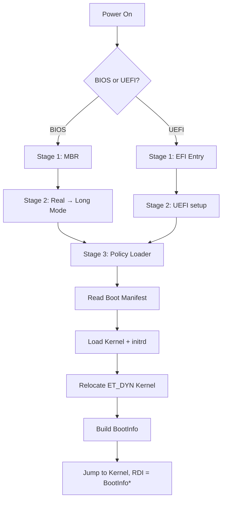
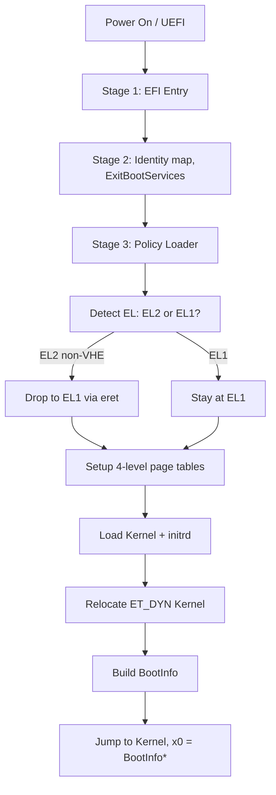

# Bootloader Design

SaltyOS uses a custom **three-stage bootloader** designed to operate on constrained systems (≈4 MB RAM), support multiple architectures (x86_64 and aarch64), and maintain full control over the boot process while allowing optional filesystem-based booting.

The design is inspired by **BSD-style loaders** and **microkernel systems such as seL4**, emphasizing a small trusted computing base, explicit boot contracts, and clear stage responsibilities.

**Architecture support:**
- **x86_64**: BIOS (MBR) and UEFI boot paths
- **aarch64**: UEFI only (no BIOS path)

---

## Overview

### Why 3 Stages?

| Stage   | Size Constraint           | Filesystem Access    | Purpose                                    |
| ------- | ------------------------- | -------------------- | ------------------------------------------ |
| Stage 1 | 446 bytes (MBR) / EFI app | None                 | Minimal platform entry, load Stage 2       |
| Stage 2 | ~64 KB                    | None (raw block I/O) | CPU mode setup, block access, load Stage 3 |
| Stage 3 | Bounded (≤ 512 KB target) | Optional             | Load kernel, build BootInfo, handoff       |

The three-stage design exists to satisfy the following constraints:

1. **Firmware limits**

   * BIOS MBR provides only 446 bytes of executable code.
2. **Memory constraints**

   * The bootloader must operate on systems with as little as ~4 MB RAM.
3. **Separation of mechanism and policy**

   * Early stages perform only mechanical setup.
   * Policy (load address selection, relocations, configuration) is isolated to Stage 3.
4. **Optional filesystem support**

   * Filesystems are supported for convenience, not required for correctness.

---

## Boot Flow

### x86_64



### aarch64



**aarch64 EL2 handling:** When Stage 3 runs at EL2 (common on QEMU virt and bare-metal hypervisors), it cannot use the higher-half kernel mapping because non-VHE EL2 only has TTBR0_EL2 (lower VA range). Stage 3 therefore drops to EL1 via `eret` with `HCR_EL2.RW=1`, enabling the TTBR0/TTBR1 split regime needed for the kernel's higher-half entry at `0xFFFF800000000000`.

---

## Boot Storage Model

### Boot Reserved Area (BRA)

All mandatory boot components reside in a **Boot Reserved Area** (BRA):

* Located at a **fixed absolute disk offset**
* Outside all partitions
* Identical for MBR, GPT, and raw media

Recommended default:

```
BRA_START_LBA = 2048  (1 MiB offset)
```

The BRA contains:

* Stage 2
* Stage 3
* Boot Manifest
* Kernel image (raw extents)
* Optional initrd

This avoids dependency on partition parsing and filesystem code in early stages.

---

## Boot Manifest

The **Boot Manifest** is mandatory and always present.

### Purpose

* Acts as the single source of truth for boot contents
* Describes kernel and initrd locations using **raw block extents**
* Eliminates filesystem dependency in the critical boot path

### Properties

* Fixed absolute LBA within the BRA
* Binary, versioned format
* Architecture-independent
* Parsable with minimal memory usage

Filesystem-based booting, if enabled, is layered on top of the manifest rather than replacing it.

---

## Stage 1: Initial Loader

### x86_64 BIOS Path (MBR)

Stage 1 for BIOS resides in the MBR boot sector (`boot/stage1/arch/x86/bios/mbr.asm`).

**Responsibilities:**

1. Establish minimal real-mode environment
2. Load Stage 2 from a fixed LBA via INT 13h
3. Transfer control to Stage 2

Stage 1 contains:

* No filesystem code
* No ELF parsing
* No policy decisions

---

### x86_64 UEFI Path

Under UEFI, Stage 1 is implemented as an EFI application (`boot/stage1/arch/x86/uefi/entry.c`).

**Responsibilities:**

1. Locate and load Stage 2
2. Preserve firmware state
3. Transfer control to Stage 2

UEFI services are not exited until Stage 3 determines it is safe to do so.

---

### aarch64 UEFI Path

aarch64 is **UEFI-only** -- there is no BIOS MBR path. Stage 1 is a PE/COFF EFI application that loads Stage 2 and transfers control. Stage 1 and Stage 2 for aarch64 are combined into the UEFI application flow; the first arch-specific code entry is `_stage3_entry` in `boot/stage3/arch/aarch64/uefi/entry_uefi.S`.

**Key differences from x86_64:**

- No real mode, protected mode, or long mode transitions
- UEFI firmware provides an identity-mapped environment at EL1 or EL2
- Stage 2 calls `ExitBootServices()` and sets up identity page tables

---

## Stage 2: Platform and Block Setup

Stage 2 is responsible for **mechanical platform initialization**.

### x86_64 BIOS Responsibilities

* Enable A20 gate (`boot/stage2/arch/x86/bios/a20.c`)
* Set up GDT for 32-bit protected mode, then transition to 64-bit long mode (`boot/stage2/arch/x86/bios/gdt.c`)
* Query BIOS E820 memory map (`boot/stage2/arch/x86/bios/memory.c`)
* Provide a uniform **block device abstraction**
* Load Stage 3 using raw block reads

### x86_64 UEFI Responsibilities

* Obtain memory map and framebuffer info from UEFI Boot Services (`boot/stage2/arch/x86/uefi/main.c`)
* Prepare Stage2Info structure for Stage 3
* Transfer control to Stage 3

### aarch64 UEFI Responsibilities

* Obtain memory map from UEFI Boot Services
* Call `ExitBootServices()`
* Set up identity page tables for Stage 3

### Non-Responsibilities (all architectures)

* No filesystem parsing
* No kernel loading
* No relocation logic
* No configuration parsing

Stage 2 must operate within a small, fixed memory budget and avoid dynamic allocation.

---

## Stage 3: Policy Loader

Stage 3 performs all policy-heavy boot logic.

### Responsibilities

1. Read and validate the Boot Manifest
2. Select a physical load address for the kernel
3. Load kernel and initrd via raw extents
4. Perform ELF relocation
5. Set up kernel page tables (identity map + higher-half mapping)
6. Construct the BootInfo structure
7. Transfer control to the kernel

Stage 3 is the **only stage** that understands kernel format and boot ABI.

### Architecture-Specific Stage 3

| Component | x86_64 BIOS | x86_64 UEFI | aarch64 UEFI |
|-----------|-------------|-------------|--------------|
| Entry | `boot/stage3/arch/x86/bios/entry.asm` | `boot/stage3/arch/x86/uefi/entry_uefi.asm` | `boot/stage3/arch/aarch64/uefi/entry_uefi.S` |
| Paging | `boot/stage3/arch/x86/paging.c` | `boot/stage3/arch/x86/paging.c` | `boot/stage3/arch/aarch64/paging.c` |
| CPU ops | `boot/stage3/arch/x86/cpu.h` | `boot/stage3/arch/x86/cpu.h` | `boot/stage3/arch/aarch64/cpu.h` |
| Linker script | `boot/stage3/arch/x86/bios/stage3.ld` | `boot/stage3/arch/x86/uefi/stage3.ld` | `boot/stage3/arch/aarch64/uefi/stage3.ld` |

### aarch64 Stage 3 Details

**Page table setup** (`boot/stage3/arch/aarch64/paging.c`):
- 4-level page tables with 4KB granule (L0-L3)
- Single root table covers both identity map (low) and higher-half kernel mapping (high at `0xFFFF800000000000`)
- MAIR configuration: index 0 = Device-nGnRnE, index 1 = Normal Non-Cacheable, index 2 = Normal Write-Back
- TCR_EL1: 48-bit VA (T0SZ=16, T1SZ=16), 4KB granule, Inner Shareable, WB-WA cacheability

**EL2→EL1 transition** (`boot/stage3/arch/aarch64/uefi/entry_uefi.S`):
- `stage3_prepare_handoff_el()` detects current EL via `CurrentEL` register
- At EL1: installs VBAR_EL1 vector table, returns 0
- At EL2: configures `HCR_EL2.RW=1` (AArch64 mode for EL1), quiesces firmware timers (`CNTHP_CTL_EL2`, `CNTP_CTL_EL0`, `CNTV_CTL_EL0`), sets up SPSR_EL2 for EL1h with DAIF masked, then performs `eret` to drop to EL1
- Returns `BOOTINFO_FLAG_STAGE3_EL2` (bit 4) to inform the kernel that the boot came through EL2

**Kernel handoff:**
- x0 = pointer to BootInfo structure (same contract as x86_64 RDI = BootInfo*)
- MMU enabled with identity + higher-half mappings active
- All exceptions masked (DAIF = 0xF)
- Stack set up in .bss (16 KiB)

---

## Kernel Loading Model

### Kernel Format

* ELF64
* **ET_DYN (Position Independent Executable)**
* RELA relocations supported
* At minimum, `R_*_RELATIVE` relocations required

This applies uniformly across architectures.

---

### Load Address Selection

* The kernel load address is chosen **at runtime**
* Stage 3 selects a suitable region from the firmware-provided memory map
* No fixed physical address is assumed

Requirements:

* Streaming load (no full-image buffering)
* Alignment preference ≥ 2 MiB
* Avoid low-memory and bootloader-used regions
* Fallback to alternate regions if necessary

---

### Relocation Rules

Let:

```
base      = chosen physical load base
min_vaddr = minimum p_vaddr of PT_LOAD segments
delta     = base - min_vaddr
```

Then:

* Each PT_LOAD segment is loaded at `p_vaddr + delta`
* Entry point becomes `e_entry + delta`
* `R_*_RELATIVE` relocations resolve to `base + addend`

---

## Filesystem Support

Filesystem support is **optional**.

### Mandatory Path

* Kernel loading via **Boot Manifest + raw extents** MUST always work
* No filesystem is required to boot

### Optional Path

* Stage 3 may include filesystem drivers (e.g., SaltyFS, FAT32)
* Filesystems may be used for:

  * Configuration files
  * Snapshot selection
  * Development convenience
* Filesystem failure must not prevent boot via raw extents

Filesystem code must not increase the mandatory memory footprint.

---

## Boot Configuration

If filesystem support is enabled, configuration may be loaded from the filesystem.

Example:

```ini
[default]
entry = main

[main]
kernel = /boot/kernel.elf
initrd = /boot/initrd.img
cmdline = console=serial0
```

Configuration is **non-essential** and ignored if unavailable.

---

## BootInfo Handoff

### Design Principles

* BootInfo is a **stable ABI contract**
* Architecture-neutral
* Extensible without breaking compatibility

### Structure

* Fixed header:

  * Magic
  * Version
  * Architecture ID
  * Pointer width
  * Endianness
* Followed by TLV records

TLVs may include:

* Memory map (filtered)
* Framebuffer info
* ACPI RSDP (x86_64) or device tree (aarch64)
* initrd location
* Command line
* Boot flags (e.g., `BOOTINFO_FLAG_STAGE3_EL2` on aarch64)

All addresses are physical unless specified otherwise.

**Kernel entry convention:**
- x86_64: `RDI` = pointer to BootInfo
- aarch64: `x0` = pointer to BootInfo

---

## Memory Constraints

The bootloader must function on systems with approximately **4 MB RAM**.

### Target Budgets

| Component         | Target   |
| ----------------- | -------- |
| Stage 2 workspace | ≤ 256 KB |
| Stage 3 workspace | ≤ 512 KB |
| Debug buffers     | ≤ 16 KB  |

### Prohibited Patterns

* Loading full images into temporary buffers
* Unbounded logging
* Retaining full firmware memory maps verbatim

---

## Multi-Architecture Considerations

Architecture-specific code is isolated to `boot/stage*/arch/<arch>/`:

| Concern | x86_64 | aarch64 |
|---------|--------|---------|
| CPU mode transitions | Real → Protected → Long mode | EL2 → EL1 (eret) |
| MMU/page tables | CR3-based 4-level (PML4) | TTBR0/TTBR1-based 4-level (4KB granule) |
| Cache/barriers | None needed (x86 coherent) | DSB/ISB, DC CIVAC, IC IVAU |
| Kernel entry | `jmp` with RDI = BootInfo* | `br` with x0 = BootInfo* |
| Firmware | BIOS INT 13h / UEFI | UEFI only |

All other logic (manifest parsing, ELF loading, relocation, BootInfo construction) is architecture-independent and shared between both architectures.

---

## Non-Goals

The following are explicitly out of scope:

* Secure Boot
* Network boot
* Interactive boot menus
* Mandatory filesystem dependency
* Firmware-specific policy logic

---

## Summary

The SaltyOS bootloader guarantees:

* A consistent three-stage model across BIOS and UEFI
* Full support for both x86_64 (BIOS + UEFI) and aarch64 (UEFI only)
* EL2-aware aarch64 boot with automatic EL2→EL1 transition when needed
* MBR and GPT compatibility without partition parsing
* ET_DYN kernel support with runtime relocation
* Operation under ~4 MB RAM
* Filesystem-free mandatory boot path
* A stable, extensible BootInfo ABI
