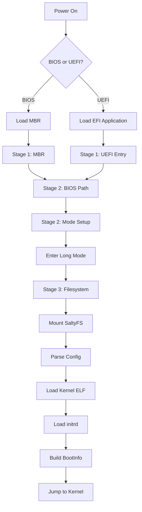

# Bootloader Design

SaltyOS uses a custom 3-stage bootloader to support booting from the COW-based SaltyFS filesystem while maintaining full control over the boot process.

## Overview

### Why 3 Stages?

| Stage | Size Constraint | Filesystem Access | Purpose |
|-------|-----------------|-------------------|---------|
| Stage 1 | 446 bytes (MBR) | None | Load Stage 2 |
| Stage 2 | ~64 KB | None (raw LBA) | CPU mode setup, load Stage 3 |
| Stage 3 | Unlimited | Yes (SaltyFS, FAT32) | Load kernel and initrd |

The 3-stage design is necessary because:

1. **MBR size limit**: Only 446 bytes available for code
2. **Filesystem complexity**: SaltyFS is too complex for Stage 1/2
3. **COW snapshots**: Stage 3 can boot from filesystem snapshots
4. **Configuration**: Boot config lives in the filesystem

### Boot Flow



## Stage 1: Initial Loader

### BIOS Path (mbr.asm)

Stage 1 for BIOS fits in the MBR boot sector (512 bytes total, 446 usable).

**Responsibilities:**
1. Set up minimal environment (segments, stack)
2. Load Stage 2 from fixed LBA using INT 13h
3. Jump to Stage 2

```nasm
; boot/stage1/bios/mbr.asm
[BITS 16]
[ORG 0x7C00]

STAGE2_LBA      equ 1           ; Stage 2 starts at LBA 1
STAGE2_SECTORS  equ 128         ; 64 KB (128 * 512)
STAGE2_ADDR     equ 0x8000      ; Load address

start:
    ; Clear interrupts and set up segments
    cli
    xor ax, ax
    mov ds, ax
    mov es, ax
    mov ss, ax
    mov sp, 0x7C00          ; Stack below bootloader
    sti

    ; Save boot drive
    mov [boot_drive], dl

    ; Load Stage 2 using LBA
    mov ah, 0x42            ; Extended read
    mov si, dap
    int 0x13
    jc disk_error

    ; Jump to Stage 2
    mov dl, [boot_drive]    ; Pass boot drive
    jmp 0x0000:STAGE2_ADDR

disk_error:
    mov si, error_msg
    call print_string
    hlt

print_string:
    lodsb
    or al, al
    jz .done
    mov ah, 0x0E
    int 0x10
    jmp print_string
.done:
    ret

; Data
boot_drive: db 0
error_msg:  db "Disk error", 0

; Disk Address Packet for INT 13h AH=42h
dap:
    db 0x10                 ; DAP size
    db 0x00                 ; Reserved
    dw STAGE2_SECTORS       ; Sectors to read
    dw STAGE2_ADDR          ; Offset
    dw 0x0000               ; Segment
    dq STAGE2_LBA           ; Starting LBA

; Padding and boot signature
times 446-($-$$) db 0
; Partition table (64 bytes) would go here
times 510-($-$$) db 0
dw 0xAA55                   ; Boot signature
```

### UEFI Path (entry.c)

For UEFI, Stage 1 is an EFI application that can be larger.

```c
// boot/stage1/uefi/entry.c

#include <efi.h>
#include <efilib.h>

EFI_STATUS EFIAPI efi_main(EFI_HANDLE image_handle, EFI_SYSTEM_TABLE *st) {
    EFI_STATUS status;
    
    // Initialize UEFI library
    InitializeLib(image_handle, st);
    
    // Clear screen
    st->ConOut->ClearScreen(st->ConOut);
    Print(L"SaltyOS Bootloader\r\n");
    
    // Get memory map
    UINTN map_size = 0;
    UINTN map_key, desc_size;
    UINT32 desc_version;
    EFI_MEMORY_DESCRIPTOR *memory_map = NULL;
    
    status = st->BootServices->GetMemoryMap(
        &map_size, memory_map, &map_key, &desc_size, &desc_version);
    
    // Allocate memory for map
    map_size += 2 * desc_size;  // Extra space for changes
    status = st->BootServices->AllocatePool(
        EfiLoaderData, map_size, (void**)&memory_map);
    
    // Get actual memory map
    status = st->BootServices->GetMemoryMap(
        &map_size, memory_map, &map_key, &desc_size, &desc_version);
    
    // Load Stage 3 from ESP
    // ... (load \EFI\SALTYOS\STAGE3.BIN)
    
    // Exit boot services
    status = st->BootServices->ExitBootServices(image_handle, map_key);
    
    // Jump to Stage 3 (already in long mode on UEFI)
    // ...
    
    return EFI_SUCCESS;
}
```

## Stage 2: Mode Setup

Stage 2 handles CPU initialization and mode transitions.

### Responsibilities

1. **A20 Line**: Enable full address space
2. **GDT Setup**: Configure initial segment descriptors
3. **Protected Mode**: Switch from real mode
4. **Long Mode**: Enable 64-bit mode with paging
5. **Memory Map**: Collect E820 memory map (BIOS)
6. **Load Stage 3**: From fixed location or partition

### Memory Map (x86_64)

```
┌─────────────────────────────────────┐ 0x100000 (1 MB)
│         Stage 2 / Stage 3           │
│         (Extended Memory)           │
├─────────────────────────────────────┤ 0x80000 (512 KB)
│                                     │
├─────────────────────────────────────┤ 0x10000 (64 KB)
│            Stage 2                  │
├─────────────────────────────────────┤ 0x8000 (32 KB)
│         Stage 2 Load Addr           │
├─────────────────────────────────────┤ 0x7E00
│            Stack                    │
├─────────────────────────────────────┤ 0x7C00
│         Stage 1 (MBR)               │
├─────────────────────────────────────┤ 0x7A00
│                                     │
├─────────────────────────────────────┤ 0x500
│           BIOS Data                 │
└─────────────────────────────────────┘ 0x0
```

### A20 Line Activation

```c
// boot/stage2/a20.c

#include <stdint.h>
#include "io.h"

// Check if A20 is already enabled
static int a20_check(void) {
    uint16_t *low = (uint16_t *)0x0000;
    uint16_t *high = (uint16_t *)0x100000;
    
    uint16_t old = *high;
    *low = 0x1234;
    
    // If A20 is disabled, this will wrap around
    int enabled = (*high != 0x1234);
    *high = old;
    
    return enabled;
}

// Enable A20 via keyboard controller
static void a20_keyboard(void) {
    // Wait for keyboard controller
    while (inb(0x64) & 0x02);
    outb(0x64, 0xD1);
    while (inb(0x64) & 0x02);
    outb(0x60, 0xDF);
    while (inb(0x64) & 0x02);
}

// Enable A20 via Fast A20
static void a20_fast(void) {
    uint8_t val = inb(0x92);
    if (!(val & 0x02)) {
        outb(0x92, val | 0x02);
    }
}

void a20_enable(void) {
    if (a20_check()) return;
    
    a20_fast();
    if (a20_check()) return;
    
    a20_keyboard();
}
```

### Long Mode Entry

```nasm
; boot/stage2/long_mode.asm

[BITS 32]

section .text
global enter_long_mode
extern stage3_entry

; Page table addresses
PML4_ADDR   equ 0x1000
PDPT_ADDR   equ 0x2000
PD_ADDR     equ 0x3000

enter_long_mode:
    ; Disable paging (in case it was enabled)
    mov eax, cr0
    and eax, ~(1 << 31)
    mov cr0, eax

    ; Clear page tables
    mov edi, PML4_ADDR
    mov ecx, 0x3000 / 4
    xor eax, eax
    rep stosd

    ; Set up identity mapping for first 2MB
    ; PML4[0] -> PDPT
    mov dword [PML4_ADDR], PDPT_ADDR | 0x03

    ; PDPT[0] -> PD
    mov dword [PDPT_ADDR], PD_ADDR | 0x03

    ; PD[0] -> 2MB page (PS bit set)
    mov dword [PD_ADDR], 0x00 | 0x83  ; Present, RW, PS (2MB page)

    ; Load PML4 into CR3
    mov eax, PML4_ADDR
    mov cr3, eax

    ; Enable PAE
    mov eax, cr4
    or eax, (1 << 5)        ; PAE
    mov cr4, eax

    ; Enable long mode (set EFER.LME)
    mov ecx, 0xC0000080     ; EFER MSR
    rdmsr
    or eax, (1 << 8)        ; LME
    wrmsr

    ; Enable paging
    mov eax, cr0
    or eax, (1 << 31)       ; PG
    mov cr0, eax

    ; Load 64-bit GDT
    lgdt [gdt64_ptr]

    ; Far jump to 64-bit code
    jmp 0x08:long_mode_start

[BITS 64]
long_mode_start:
    ; Set up segment registers
    mov ax, 0x10
    mov ds, ax
    mov es, ax
    mov fs, ax
    mov gs, ax
    mov ss, ax

    ; Set up stack
    mov rsp, 0x80000

    ; Jump to Stage 3
    call stage3_entry

    ; Should not return
    hlt

section .data
gdt64:
    dq 0                    ; Null descriptor
    dq 0x00AF9A000000FFFF   ; 64-bit code segment
    dq 0x00CF92000000FFFF   ; 64-bit data segment
gdt64_ptr:
    dw $ - gdt64 - 1
    dq gdt64
```

## Stage 3: Kernel Loader

Stage 3 can read filesystems and load the kernel.

### Responsibilities

1. **Mount SaltyFS**: Read-only driver for root filesystem
2. **Parse Config**: Read `/boot/saltyos.cfg`
3. **Load Kernel**: Parse and load ELF64 kernel image
4. **Load initrd**: Load initial ramdisk
5. **Build BootInfo**: Prepare handoff structure
6. **Jump to Kernel**: Transfer control

### Configuration File

```ini
# /boot/saltyos.cfg

[default]
timeout = 5
entry = current

[current]
title = SaltyOS
kernel = /boot/kernel.elf
initrd = /boot/initrd.img
cmdline = console=serial0 log=debug

[recovery]
title = SaltyOS (Recovery)
kernel = /boot/kernel.elf
initrd = /boot/initrd-recovery.img
cmdline = console=serial0 log=debug single

[snapshot-2026-01-20]
title = SaltyOS (Snapshot 2026-01-20)
snapshot = 42
kernel = /boot/kernel.elf
initrd = /boot/initrd.img
```

### SaltyFS Read-Only Driver

```c
// boot/stage3/fs/saltyfs.c

#include "saltyfs.h"
#include "../disk.h"

// SaltyFS superblock (simplified)
typedef struct {
    uint32_t magic;             // 0x53414C54 ("SALT")
    uint32_t version;
    uint64_t block_size;
    uint64_t total_blocks;
    uint64_t root_tree_addr;    // Root of B-tree
    uint64_t snapshot_tree_addr;
    // ...
} SaltySuperblock;

static SaltySuperblock sb;
static uint64_t current_snapshot = 0;

int saltyfs_mount(uint64_t partition_lba) {
    // Read superblock from first block
    if (disk_read(partition_lba, 1, &sb) != 0) {
        return -1;
    }
    
    if (sb.magic != 0x53414C54) {
        return -1;  // Not SaltyFS
    }
    
    return 0;
}

int saltyfs_set_snapshot(uint64_t snapshot_id) {
    // For COW filesystem, change the root tree pointer
    // to point to a historical snapshot
    current_snapshot = snapshot_id;
    // ... lookup snapshot tree
    return 0;
}

// Read file contents
int saltyfs_read_file(const char *path, void *buffer, size_t *size) {
    // 1. Parse path components
    // 2. Walk B-tree to find inode
    // 3. Read extent tree for data blocks
    // 4. Copy data to buffer
    
    // (Actual implementation would be more complex)
    return 0;
}
```

### ELF Loader

```c
// boot/stage3/elf.c

#include "elf.h"
#include <stdint.h>

typedef struct {
    uint8_t  e_ident[16];
    uint16_t e_type;
    uint16_t e_machine;
    uint32_t e_version;
    uint64_t e_entry;
    uint64_t e_phoff;
    uint64_t e_shoff;
    uint32_t e_flags;
    uint16_t e_ehsize;
    uint16_t e_phentsize;
    uint16_t e_phnum;
    uint16_t e_shentsize;
    uint16_t e_shnum;
    uint16_t e_shstrndx;
} Elf64_Ehdr;

typedef struct {
    uint32_t p_type;
    uint32_t p_flags;
    uint64_t p_offset;
    uint64_t p_vaddr;
    uint64_t p_paddr;
    uint64_t p_filesz;
    uint64_t p_memsz;
    uint64_t p_align;
} Elf64_Phdr;

#define PT_LOAD 1

uint64_t load_elf(void *elf_data, size_t size) {
    Elf64_Ehdr *ehdr = (Elf64_Ehdr *)elf_data;
    
    // Validate ELF header
    if (ehdr->e_ident[0] != 0x7F ||
        ehdr->e_ident[1] != 'E' ||
        ehdr->e_ident[2] != 'L' ||
        ehdr->e_ident[3] != 'F') {
        return 0;  // Not an ELF file
    }
    
    // Must be 64-bit
    if (ehdr->e_ident[4] != 2) {
        return 0;
    }
    
    // Load program headers
    Elf64_Phdr *phdr = (Elf64_Phdr *)((uint8_t *)elf_data + ehdr->e_phoff);
    
    for (int i = 0; i < ehdr->e_phnum; i++) {
        if (phdr[i].p_type == PT_LOAD) {
            // Copy segment to its virtual address
            void *src = (uint8_t *)elf_data + phdr[i].p_offset;
            void *dst = (void *)phdr[i].p_vaddr;
            
            // Copy file contents
            memcpy(dst, src, phdr[i].p_filesz);
            
            // Zero BSS (memsz - filesz)
            if (phdr[i].p_memsz > phdr[i].p_filesz) {
                memset(
                    (uint8_t *)dst + phdr[i].p_filesz,
                    0,
                    phdr[i].p_memsz - phdr[i].p_filesz
                );
            }
        }
    }
    
    return ehdr->e_entry;
}
```

### Kernel Handoff

```c
// boot/stage3/handoff.c

#include "handoff.h"

// BootInfo structure passed to kernel
typedef struct {
    uint64_t magic;             // 0x53414C5459 ("SALTY")
    uint64_t version;
    
    // Memory map
    uint64_t memory_map_addr;
    uint64_t memory_map_entries;
    
    // Kernel location
    uint64_t kernel_phys_start;
    uint64_t kernel_phys_end;
    uint64_t kernel_virt_start;
    
    // initrd location
    uint64_t initrd_start;
    uint64_t initrd_size;
    
    // Framebuffer (optional)
    uint64_t framebuffer_addr;
    uint32_t framebuffer_width;
    uint32_t framebuffer_height;
    uint32_t framebuffer_pitch;
    uint32_t framebuffer_bpp;
    
    // ACPI
    uint64_t rsdp_addr;
    
    // Command line
    char cmdline[256];
} BootInfo;

void jump_to_kernel(uint64_t entry, BootInfo *info) {
    // Set up kernel page tables (higher half mapping)
    setup_kernel_paging(info);
    
    // Jump to kernel entry point
    typedef void (*kernel_entry_fn)(BootInfo *);
    kernel_entry_fn kernel = (kernel_entry_fn)entry;
    kernel(info);
    
    // Should never return
    __builtin_unreachable();
}
```

## Build Configuration

### Meson Build File

```meson
# boot/meson.build

# Stage 1 BIOS
if host_machine.system() == 'none'
    stage1_bios = custom_target('stage1_bios',
        input: 'stage1/bios/mbr.asm',
        output: 'mbr.bin',
        command: [nasm, '-f', 'bin', '@INPUT@', '-o', '@OUTPUT@']
    )
endif

# Stage 2
stage2_sources = files(
    'stage2/loader.c',
    'stage2/a20.c',
    'stage2/memory_map.c',
    'stage2/paging_early.c',
    'common/print.c',
    'common/string.c',
)

stage2_asm = custom_target('stage2_asm',
    input: 'stage2/long_mode.asm',
    output: 'long_mode.o',
    command: [nasm, '-f', asm_format, '@INPUT@', '-o', '@OUTPUT@']
)

# Stage 3
stage3_sources = files(
    'stage3/main.c',
    'stage3/config.c',
    'stage3/elf.c',
    'stage3/handoff.c',
    'stage3/fs/saltyfs.c',
    'stage3/fs/fat32.c',
    'stage3/drivers/disk.c',
    'common/print.c',
    'common/string.c',
)
```

## Testing

### QEMU Testing

```bash
# Test BIOS boot
qemu-system-x86_64 \
    -machine pc \
    -drive file=saltyos.img,format=raw \
    -serial stdio \
    -no-reboot

# Test UEFI boot
qemu-system-x86_64 \
    -machine q35 \
    -bios /usr/share/OVMF/OVMF_CODE.fd \
    -drive file=saltyos.img,format=raw \
    -serial stdio \
    -no-reboot
```

### Debug Output

All stages output debug information via:
- **VGA text mode** (BIOS): 0xB8000
- **Serial port**: COM1 (0x3F8)
- **UEFI**: ConOut protocol

## Security Considerations

1. **Secure Boot**: UEFI path should support Secure Boot signing
2. **Measured Boot**: TPM PCR extension at each stage
3. **Verified Boot**: Stage N verifies Stage N+1 signature
4. **Memory Protection**: Clear sensitive data before kernel handoff
