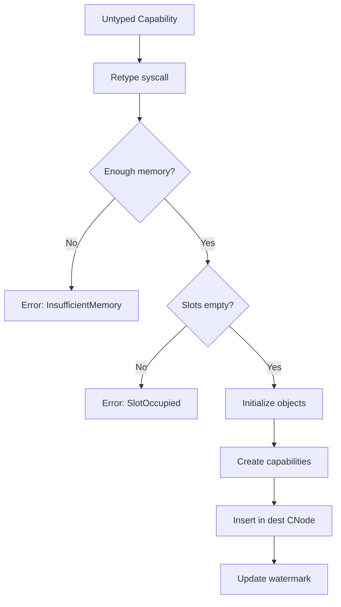

# Capability System Design

This document describes the capability-based access control system in SaltyOS.

## Overview

SaltyOS uses capabilities as the sole mechanism for access control. A capability is an unforgeable token that grants its holder specific rights to a kernel object.

### Key Properties

1. **Unforgeable**: Only the kernel can create and modify capabilities
2. **Delegatable**: Capabilities can be transferred between tasks via IPC
3. **Revocable**: Parent capabilities can revoke all derived capabilities
4. **Attenuatable**: Rights can only be reduced, never increased

## Fat Capabilities

Unlike seL4's inline (single-word) capabilities, SaltyOS uses "fat" capabilities with extended metadata.

### Structure

```rust
/// Fat Capability - 32 bytes (256 bits)
/// No parent pointer — CDT (Capability Derivation Tree) tracking
/// is handled separately in cap/cdt.rs using raw pointer links.
#[repr(C)]
pub struct Capability {
    /// Pointer to kernel object (null for empty slots)
    pub object: *mut KernelObject,  // 0x00, 8 bytes

    /// Badge value (for IPC sender identification)
    pub badge: u64,                 // 0x08, 8 bytes

    /// Capability rights bitmap
    pub rights: CapRights,          // 0x10, 4 bytes (u32)

    /// Object type discriminant
    pub obj_type: ObjectType,       // 0x14, 1 byte (u8)

    /// Derivation depth (for revocation limits)
    pub depth: u8,                  // 0x15, 1 byte

    /// Reserved for alignment
    pub _reserved: u16,             // 0x16, 2 bytes

    /// Padding to 32 bytes
    pub _pad: u64,                  // 0x18, 8 bytes
}
```

### Memory Layout

```
Offset  Size  Field
──────  ────  ─────────────
0x00    8     object pointer (*mut KernelObject)
0x08    8     badge (u64)
0x10    4     rights (CapRights, u32)
0x14    1     obj_type (ObjectType, u8)
0x15    1     depth (u8)
0x16    2     _reserved (u16)
0x18    8     _pad (u64)
──────  ────  ─────────────
Total:  32 bytes
```

### Why Fat Capabilities?

| Feature | Inline (seL4) | Fat (SaltyOS) |
|---------|---------------|---------------|
| Size | 8 bytes | 32 bytes |
| Badge | Separate lookup | Inline |
| Parent tracking | External CDT | Separate CDT (cdt.rs) |
| Type info | In object | Inline |
| Cache efficiency | Better | Worse |
| Simplicity | Complex | Simpler |

Trade-off: More memory per capability, but simpler implementation and better debuggability. Parent/child relationships for revocation are tracked in a separate CDT structure (`cap/cdt.rs`) rather than inline pointers.

## Capability Types

The `ObjectType` enum (defined in `kernite/src/cap/object.rs`) has 12 variants.
The same discriminant values are used in both the `Capability.obj_type` field
and the `KernelObject` header.

```rust
#[repr(u8)]
pub enum ObjectType {
    /// Empty capability slot
    Null = 0,

    /// Untyped (raw) memory — can be retyped into other objects
    Untyped = 1,

    /// Synchronous IPC endpoint (rendezvous-style)
    Endpoint = 2,

    /// Asynchronous notification (bitmap signaling)
    Notification = 3,

    /// Thread Control Block
    Tcb = 4,

    /// Capability storage node (array of cap slots)
    CNode = 5,

    /// Virtual address space (page table root)
    VSpace = 6,

    /// Physical memory frame (4KB page)
    Frame = 7,

    /// Interrupt handler (routes IRQ to notification)
    IrqHandler = 8,

    /// I/O port range (x86-specific)
    IoPort = 9,

    /// Scheduling context (EDF parameters)
    SchedContext = 10,

    /// Memory object (user page management, radix tree, COW)
    MemoryObject = 11,
}
```

## Capability Rights

Rights are stored as a `u32` bitmap wrapper (`CapRights(u32)`) in
`kernite/src/cap/mod.rs`. There are 15 defined rights. CNode operations
(copy, mint, move, delete) are controlled by invoke labels and the
GRANT/REVOKE rights, not separate CNode-specific right bits.

```rust
/// CapRights is a newtype wrapper around u32, with named constants.
/// Defined in kernite/src/cap/mod.rs.
pub struct CapRights(pub u32);

// Common rights
pub const READ:      CapRights = CapRights(1 << 0);
pub const WRITE:     CapRights = CapRights(1 << 1);
pub const EXECUTE:   CapRights = CapRights(1 << 2);
pub const GRANT:     CapRights = CapRights(1 << 3);   // Can transfer cap via IPC
pub const REVOKE:    CapRights = CapRights(1 << 4);   // Can revoke derived caps

// Endpoint/IPC rights
pub const SEND:      CapRights = CapRights(1 << 5);
pub const RECV:      CapRights = CapRights(1 << 6);
pub const CALL:      CapRights = CapRights(1 << 7);
pub const REPLY:     CapRights = CapRights(1 << 8);

// TCB rights
pub const CONFIGURE: CapRights = CapRights(1 << 9);
pub const SUSPEND:   CapRights = CapRights(1 << 10);
pub const RESUME:    CapRights = CapRights(1 << 11);

// Memory rights
pub const MAP:       CapRights = CapRights(1 << 12);
pub const UNMAP:     CapRights = CapRights(1 << 13);
pub const RETYPE:    CapRights = CapRights(1 << 14);

// All rights
pub const ALL:       CapRights = CapRights(0xFFFFFFFF);
```

## CNode (Capability Node)

A CNode is an array of capability slots, forming the task's capability space (CSpace).

### Structure

A CNode is a kernel object (allocated from untyped memory via retype). The
slot array is stored inline immediately after the CNode header, in the same
block of untyped memory. There is no heap allocation — the `slots` field is
a raw pointer to the first slot, and `size_bits` determines the count
(2^size_bits slots, valid range 4-16 for 16 to 65,536 slots).

```rust
/// Capability Node - array of capability slots (kernel object)
#[repr(C)]
pub struct CNode {
    pub header: KernelObject,       // Must be first field

    /// Raw pointer to first capability slot (stored inline after this struct)
    pub slots: *mut Capability,

    /// log2(number of slots) — valid range: 4..=16
    pub size_bits: u8,

    /// Guard value for CSpace traversal
    pub guard: u64,

    /// Guard size in bits
    pub guard_bits: u8,
}

impl CNode {
    /// Number of slots in this CNode
    pub fn num_slots(&self) -> usize {
        1 << self.size_bits
    }

    /// Look up a capability by index.
    /// Returns a raw pointer to the slot (caller must validate index).
    pub fn get(&self, index: usize) -> Option<&Capability> {
        if index >= self.num_slots() {
            return None;
        }
        // SAFETY: slots points to a valid array of num_slots() Capability entries,
        // allocated from the same untyped memory block as this CNode.
        unsafe { Some(&*self.slots.add(index)) }
    }

    /// Insert a capability at index
    pub fn insert(&mut self, index: usize, cap: Capability) -> Result<(), CapError> {
        if index >= self.num_slots() {
            return Err(CapError::InvalidSlot);
        }
        // SAFETY: bounds checked above
        let slot = unsafe { &mut *self.slots.add(index) };
        if slot.obj_type != ObjectType::Null {
            return Err(CapError::SlotOccupied);
        }
        *slot = cap;
        Ok(())
    }
}
```

### CSpace Structure

A task's CSpace can be a single CNode or a tree of CNodes:

```
                    ┌────────────────────────┐
                    │   Root CNode (TCB)     │
                    │   size_bits: 12        │
                    │   (4096 slots)         │
                    └───────────┬────────────┘
                                │
        ┌───────────────────────┼───────────────────────┐
        │                       │                       │
        ▼                       ▼                       ▼
┌───────────────┐     ┌───────────────┐     ┌───────────────┐
│   Slot 0      │     │   Slot 1      │     │   Slot N      │
│   Endpoint    │     │   → CNode     │     │   Frame       │
└───────────────┘     └───────┬───────┘     └───────────────┘
                              │
                              ▼
                    ┌───────────────────┐
                    │   Nested CNode    │
                    │   size_bits: 8    │
                    └───────────────────┘
```

### Capability Addressing

Capabilities are addressed using a path through the CSpace:

```
┌────────────────────────────────────────────────────────────┐
│                    Capability Pointer (64 bits)            │
├─────────────────────┬─────────────────────┬────────────────┤
│   CNode Index       │   Nested Index      │    Depth       │
│   (variable bits)   │   (variable bits)   │   (6 bits)     │
└─────────────────────┴─────────────────────┴────────────────┘
```

## Capability Operations

### Derive (Copy with Reduced Rights)

Derivation creates a new capability with equal or fewer rights and increments
the depth counter. The parent-child relationship is recorded in the CDT
(`cap/cdt.rs`), not inline in the capability struct.

```rust
/// Create a derived capability with equal or fewer rights.
/// The CDT entry linking parent to child is created separately.
fn derive_cap(src: &Capability, new_rights: CapRights) -> Result<Capability, CapError> {
    // Can only reduce rights, never increase
    if (new_rights.0 & !src.rights.0) != 0 {
        return Err(CapError::InsufficientRights);
    }

    // Check derivation depth limit
    if src.depth >= MAX_DERIVATION_DEPTH {
        return Err(CapError::DepthExceeded);
    }

    Ok(Capability {
        object: src.object,
        badge: src.badge,
        rights: new_rights,
        obj_type: src.obj_type,
        depth: src.depth + 1,
        _reserved: 0,
        _pad: 0,
    })
}
```

### Mint (Create Badged Capability)

Minting sets a badge value on a capability copy. When a badged endpoint cap
is used for IPC, the receiver sees the badge, allowing sender identification.
Minting is a CNode invocation (label `CNODE_MINT`), not a method on Capability.

```rust
/// Mint: create a badged copy of a capability with (optionally reduced) rights.
/// Typically used for endpoint capabilities to identify senders.
fn cnode_mint(
    src: &Capability,
    new_rights: CapRights,
    badge: u64,
) -> Result<Capability, CapError> {
    // Badge is typically used with endpoints, but not strictly enforced
    if (new_rights.0 & !src.rights.0) != 0 {
        return Err(CapError::InsufficientRights);
    }

    Ok(Capability {
        object: src.object,
        badge,
        rights: new_rights,
        obj_type: src.obj_type,
        depth: src.depth + 1,
        _reserved: 0,
        _pad: 0,
    })
}
```

### Revoke (Destroy All Derived Capabilities)

Revocation walks the CDT (Capability Derivation Tree, implemented in
`cap/cdt.rs`) to find all descendants. The CDT uses raw pointer links
between CDT entries — not inline parent pointers in capabilities.

```rust
/// Revoke all capabilities derived from the one at the given slot.
/// Walks the CDT to find all descendants, nulls their slots, and
/// cleans up blocked threads. O(n) in number of derived caps.
fn cnode_revoke(cnode: &mut CNode, index: usize) -> Result<(), CapError> {
    let cap = match cnode.get(index) {
        Some(c) => c,
        None => return Err(CapError::InvalidSlot),
    };

    if (cap.rights.0 & REVOKE.0) == 0 {
        return Err(CapError::InsufficientRights);
    }

    // Walk CDT descendants via raw pointer links in CDT entries
    cdt::revoke_descendants(cap.object);

    Ok(())
}
```

### Delete (Remove Single Capability)

```rust
/// Delete a capability from a CNode slot.
/// Decrements the object's reference count. Objects are never freed
/// (they remain in their parent untyped memory), but the CDT entry
/// is removed and the slot is nulled.
fn cnode_delete(cnode: &mut CNode, index: usize) -> Result<(), CapError> {
    if index >= cnode.num_slots() {
        return Err(CapError::InvalidSlot);
    }

    // SAFETY: index bounds-checked above
    let slot = unsafe { &mut *cnode.slots.add(index) };
    if slot.obj_type == ObjectType::Null {
        return Err(CapError::EmptySlot);
    }

    // Decrement reference count on the kernel object
    // SAFETY: slot.object is valid (non-null cap)
    unsafe {
        let header = &mut *slot.object;
        header.refcount -= 1;
    }

    // Remove CDT entry for this capability
    cdt::remove_entry(slot);

    // Null the slot
    *slot = Capability {
        object: core::ptr::null_mut(),
        badge: 0,
        rights: CapRights(0),
        obj_type: ObjectType::Null,
        depth: 0,
        _reserved: 0,
        _pad: 0,
    };

    Ok(())
}
```

## Untyped Memory and Retyping

### Untyped Memory

Untyped memory represents raw physical memory that can be converted to typed kernel objects.

```rust
#[repr(C)]
pub struct Untyped {
    pub header: KernelObject,   // Must be first field (ObjectType::Untyped)

    /// Physical base address
    pub phys_addr: u64,

    /// Size in bytes (power of 2)
    pub size_bytes: usize,

    /// Watermark: how much has been consumed by retype
    pub watermark: usize,

    /// Is this device memory? (device memory cannot be retyped to most object types)
    pub is_device: bool,
}
```

### Retype Operation

Retype carves typed kernel objects out of raw untyped memory. The objects are
initialized in-place at the untyped memory address — no heap allocation.
A watermark tracks how much of the untyped region has been consumed.
Frame objects require `size_bits >= 12` (4KB minimum).

```rust
/// Convert untyped memory to typed objects.
/// Objects are placed sequentially starting at phys_addr + watermark.
fn untyped_retype(
    ut: &mut Untyped,
    new_type: ObjectType,
    size_bits: u8,       // For variable-size objects (CNode, Frame)
    num_objects: usize,
    dest_cnode: &mut CNode,
    dest_offset: usize,
) -> Result<(), CapError> {
    let obj_size = object_size(new_type, size_bits);
    let total_size = obj_size * num_objects;

    // Check sufficient untyped memory remaining
    if ut.watermark + total_size > ut.size_bytes {
        return Err(CapError::InsufficientMemory);
    }

    // Check destination slots are empty
    for i in 0..num_objects {
        if let Some(slot) = dest_cnode.get(dest_offset + i) {
            if slot.obj_type != ObjectType::Null {
                return Err(CapError::SlotOccupied);
            }
        } else {
            return Err(CapError::InvalidSlot);
        }
    }

    // Create objects in-place at untyped memory addresses
    for i in 0..num_objects {
        let obj_addr = ut.phys_addr + ut.watermark + (i * obj_size);
        // SAFETY: obj_addr points to valid, zeroed untyped memory
        let obj_ptr = unsafe { init_object(new_type, obj_addr, size_bits) };

        // SAFETY: dest slot bounds checked above
        let slot = unsafe { &mut *dest_cnode.slots.add(dest_offset + i) };
        *slot = Capability {
            object: obj_ptr,
            badge: 0,
            rights: CapRights::ALL,
            obj_type: new_type,
            depth: 0,
            _reserved: 0,
            _pad: 0,
        };
    }

    ut.watermark += total_size;
    Ok(())
}
```

### Object Creation Flow



## Initial Capability Distribution

At boot, the kernel creates the init task with well-known capability slots.
These are set up in `kernite/src/init.rs` using the parsed boot info and CPIO
initrd. Init is statically linked and is the first userspace process.

```rust
// kernite/src/init.rs (simplified)

/// Well-known capability slot assignments for the init task.
/// These must match the constants in lib/trona/uapi/consts/kernel.rs.
const CAP_SELF_TCB: usize       = 0;
const CAP_SELF_VSPACE: usize    = 1;
const CAP_SELF_CSPACE: usize    = 2;
const CAP_PROCMGR_EP: usize     = 3;
const CAP_VFS_EP: usize         = 4;
const CAP_NAMESRV_EP: usize    = 5;
const CAP_MMSRV_EP: usize       = 7;
const CAP_COM1_IOPORT: usize    = 8;
const CAP_CONSOLE_EP: usize     = 11;
const CAP_UNTYPED_START: usize  = 16;

fn create_init_task(boot_info: &BootInfo) {
    // Retype untyped memory to create root CNode, TCB, VSpace, etc.
    // All objects are carved from untyped memory — no heap allocation.

    // Insert well-known caps into init's CSpace
    // Slot 0: init's own TCB
    // Slot 1: init's VSpace
    // Slot 2: init's CNode root
    // Slot 3-11: service endpoint caps (initially null, filled by init)
    // Slot 8: COM1 I/O port range capability
    // Slot 16+: untyped memory capabilities for all usable physical regions

    let mut slot = CAP_UNTYPED_START;
    for region in boot_info.memory_regions() {
        if region.is_usable() {
            // SAFETY: slot is within CNode bounds
            unsafe {
                let cap_slot = &mut *root_cnode.slots.add(slot);
                *cap_slot = make_untyped_cap(region.base, region.size);
            }
            slot += 1;
        }
    }
}
```

## CSpace Operations via Syscalls

### CNode Invocation

CNode operations are performed via the Invoke syscall (number 9) with the
CNode capability and an invoke label. Labels are defined in
`lib/trona/uapi/consts/kernel.rs` (range `0x10`-`0x18`).

Arguments are passed in message registers (MR0-MR3 in CPU registers,
MR4+ via IPC buffer).

```rust
/// CNode invoke labels (from lib/trona/uapi/consts/kernel.rs)
const CNODE_COPY:        u64 = 0x10;
const CNODE_MINT:        u64 = 0x11;
const CNODE_MOVE:        u64 = 0x12;
const CNODE_MUTATE:      u64 = 0x13;
const CNODE_DELETE:      u64 = 0x14;
const CNODE_REVOKE:      u64 = 0x15;
const CNODE_SAVE_CALLER: u64 = 0x16;
const CNODE_SET_GUARD:   u64 = 0x17;
const CNODE_GET_INFO:    u64 = 0x18;

/// CNode capability invocation dispatch
fn invoke_cnode(
    cap: &Capability,
    label: u64,
    mr0: u64,
    mr1: u64,
    mr2: u64,
    mr3: u64,
) -> Result<u64, SyscallError> {
    match label {
        CNODE_COPY => {
            // mr0=dest_index, mr1=src_cnode_slot, mr2=src_index, mr3=rights
            cnode_copy(cap, mr0, mr1, mr2, CapRights(mr3 as u32))
        }
        CNODE_MINT => {
            // mr0=dest_index, mr1=src_cnode_slot, mr2=src_index, mr3=rights
            // badge from IPC buffer MR4
            cnode_mint(cap, mr0, mr1, mr2, CapRights(mr3 as u32))
        }
        CNODE_MOVE => {
            cnode_move(cap, mr0, mr1, mr2)
        }
        CNODE_MUTATE => {
            cnode_mutate(cap, mr0, mr1, mr2, CapRights(mr3 as u32))
        }
        CNODE_DELETE => {
            cnode_delete(cap, mr0)
        }
        CNODE_REVOKE => {
            cnode_revoke(cap, mr0)
        }
        CNODE_SAVE_CALLER => {
            cnode_save_caller(cap, mr0)
        }
        CNODE_SET_GUARD => {
            cnode_set_guard(cap, mr0, mr1)
        }
        CNODE_GET_INFO => {
            cnode_get_info(cap, mr0)
        }
        _ => Err(SyscallError::InvalidInvocation),
    }
}
```

### MemoryObject Invocations

MemoryObject (MO) operations manage user data pages. MO is created via
`untyped_retype(OBJ_MEMORY_OBJECT)`. Labels defined in
`lib/trona/uapi/consts/kernel.rs` (range `0x90`-`0x97`):

| Label | Value | Operation | Description |
|-------|-------|-----------|-------------|
| `MO_COMMIT` | 0x90 | Commit pages | Allocate frames for page range (arg2=ut_cap, 0=PMM fallback) |
| `MO_DECOMMIT` | 0x91 | Decommit pages | Release physical frames back to source |
| `MO_GET_SIZE` | 0x92 | Get size | Return page count |
| `MO_CLONE` | 0x93 | COW clone | Create copy-on-write snapshot child |
| `MO_RESIZE` | 0x94 | Resize | Change page count |
| `MO_READ` | 0x95 | Read page | Read data from MO page |
| `MO_WRITE` | 0x96 | Write page | Write data to MO page |
| `MO_HAS_PAGE` | 0x97 | Check page | Check if page is committed |

### VSpace MemoryObject Labels

VSpace operations for MO-based mappings. Invoked on a VSpace capability
(range `0x97`-`0x9A`):

| Label | Value | Operation | Description |
|-------|-------|-----------|-------------|
| `VSPACE_MAP_MO` | 0x97 | Map MO range | Map MO pages into VSpace at given VA |
| `VSPACE_UNMAP_MO` | 0x98 | Unmap MO range | Remove MO mapping from VSpace |
| `VSPACE_SHARE_RO_PAGE` | 0x99 | Share page RO | Share a read-only page between VSpaces |
| `VSPACE_FORK_RANGE` | 0x9A | Fork range | COW-fork a VA range (used by fork()) |

See [Memory Management](memory.md) for the full MO design.

## Security Properties

### No Ambient Authority

Tasks can only access resources through capabilities they hold:
- No global namespace for objects
- No "root" or "admin" privileges
- Principle of least privilege by default

### Confinement

A task can be confined by:
1. Not giving it the GRANT right
2. Not giving it capabilities to external endpoints
3. Controlling what capabilities it receives

### Revocation

Capability revocation is:
- **Complete**: All derived capabilities are revoked
- **Immediate**: Takes effect before retype returns
- **Transitive**: Covers all levels of derivation

### Memory Safety

Memory is only accessible through:
1. MemoryObject capabilities (for page commit/decommit/clone)
2. VSpace capabilities (for mapping MO pages via VSPACE_MAP_MO)
3. No direct physical memory access for userspace

## Example: Creating a Server

This example shows the userland flow using trona invoke wrappers.

```rust
// In init process (using trona invoke wrappers)

// 1. Retype untyped memory to create an endpoint
trona_untyped_retype(
    untyped_cap,            // source untyped capability slot
    OBJ_ENDPOINT,           // ObjectType::Endpoint = 2
    0,                      // size_bits (unused for Endpoint)
    1,                      // num_objects
    CAP_SELF_CSPACE,        // dest CNode (our own CSpace)
    server_ep_slot,         // dest slot index
);

// 2. Mint a badged copy for clients (send-only)
trona_cnode_mint(
    CAP_SELF_CSPACE,        // dest CNode
    client_ep_slot,         // dest slot
    CAP_SELF_CSPACE,        // src CNode
    server_ep_slot,         // src slot
    RIGHTS_SEND,            // only send right
    CLIENT_BADGE,           // badge value for sender identification
);

// 3. Server recvs on endpoint, clients send
// When a client sends, the server sees CLIENT_BADGE in the message badge
```
