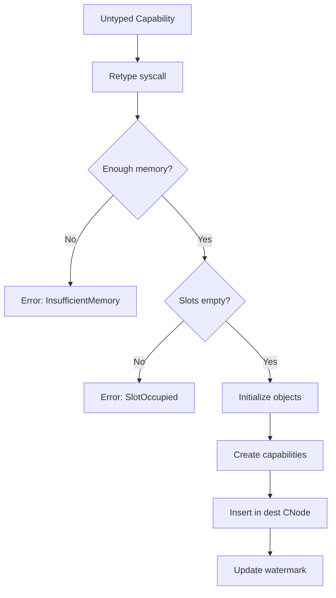

# Capability System Design

This document describes the capability-based access control system in SaltyOS.

## Overview

SaltyOS uses capabilities as the sole mechanism for access control. A capability is an unforgeable token that grants its holder specific rights to a kernel object.

### Key Properties

1. **Unforgeable**: Only the kernel can create and modify capabilities
2. **Delegatable**: Capabilities can be transferred between tasks via IPC
3. **Revocable**: Parent capabilities can revoke all derived capabilities
4. **Attenuatable**: Rights can only be reduced, never increased

## Fat Capabilities

Unlike seL4's inline (single-word) capabilities, SaltyOS uses "fat" capabilities with extended metadata.

### Structure

```rust
/// Fat Capability - 32 bytes (256 bits)
#[repr(C)]
pub struct Capability {
    /// Pointer to kernel object
    /// Null for empty capability slots
    object: *mut KernelObject,      // 8 bytes
    
    /// Capability rights bitmap
    rights: CapRights,               // 4 bytes
    
    /// Capability type
    cap_type: CapType,               // 1 byte
    
    /// Derivation depth (for revocation limits)
    depth: u8,                       // 1 byte
    
    /// Reserved for alignment
    _reserved: u16,                  // 2 bytes
    
    /// Badge value (for IPC sender identification)
    badge: u64,                      // 8 bytes
    
    /// Parent capability (for revocation tree)
    parent: *mut Capability,         // 8 bytes
}
```

### Memory Layout

```
Offset  Size  Field
──────  ────  ─────────────
0x00    8     object pointer
0x08    4     rights
0x0C    1     cap_type
0x0D    1     depth
0x0E    2     reserved
0x10    8     badge
0x18    8     parent
──────  ────  ─────────────
Total:  32 bytes
```

### Why Fat Capabilities?

| Feature | Inline (seL4) | Fat (SaltyOS) |
|---------|---------------|---------------|
| Size | 8 bytes | 32 bytes |
| Badge | Separate lookup | Inline |
| Parent tracking | External CDT | Inline pointer |
| Type info | In object | Inline |
| Cache efficiency | Better | Worse |
| Simplicity | Complex | Simpler |

Trade-off: More memory per capability, but simpler implementation and better debuggability.

## Capability Types

```rust
#[repr(u8)]
pub enum CapType {
    /// Empty capability slot
    Null = 0,
    
    /// Synchronous IPC endpoint
    Endpoint = 1,
    
    /// Asynchronous notification
    Notification = 2,
    
    /// Thread Control Block
    Tcb = 3,
    
    /// Capability storage node
    CNode = 4,
    
    /// Virtual address space
    VSpace = 5,
    
    /// Physical memory frame
    Frame = 6,
    
    /// Untyped (raw) memory
    Untyped = 7,
    
    /// Interrupt handler
    IrqHandler = 8,
    
    /// IRQ control (for creating handlers)
    IrqControl = 9,
    
    /// IO port range (x86)
    IoPort = 10,
    
    /// Scheduling context
    SchedContext = 11,
    
    /// Page table (intermediate level)
    PageTable = 12,
}
```

## Capability Rights

```rust
bitflags! {
    /// Rights bitmap
    pub struct CapRights: u32 {
        // Common rights
        const READ       = 1 << 0;
        const WRITE      = 1 << 1;
        const GRANT      = 1 << 2;   // Can transfer cap via IPC
        const REVOKE     = 1 << 3;   // Can revoke derived caps
        
        // Endpoint rights
        const SEND       = 1 << 4;
        const RECV       = 1 << 5;
        const CALL       = 1 << 6;
        const REPLY      = 1 << 7;
        
        // TCB rights
        const CONFIGURE  = 1 << 8;
        const SUSPEND    = 1 << 9;
        const RESUME     = 1 << 10;
        const READ_REGS  = 1 << 11;
        const WRITE_REGS = 1 << 12;
        
        // Memory rights
        const MAP        = 1 << 13;
        const UNMAP      = 1 << 14;
        const RETYPE     = 1 << 15;
        
        // CNode rights
        const INSERT     = 1 << 16;
        const DELETE     = 1 << 17;
        const COPY       = 1 << 18;
        const MINT       = 1 << 19;
        const MOVE       = 1 << 20;
        
        // All rights
        const ALL        = 0xFFFFFFFF;
    }
}
```

## CNode (Capability Node)

A CNode is an array of capability slots, forming the task's capability space (CSpace).

### Structure

```rust
/// Capability Node - array of capability slots
pub struct CNode {
    /// Capability slots
    slots: Box<[Capability]>,
    
    /// Number of slots (power of 2)
    size_bits: u8,
    
    /// Guard value for CSpace traversal
    guard: u64,
    
    /// Guard size in bits
    guard_bits: u8,
}

impl CNode {
    /// Create a new CNode with 2^size_bits slots
    pub fn new(size_bits: u8) -> Self {
        let size = 1 << size_bits;
        Self {
            slots: vec![Capability::null(); size].into_boxed_slice(),
            size_bits,
            guard: 0,
            guard_bits: 0,
        }
    }
    
    /// Look up a capability by index
    pub fn get(&self, index: usize) -> Option<&Capability> {
        self.slots.get(index)
    }
    
    /// Insert a capability at index
    pub fn insert(&mut self, index: usize, cap: Capability) -> Result<(), CapError> {
        if index >= self.slots.len() {
            return Err(CapError::InvalidSlot);
        }
        if !self.slots[index].is_null() {
            return Err(CapError::SlotOccupied);
        }
        self.slots[index] = cap;
        Ok(())
    }
}
```

### CSpace Structure

A task's CSpace can be a single CNode or a tree of CNodes:

```
                    ┌────────────────────────┐
                    │   Root CNode (TCB)     │
                    │   size_bits: 12        │
                    │   (4096 slots)         │
                    └───────────┬────────────┘
                                │
        ┌───────────────────────┼───────────────────────┐
        │                       │                       │
        ▼                       ▼                       ▼
┌───────────────┐     ┌───────────────┐     ┌───────────────┐
│   Slot 0      │     │   Slot 1      │     │   Slot N      │
│   Endpoint    │     │   → CNode     │     │   Frame       │
└───────────────┘     └───────┬───────┘     └───────────────┘
                              │
                              ▼
                    ┌───────────────────┐
                    │   Nested CNode    │
                    │   size_bits: 8    │
                    └───────────────────┘
```

### Capability Addressing

Capabilities are addressed using a path through the CSpace:

```
┌────────────────────────────────────────────────────────────┐
│                    Capability Pointer (64 bits)            │
├─────────────────────┬─────────────────────┬────────────────┤
│   CNode Index       │   Nested Index      │    Depth       │
│   (variable bits)   │   (variable bits)   │   (6 bits)     │
└─────────────────────┴─────────────────────┴────────────────┘
```

## Capability Operations

### Derive (Copy with Reduced Rights)

```rust
impl Capability {
    /// Create a derived capability with equal or fewer rights
    pub fn derive(&self, new_rights: CapRights) -> Result<Capability, CapError> {
        // Can only reduce rights
        if !self.rights.contains(new_rights) {
            return Err(CapError::InsufficientRights);
        }
        
        // Check derivation depth limit
        if self.depth >= MAX_DERIVATION_DEPTH {
            return Err(CapError::DepthExceeded);
        }
        
        Ok(Capability {
            object: self.object,
            rights: new_rights,
            cap_type: self.cap_type,
            depth: self.depth + 1,
            badge: self.badge,
            parent: self as *const _ as *mut _,
            ..Default::default()
        })
    }
}
```

### Mint (Create Badged Capability)

```rust
impl Capability {
    /// Create a badged capability (for IPC endpoints)
    pub fn mint(&self, badge: u64) -> Result<Capability, CapError> {
        if self.cap_type != CapType::Endpoint {
            return Err(CapError::InvalidOperation);
        }
        
        if !self.rights.contains(CapRights::GRANT) {
            return Err(CapError::InsufficientRights);
        }
        
        Ok(Capability {
            object: self.object,
            rights: self.rights - CapRights::GRANT, // Remove grant right
            cap_type: self.cap_type,
            depth: self.depth + 1,
            badge,
            parent: self as *const _ as *mut _,
            ..Default::default()
        })
    }
}
```

### Revoke (Destroy All Derived Capabilities)

```rust
impl Capability {
    /// Revoke all capabilities derived from this one
    pub fn revoke(&mut self) -> Result<(), CapError> {
        if !self.rights.contains(CapRights::REVOKE) {
            return Err(CapError::InsufficientRights);
        }
        
        // Walk derivation tree and null all children
        // This is O(n) in number of derived caps
        revoke_tree(self);
        
        Ok(())
    }
}

fn revoke_tree(root: &Capability) {
    // BFS/DFS through capability derivation tree
    // For each derived cap:
    //   1. Recursively revoke its children
    //   2. Null the capability slot
    //   3. Update any waiting threads
}
```

### Delete (Remove Single Capability)

```rust
impl CNode {
    /// Delete a capability from a slot
    pub fn delete(&mut self, index: usize) -> Result<(), CapError> {
        if index >= self.slots.len() {
            return Err(CapError::InvalidSlot);
        }
        
        let cap = &mut self.slots[index];
        if cap.is_null() {
            return Err(CapError::EmptySlot);
        }
        
        // If this is the last cap to an object, destroy the object
        if is_last_reference(cap) {
            destroy_object(cap.object);
        }
        
        *cap = Capability::null();
        Ok(())
    }
}
```

## Untyped Memory and Retyping

### Untyped Memory

Untyped memory represents raw physical memory that can be converted to typed kernel objects.

```rust
pub struct Untyped {
    /// Physical base address
    phys_addr: PhysAddr,
    
    /// Size in bytes (power of 2)
    size_bytes: usize,
    
    /// Watermark: how much has been allocated
    watermark: usize,
    
    /// Is this device memory?
    is_device: bool,
}
```

### Retype Operation

```rust
impl Untyped {
    /// Convert untyped memory to typed objects
    pub fn retype(
        &mut self,
        new_type: CapType,
        size_bits: u8,      // For variable-size objects
        num_objects: usize,
        dest_cnode: &mut CNode,
        dest_offset: usize,
    ) -> Result<(), CapError> {
        let obj_size = object_size(new_type, size_bits);
        let total_size = obj_size * num_objects;
        
        // Check sufficient untyped memory
        if self.watermark + total_size > self.size_bytes {
            return Err(CapError::InsufficientMemory);
        }
        
        // Check destination slots are empty
        for i in 0..num_objects {
            if !dest_cnode.slots[dest_offset + i].is_null() {
                return Err(CapError::SlotOccupied);
            }
        }
        
        // Create objects
        for i in 0..num_objects {
            let obj_addr = self.phys_addr + self.watermark + (i * obj_size);
            let object = create_object(new_type, obj_addr, size_bits);
            
            dest_cnode.slots[dest_offset + i] = Capability {
                object: Box::into_raw(object),
                rights: CapRights::ALL,
                cap_type: new_type,
                depth: 0,
                badge: 0,
                parent: core::ptr::null_mut(),
                ..Default::default()
            };
        }
        
        self.watermark += total_size;
        Ok(())
    }
}
```

### Object Creation Flow



## Initial Capability Distribution

At boot, the kernel creates the init task with all system capabilities:

```rust
fn create_init_task(boot_info: &BootInfo) -> Tcb {
    // Create root CNode
    let root_cnode = CNode::new(12);  // 4096 slots
    
    // Create initial capabilities
    let caps = [
        // Slot 0: TCB cap for init itself
        (0, create_tcb_cap(&init_tcb)),
        
        // Slot 1: Root CNode cap
        (1, create_cnode_cap(&root_cnode)),
        
        // Slot 2: VSpace cap
        (2, create_vspace_cap(&init_vspace)),
        
        // Slot 3: IRQ Control
        (3, create_irq_control_cap()),
        
        // Slot 4+: Untyped memory caps
        // One per physical memory region
    ];
    
    // Create untyped caps for all usable physical memory
    let mut slot = 4;
    for region in boot_info.memory_map.usable_regions() {
        root_cnode.insert(slot, create_untyped_cap(region));
        slot += 1;
    }
    
    // Create init TCB
    let mut init_tcb = Tcb::new(ThreadId(0), root_cnode, init_vspace);
    init_tcb.configure(init_entry, init_stack, init_ipc_buffer);
    
    init_tcb
}
```

## CSpace Operations via Syscalls

### CNode Invocation

```rust
/// CNode capability invocation
fn invoke_cnode(
    tcb: &mut Tcb,
    cap: &Capability,
    label: u64,
    msg: &IpcMessage,
) -> InvokeResult {
    match label {
        // Copy: Copy cap from src to dest
        CNODE_COPY => {
            let dest_index = msg.get_word(0);
            let src_cnode = msg.get_cap(0);
            let src_index = msg.get_word(1);
            let rights = CapRights::from_bits_truncate(msg.get_word(2) as u32);
            
            cnode_copy(cap, dest_index, src_cnode, src_index, rights)
        }
        
        // Mint: Create badged cap
        CNODE_MINT => {
            let dest_index = msg.get_word(0);
            let src_cnode = msg.get_cap(0);
            let src_index = msg.get_word(1);
            let rights = CapRights::from_bits_truncate(msg.get_word(2) as u32);
            let badge = msg.get_word(3);
            
            cnode_mint(cap, dest_index, src_cnode, src_index, rights, badge)
        }
        
        // Delete: Remove cap from slot
        CNODE_DELETE => {
            let index = msg.get_word(0);
            cnode_delete(cap, index)
        }
        
        // Revoke: Revoke all derived caps
        CNODE_REVOKE => {
            let index = msg.get_word(0);
            cnode_revoke(cap, index)
        }
        
        // Move: Move cap between slots
        CNODE_MOVE => {
            let dest_index = msg.get_word(0);
            let src_cnode = msg.get_cap(0);
            let src_index = msg.get_word(1);
            
            cnode_move(cap, dest_index, src_cnode, src_index)
        }
        
        _ => InvokeResult::Error(SyscallError::InvalidOperation),
    }
}
```

## Security Properties

### No Ambient Authority

Tasks can only access resources through capabilities they hold:
- No global namespace for objects
- No "root" or "admin" privileges
- Principle of least privilege by default

### Confinement

A task can be confined by:
1. Not giving it the GRANT right
2. Not giving it capabilities to external endpoints
3. Controlling what capabilities it receives

### Revocation

Capability revocation is:
- **Complete**: All derived capabilities are revoked
- **Immediate**: Takes effect before retype returns
- **Transitive**: Covers all levels of derivation

### Memory Safety

Memory is only accessible through:
1. Frame capabilities (for mapping to VSpace)
2. VSpace capabilities (for map/unmap operations)
3. No direct physical memory access for userspace

## Example: Creating a Server

```rust
// In init process

// 1. Retype untyped to create endpoint
invoke(untyped_cap, UNTYPED_RETYPE, &[
    CapType::Endpoint as u64,
    0,  // size_bits (unused for Endpoint)
    1,  // num_objects
    server_cnode_cap,
    0,  // dest_offset
]);

// 2. Get the endpoint capability (now at slot 0 of server_cnode)
let server_ep = cnode_lookup(server_cnode_cap, 0);

// 3. Mint a badged copy for clients
invoke(root_cnode_cap, CNODE_MINT, &[
    client_ep_slot,     // dest
    server_cnode_cap,   // src cnode
    0,                  // src index
    CapRights::SEND,    // only send right
    CLIENT_BADGE,       // badge value
]);

// 4. Server can recv on endpoint, clients can send
// Server sees CLIENT_BADGE to identify sender
```
