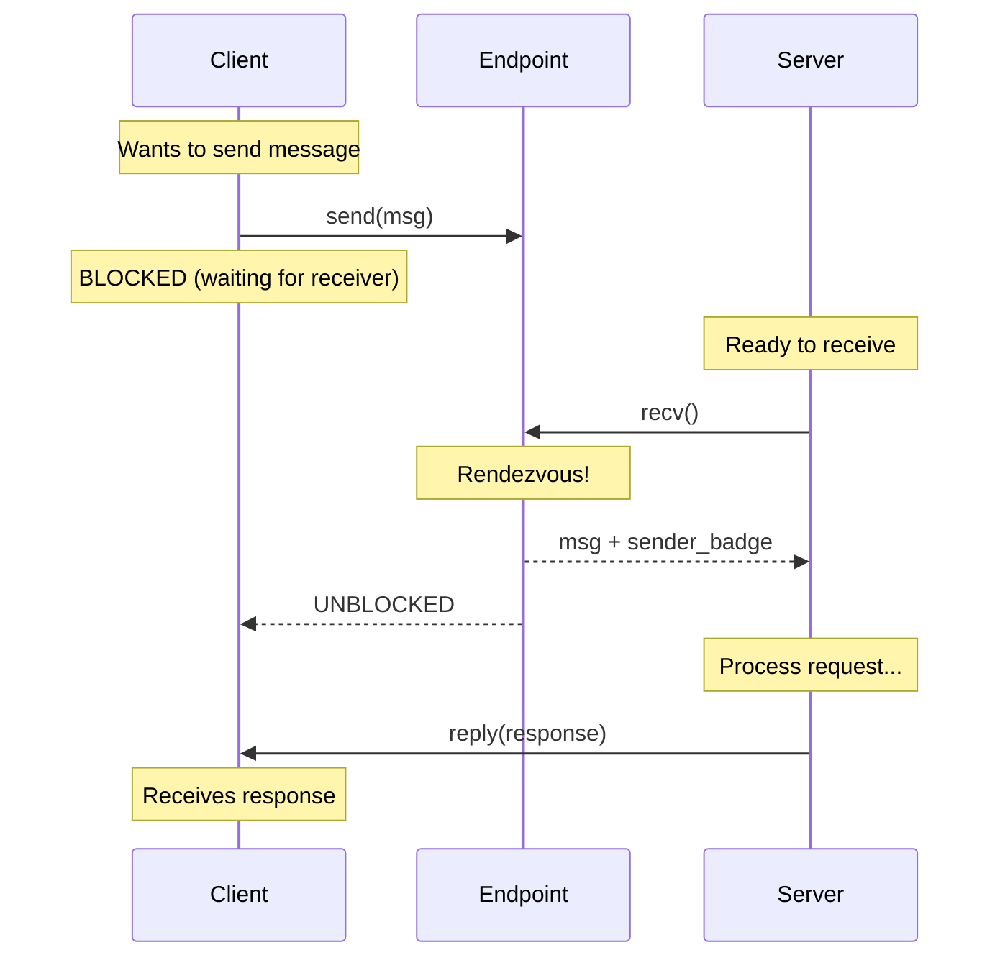

# IPC Design

This document describes the Inter-Process Communication system in SaltyOS.

## Overview

SaltyOS implements two IPC primitives:

1. **Endpoints**: Synchronous, rendezvous-style message passing
2. **Notifications**: Lightweight asynchronous signaling

This dual-primitive design follows the L4/seL4 tradition, providing both reliable message passing and efficient event notification.

## Implementation Status

| Feature | Status |
|---------|--------|
| Endpoint send/recv | Implemented |
| Endpoint call/reply_recv | Implemented |
| NBSend (non-blocking) | Implemented |
| Notifications (signal/wait/poll) | Implemented |
| Combined notification + endpoint wait | Implemented |
| IPC buffer overflow (MR4-MR19) | Implemented |
| Capability transfer via IPC | Implemented |
| Fault delivery via endpoint | Implemented |
| IPC assembly fastpath | Implemented |
| Timed IPC (SendTimed/RecvTimed) | Implemented |
| Futex (userspace mutex primitive) | Implemented |
| IPC wait queue management | Implemented |

## Synchronous IPC (Endpoints)

### Concept

An Endpoint is a kernel object that facilitates synchronous message passing between threads:

- **Rendezvous**: Sender blocks until receiver is ready (and vice versa)
- **Badge**: Identifies sender to receiver (set via `CNode_Mint`)
- **Reply capability**: One-shot reply path for Call/ReplyRecv RPC pattern



### Endpoint Structure

```rust
pub struct Endpoint {
    pub header: KernelObject,
    state: EndpointState,
    send_queue: WaitQueue,
    recv_queue: WaitQueue,
}

#[derive(Clone, Copy, PartialEq)]
pub enum EndpointState {
    Idle,
    SendBlocked,
    RecvBlocked,
}
```

### Message Format

```rust
/// IPC Message (kernel-internal)
pub struct Message {
    pub label: u64,      // Extracted from msg_info bits 51:12
    pub length: usize,   // Extracted from msg_info bits 6:0
    pub regs: [u64; 4],  // Inline register MRs (MR0-MR3)
}
```

Messages carry up to 4 inline register words. For longer messages (length > 4), additional words overflow to the IPC buffer.

### Message Info Word

The msg_info word packs label, length, and extra caps count:

```
Bits  6:0  = Length (0-127)
Bits 11:7  = ExtraCaps (0-31)
Bits 51:12 = Label (40 bits)
Bits 63:52 = Reserved
```

### IPC Buffer

Each thread has an IPC buffer (4KB page) mapped at a configurable virtual address:

```rust
#[repr(C)]
pub struct IpcBuffer {
    pub msg: [u64; 22],         // 0x000: label, length, MR0..MR19 (176 bytes)
    pub badge: u64,             // 0x0B0: Received badge
    pub caps: [u64; 4],         // 0x0B8: Cap slots to transfer (sender-side)
    pub receive_cnode: u64,     // 0x0D8: CNode for receiving caps
    pub receive_index: u64,     // 0x0E0: Starting slot index
    pub receive_depth: u64,     // 0x0E8: CNode depth
    pub reserved: [u64; 478],   // 0x0F0: Future use (3824 bytes)
}
```

**Message overflow:** MR0-MR3 are passed in CPU registers for low latency. When length > 4, the kernel reads MR4-MR19 from the sender's IPC buffer and writes them to the receiver's IPC buffer.

**Capability transfer:** The sender sets `caps[0..3]` to slot indices in its CNode. The receiver configures `receive_cnode`, `receive_index`, and `receive_depth` to specify where received capabilities should be placed. The `ExtraCaps` field in msg_info indicates how many caps to transfer.

### Operations

#### Send

```
Fastpath (receiver waiting):
  1. Pop receiver from recv_queue
  2. Set reply_tcb in receiver's TCB (for Call pattern)
  3. Transfer message: copy MRs + badge to receiver's saved state
  4. Transfer capabilities if ExtraCaps > 0
  5. Wake receiver (enqueue to scheduler)

Slowpath (no receiver):
  1. Push sender onto send_queue
  2. Set state to SendBlocked
  3. Block current thread (context switch)
```

#### Receive

```
Fastpath (sender waiting):
  1. Pop sender from send_queue
  2. Extract message from sender's BlockedReason
  3. Set reply_tcb in current thread's TCB
  4. Transfer message to current thread
  5. Wake sender (unless fault-blocked)

Slowpath (no sender):
  1. Push receiver onto recv_queue
  2. Set state to RecvBlocked
  3. Block current thread
  4. On wake: read message from saved_caller_msg
```

#### Call (Send + Receive)

Atomic send-then-block-for-reply:
1. Perform send (which may fastpath or slowpath)
2. Set current thread to ReplyWait blocked state
3. Context switch
4. On wake: reply message is in `saved_caller_msg`

#### ReplyRecv

Atomic reply-then-receive:
1. Reply to `reply_tcb` (if non-null): copy reply message, wake caller
2. Clear reply capability (one-shot)
3. Perform receive on the endpoint

### Capability Transfer

When `ExtraCaps > 0` in the msg_info word, the kernel transfers capabilities from sender to receiver during message transfer:

1. **Sender setup:** Write CNode slot indices into `ipc_buffer.caps[0..3]`
2. **Receiver setup:** Configure `receive_cnode`, `receive_index`, `receive_depth`
3. **Transfer:** For each cap (up to ExtraCaps count):
   - Read sender's `caps[i]` (slot index in sender's CNode)
   - Look up capability in sender's CSpace
   - Check Grant right on the capability
   - Copy into receiver's CNode at `receive_index + i`

### Fault Delivery

When a thread faults (page fault, invalid cap, etc.), the kernel delivers a fault message to the thread's fault handler endpoint:

```
Fault message format:
  label  = fault type (e.g., VM_FAULT, CAP_FAULT)
  length = 4
  regs[0] = fault address
  regs[1] = fault status / error code
  regs[2] = faulting instruction pointer
  regs[3] = reserved
```

The faulting thread is always blocked (even on fastpath). The fault handler receives a reply capability and can:
- Map the missing page and reply to resume the thread
- Kill the thread by not replying

## Notifications

### Concept

Notifications provide lightweight, asynchronous signaling:

- **Word-sized bitmap**: Very small kernel object
- **Non-blocking signal**: Sender never blocks
- **Coalescing**: Multiple signals merge (OR semantics)

Use cases:
- IRQ delivery
- Event flags
- Waking async waiters

### Notification Structure

```rust
pub struct Notification {
    pub header: KernelObject,
    pub bits: AtomicU64,        // Pending notification bits
    waiting: *mut Tcb,          // Thread directly Wait()-ing
    pub bound_tcb: *mut Tcb,    // Thread with this notification bound
}
```

The `bound_tcb` field maintains a bidirectional link with the TCB's `bound_notification` pointer. Bind/unbind operations update both sides, and cleanup on either object destruction clears the back-pointer to prevent use-after-free.

### Operations

#### Signal

Atomically ORs bits into the notification word. Wake behavior:
1. If a thread is directly waiting (via `Wait` syscall), wake it with accumulated bits.
2. Otherwise, if `bound_tcb` is non-null and the bound thread is `RecvBlocked` on an endpoint, remove it from the endpoint's recv queue and deliver the notification bits as the badge.

#### Wait

If notification word is non-zero: returns immediately with value (word is cleared). Otherwise, blocks until signaled.

#### Poll

Non-blocking check. Returns current word value or WouldBlock.

### Combined Notification + Endpoint Wait

A thread can bind a notification to itself via `TCB_BindNotification`. The kernel maintains a bidirectional link: `tcb.bound_notification` ↔ `notification.bound_tcb`.

When calling `recv()` on an endpoint with no sender waiting, the kernel checks the bound notification for pending bits before blocking. If bits are pending, they are atomically swapped out and returned immediately as the badge (with an empty message), avoiding the block entirely.

Additionally, if a signal arrives on the bound notification while the thread is `RecvBlocked` on an endpoint, the signal handler wakes the thread by removing it from the endpoint's recv queue and delivering the notification bits. This enables servers to wait on both client IPC and async events (e.g., IRQs) simultaneously.

The IPC fastpath (ReplyRecv) bails to the slowpath when no sender is waiting, ensuring the bound notification check occurs correctly.

## IRQ Handling

IRQs are delivered via notifications:

```
Hardware IRQ → Kernel IRQ Handler → Signal Notification → Wake Driver Thread → Handle IRQ in Userspace → Ack via IRQHandler cap
```

Each IRQ handler object binds to a notification. When the IRQ fires, the kernel signals `1 << (irq_num % 64)` into the notification word.

## Timed IPC

Two additional syscalls extend the basic Send/Recv with timeout support:

| Syscall # | Name | Description |
|-----------|------|-------------|
| 21 | SendTimed | Blocking send with timeout (microseconds) |
| 22 | RecvTimed | Blocking receive with timeout (microseconds) |

When the timeout expires before a partner arrives, the blocked thread is removed
from the endpoint's wait queue by the sleep queue timer and the syscall returns
`BESALT_CANCELLED`. This uses the same sleep queue infrastructure as `NanoSleep`
(syscall 13), implemented in `sched/sleep_queue.rs`.

Timed IPC prevents indefinite blocking in client-server interactions. A server
can use `RecvTimed` to periodically perform housekeeping even when no client
requests arrive, and a client can use `SendTimed` to detect unresponsive servers.

## Futex

The kernel provides a userspace futex primitive (syscall 18, implemented in
`ipc/futex.rs`) for building efficient userspace synchronization:

| Operation | Description |
|-----------|-------------|
| FUTEX_WAIT | Sleep if `*uaddr == expected_val`, wake on FUTEX_WAKE |
| FUTEX_WAKE | Wake up to N threads sleeping on `uaddr` |
| FUTEX_REQUEUE | Wake N threads, requeue remaining to a different `uaddr` |

The futex syscall takes a userspace virtual address as the wait key. The kernel
hashes the (VSpace, vaddr) pair to locate the wait queue. Threads blocked on a
futex are in `ThreadState::BlockedOnFutex` and can be woken by any thread that
calls FUTEX_WAKE on the same address.

Futexes are the building block for userspace mutexes, condition variables,
semaphores, and rwlocks in trona (see `lib/trona/substrate/src/sync/`).

## IPC Wait Queue

Wait queues (`ipc/queue.rs`) are the shared infrastructure underlying endpoint
send/recv queues, notification waiters, and futex wait lists. Each queue is an
intrusive linked list threaded through TCB fields (no heap allocation):

- `tcb.queue_next` / `tcb.queue_prev` -- doubly-linked list pointers
- Enqueue/dequeue are O(1) operations
- Priority-ordered insertion is used when priority inheritance is active

## Performance Considerations

### IPC Latency Goals

| Operation | Target Latency |
|-----------|---------------|
| Send/Recv (fastpath) | < 500 cycles |
| Send/Recv (slowpath) | < 2000 cycles |
| Notification signal | < 200 cycles |
| Notification wait | < 300 cycles |

### Optimization Techniques

1. **Register passing**: MR0-MR3 in CPU registers, not memory
2. **Direct switch**: Skip scheduler for IPC rendezvous
3. **Lazy FPU**: Don't save FPU unless used
4. **No allocation**: All structures pre-allocated
5. **Assembly fastpath**: Hybrid asm/Rust fastpath for Call + ReplyRecv (short messages, no cap transfer)
