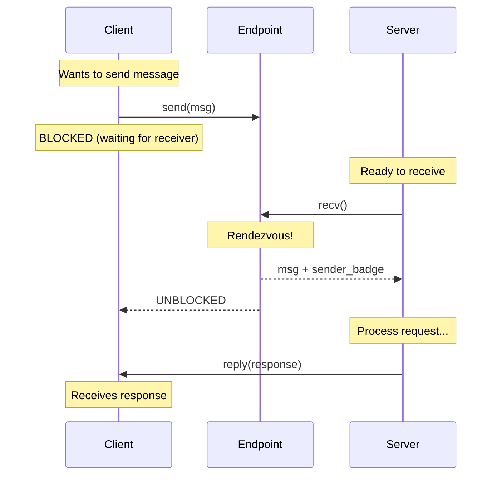

# IPC Design

This document describes the Inter-Process Communication system in SaltyOS.

## Overview

SaltyOS implements two IPC primitives:

1. **Endpoints**: Synchronous, rendezvous-style message passing
2. **Notifications**: Lightweight asynchronous signaling

This dual-primitive design follows the L4/seL4 tradition, providing both reliable message passing and efficient event notification.

## Synchronous IPC (Endpoints)

### Concept

An Endpoint is a kernel object that facilitates synchronous message passing between threads:

- **Rendezvous**: Sender blocks until receiver is ready (and vice versa)
- **Zero-copy potential**: Large transfers via page donation
- **Badge**: Identifies sender to receiver



### Endpoint Structure

```rust
/// Synchronous IPC Endpoint
pub struct Endpoint {
    /// Queue of waiting senders
    send_queue: ThreadQueue,
    
    /// Queue of waiting receivers  
    recv_queue: ThreadQueue,
    
    /// Current state
    state: EndpointState,
}

#[derive(Clone, Copy, PartialEq)]
pub enum EndpointState {
    /// No threads waiting
    Idle,
    /// One or more senders waiting
    SendBlocked,
    /// One or more receivers waiting
    RecvBlocked,
}

impl Endpoint {
    pub fn new() -> Self {
        Self {
            send_queue: ThreadQueue::new(),
            recv_queue: ThreadQueue::new(),
            state: EndpointState::Idle,
        }
    }
}
```

### IPC Message Format

```rust
/// IPC Message stored in thread's IPC buffer
#[repr(C)]
pub struct IpcMessage {
    /// Message label (operation identifier)
    pub label: u64,
    
    /// Number of capability slots transferred
    pub caps_transferred: u8,
    
    /// Number of extra capability slots (for receiving)
    pub caps_unwrapped: u8,
    
    /// Reserved
    _reserved: [u8; 6],
    
    /// Message registers (MR0-MR3)
    pub mrs: [u64; 4],
    
    /// Extra words (for longer messages)
    pub extra: [u64; IPC_EXTRA_WORDS],
}

/// Maximum message size in words
pub const IPC_MAX_WORDS: usize = 4 + IPC_EXTRA_WORDS;
pub const IPC_EXTRA_WORDS: usize = 16;
```

### IPC Buffer

Each thread has an IPC buffer page mapped at a known virtual address:

```
┌─────────────────────────────────────────────┐
│              IPC Buffer (4KB)                │
├─────────────────────────────────────────────┤
│  Offset 0x000: IpcMessage structure          │
├─────────────────────────────────────────────┤
│  Offset 0x100: Capability receive slots      │
│               (up to 16 caps)                │
├─────────────────────────────────────────────┤
│  Offset 0x200: Extended message data         │
│               (for large messages)           │
├─────────────────────────────────────────────┤
│  Offset 0x800: Reserved                      │
└─────────────────────────────────────────────┘
```

### Operations

#### Send

```rust
/// Send a message through an endpoint
pub fn sys_send(
    tcb: &mut Tcb,
    endpoint_cap: CapPtr,
    msg_info: u64,
) -> SyscallResult {
    // Look up endpoint capability
    let cap = tcb.cspace.lookup(endpoint_cap)?;
    
    if cap.cap_type != CapType::Endpoint {
        return Err(SyscallError::InvalidCapability);
    }
    
    if !cap.rights.contains(CapRights::SEND) {
        return Err(SyscallError::InsufficientRights);
    }
    
    let endpoint = unsafe { &mut *(cap.object as *mut Endpoint) };
    let badge = cap.badge;
    
    do_send(tcb, endpoint, badge, msg_info)
}

fn do_send(
    sender: &mut Tcb,
    endpoint: &mut Endpoint,
    badge: u64,
    msg_info: u64,
) -> SyscallResult {
    match endpoint.state {
        EndpointState::Idle | EndpointState::SendBlocked => {
            // No receiver ready - block sender
            sender.state = ThreadState::BlockedOnSend { 
                endpoint: endpoint.as_ref() 
            };
            endpoint.send_queue.push(sender);
            endpoint.state = EndpointState::SendBlocked;
            
            // Yield to scheduler
            schedule();
            
            // When we return, message has been delivered
            Ok(0)
        }
        
        EndpointState::RecvBlocked => {
            // Receiver is waiting - immediate transfer
            let receiver = endpoint.recv_queue.pop().unwrap();
            
            // Transfer message
            transfer_ipc_message(sender, receiver, badge, msg_info);
            
            // Wake receiver
            receiver.state = ThreadState::Ready;
            scheduler::make_runnable(receiver);
            
            // Update endpoint state
            if endpoint.recv_queue.is_empty() {
                endpoint.state = EndpointState::Idle;
            }
            
            Ok(0)
        }
    }
}
```

#### Receive

```rust
/// Receive a message from an endpoint
pub fn sys_recv(
    tcb: &mut Tcb,
    endpoint_cap: CapPtr,
) -> SyscallResult {
    let cap = tcb.cspace.lookup(endpoint_cap)?;
    
    if cap.cap_type != CapType::Endpoint {
        return Err(SyscallError::InvalidCapability);
    }
    
    if !cap.rights.contains(CapRights::RECV) {
        return Err(SyscallError::InsufficientRights);
    }
    
    let endpoint = unsafe { &mut *(cap.object as *mut Endpoint) };
    
    do_recv(tcb, endpoint)
}

fn do_recv(
    receiver: &mut Tcb,
    endpoint: &mut Endpoint,
) -> SyscallResult {
    match endpoint.state {
        EndpointState::Idle | EndpointState::RecvBlocked => {
            // No sender ready - block receiver
            receiver.state = ThreadState::BlockedOnReceive { 
                endpoint: endpoint.as_ref() 
            };
            endpoint.recv_queue.push(receiver);
            endpoint.state = EndpointState::RecvBlocked;
            
            // Yield to scheduler
            schedule();
            
            // When we return, message is in IPC buffer
            // Return badge from sender
            Ok(receiver.ipc_badge)
        }
        
        EndpointState::SendBlocked => {
            // Sender is waiting - immediate transfer
            let sender = endpoint.send_queue.pop().unwrap();
            let badge = sender.ipc_badge;
            
            // Transfer message
            transfer_ipc_message(sender, receiver, badge, sender.ipc_msg_info);
            
            // Wake sender
            sender.state = ThreadState::Ready;
            scheduler::make_runnable(sender);
            
            // Update endpoint state
            if endpoint.send_queue.is_empty() {
                endpoint.state = EndpointState::Idle;
            }
            
            Ok(badge)
        }
    }
}
```

#### Call (Send + Receive)

```rust
/// Send and wait for reply (RPC pattern)
pub fn sys_call(
    tcb: &mut Tcb,
    endpoint_cap: CapPtr,
    msg_info: u64,
) -> SyscallResult {
    let cap = tcb.cspace.lookup(endpoint_cap)?;
    
    if !cap.rights.contains(CapRights::CALL) {
        return Err(SyscallError::InsufficientRights);
    }
    
    let endpoint = unsafe { &mut *(cap.object as *mut Endpoint) };
    
    // Set up reply capability
    let reply_cap = create_reply_cap(tcb);
    
    // Include reply cap in message
    tcb.ipc_buffer.set_reply_cap(reply_cap);
    
    // Send the message
    do_send(tcb, endpoint, cap.badge, msg_info)?;
    
    // Wait for reply (blocked on one-shot reply endpoint)
    wait_for_reply(tcb)
}
```

#### Reply + Receive

```rust
/// Reply to caller and wait for next request
pub fn sys_reply_recv(
    tcb: &mut Tcb,
    endpoint_cap: CapPtr,
    msg_info: u64,
) -> SyscallResult {
    // Reply to saved caller
    if let Some(caller) = tcb.saved_caller.take() {
        transfer_ipc_message(tcb, caller, 0, msg_info);
        caller.state = ThreadState::Ready;
        scheduler::make_runnable(caller);
    }
    
    // Now receive next request
    sys_recv(tcb, endpoint_cap)
}
```

### Message Transfer

```rust
fn transfer_ipc_message(
    sender: &Tcb,
    receiver: &mut Tcb,
    badge: u64,
    msg_info: u64,
) {
    let msg_length = (msg_info & 0x7F) as usize;
    let caps_count = ((msg_info >> 7) & 0x7) as usize;
    
    // Copy message registers
    let src = &sender.ipc_buffer.mrs;
    let dst = &mut receiver.ipc_buffer.mrs;
    
    for i in 0..msg_length.min(4) {
        dst[i] = src[i];
    }
    
    // Copy extra words if needed
    if msg_length > 4 {
        let src_extra = &sender.ipc_buffer.extra;
        let dst_extra = &mut receiver.ipc_buffer.extra;
        
        for i in 0..(msg_length - 4).min(IPC_EXTRA_WORDS) {
            dst_extra[i] = src_extra[i];
        }
    }
    
    // Transfer capabilities
    for i in 0..caps_count {
        transfer_cap(sender, receiver, i);
    }
    
    // Set badge for receiver
    receiver.ipc_badge = badge;
    receiver.ipc_msg_info = msg_info;
}
```

## Notifications

### Concept

Notifications provide lightweight, asynchronous signaling:

- **Word-sized bitmap or counter**: Very small kernel object
- **Non-blocking signal**: Sender never blocks
- **Coalescing**: Multiple signals merge into one

Use cases:
- IRQ delivery
- Event flags
- Semaphores
- Waking async waiters

### Notification Structure

```rust
/// Asynchronous notification object
pub struct Notification {
    /// Notification word (bitmap or counter)
    word: AtomicU64,
    
    /// Thread waiting on this notification (if any)
    waiting: Option<TcbRef>,
}

impl Notification {
    pub fn new() -> Self {
        Self {
            word: AtomicU64::new(0),
            waiting: None,
        }
    }
}
```

### Operations

#### Signal

```rust
/// Signal a notification (set bits)
pub fn sys_signal(
    tcb: &mut Tcb,
    notif_cap: CapPtr,
    bits: u64,
) -> SyscallResult {
    let cap = tcb.cspace.lookup(notif_cap)?;
    
    if cap.cap_type != CapType::Notification {
        return Err(SyscallError::InvalidCapability);
    }
    
    if !cap.rights.contains(CapRights::WRITE) {
        return Err(SyscallError::InsufficientRights);
    }
    
    let notif = unsafe { &*(cap.object as *const Notification) };
    
    // Atomically OR bits into notification word
    notif.word.fetch_or(bits, Ordering::SeqCst);
    
    // Wake waiting thread if any
    if let Some(waiter) = notif.waiting.take() {
        waiter.state = ThreadState::Ready;
        scheduler::make_runnable(waiter);
    }
    
    Ok(0)
}
```

#### Wait

```rust
/// Wait on a notification
pub fn sys_wait(
    tcb: &mut Tcb,
    notif_cap: CapPtr,
) -> SyscallResult {
    let cap = tcb.cspace.lookup(notif_cap)?;
    
    if cap.cap_type != CapType::Notification {
        return Err(SyscallError::InvalidCapability);
    }
    
    if !cap.rights.contains(CapRights::READ) {
        return Err(SyscallError::InsufficientRights);
    }
    
    let notif = unsafe { &mut *(cap.object as *mut Notification) };
    
    // Try to consume notification
    let word = notif.word.swap(0, Ordering::SeqCst);
    
    if word != 0 {
        // Notification was pending - return immediately
        return Ok(word);
    }
    
    // No notification - block
    tcb.state = ThreadState::BlockedOnNotification { 
        notification: notif.as_ref() 
    };
    notif.waiting = Some(tcb.as_ref());
    
    schedule();
    
    // When we wake, return the notification word
    Ok(notif.word.swap(0, Ordering::SeqCst))
}
```

### Combined Notification + Endpoint Wait

A thread can bind a notification to itself, allowing simultaneous wait on both:

```rust
/// Wait on endpoint OR bound notification
pub fn sys_recv_with_notification(
    tcb: &mut Tcb,
    endpoint_cap: CapPtr,
) -> SyscallResult {
    // Check bound notification first
    if let Some(notif) = &tcb.bound_notification {
        let word = notif.word.swap(0, Ordering::SeqCst);
        if word != 0 {
            // Notification ready - return it
            return Ok(word | NOTIFICATION_FLAG);
        }
    }
    
    // Fall through to normal receive
    sys_recv(tcb, endpoint_cap)
}
```

## IPC Fastpath

For performance, common IPC cases use an optimized fastpath:

### Fastpath Conditions

1. Send to endpoint with receiver waiting
2. No capability transfer
3. Message fits in registers (≤ 4 words)
4. No other threads at higher priority
5. Receiver not in same security domain (would be direct call)

### Fastpath Implementation

```rust
#[inline(always)]
fn ipc_fastpath(
    sender: &mut Tcb,
    endpoint: &mut Endpoint,
    badge: u64,
) -> bool {
    // Check fastpath conditions
    if endpoint.state != EndpointState::RecvBlocked {
        return false;
    }
    
    let receiver = endpoint.recv_queue.peek().unwrap();
    
    // Check no caps transferred
    if sender.ipc_buffer.caps_transferred != 0 {
        return false;
    }
    
    // Check message fits in registers
    if sender.ipc_msg_info & 0x7F > 4 {
        return false;
    }
    
    // Fastpath!
    endpoint.recv_queue.pop();
    
    // Direct register transfer
    receiver.context.regs[0] = sender.context.regs[0];  // MR0
    receiver.context.regs[1] = sender.context.regs[1];  // MR1
    receiver.context.regs[2] = sender.context.regs[2];  // MR2
    receiver.context.regs[3] = sender.context.regs[3];  // MR3
    receiver.context.regs[4] = badge;
    receiver.context.regs[5] = sender.ipc_msg_info;
    
    // Direct context switch (skip scheduler)
    receiver.state = ThreadState::Running;
    sender.state = ThreadState::Ready;
    
    switch_to(receiver);
    
    true
}
```

## IRQ Handling

IRQs are delivered via notifications:


### IRQ Handler Object

```rust
pub struct IrqHandler {
    /// IRQ number
    irq: u32,
    
    /// Notification to signal on IRQ
    notification: Option<NotificationRef>,
    
    /// Is IRQ acknowledged?
    acked: bool,
}

impl IrqHandler {
    /// Set notification for IRQ delivery
    pub fn set_notification(&mut self, notif: NotificationRef) {
        self.notification = Some(notif);
    }
    
    /// Acknowledge IRQ (re-enable)
    pub fn ack(&mut self) {
        self.acked = true;
        arch::unmask_irq(self.irq);
    }
}
```

### IRQ Delivery

```rust
/// Called from interrupt handler
pub fn deliver_irq(irq: u32) {
    let handler = IRQ_HANDLERS[irq as usize];
    
    if let Some(notif) = &handler.notification {
        // Signal with IRQ bit
        notif.word.fetch_or(1 << (irq % 64), Ordering::SeqCst);
        
        // Wake waiter if any
        if let Some(waiter) = notif.waiting.take() {
            waiter.state = ThreadState::Ready;
            scheduler::make_runnable(waiter);
        }
    }
    
    // Mask IRQ until acked
    handler.acked = false;
    arch::mask_irq(irq);
}
```

## Userspace Async Patterns

Using sync IPC + notifications, userspace can build async patterns:

### Ring Buffer + Notification

```
┌──────────────────────────────────────────────────────────┐
│                    Shared Memory                          │
│  ┌────────────────────────────────────────────────────┐  │
│  │              Ring Buffer                            │  │
│  │  head ──► [msg0][msg1][msg2][msg3]... ◄── tail     │  │
│  └────────────────────────────────────────────────────┘  │
└──────────────────────────────────────────────────────────┘
           │                              ▲
           │ push                         │ pop
           ▼                              │
     ┌──────────┐                   ┌──────────┐
     │  Sender  │                   │ Receiver │
     └────┬─────┘                   └────┬─────┘
          │                              │
          │ signal(notification)         │ wait(notification)
          └──────────────────────────────┘
```

```rust
// Userspace async queue implementation

struct AsyncQueue {
    buffer: SharedMemory,
    notification: Notification,
}

impl AsyncQueue {
    fn send(&self, msg: &[u8]) -> Result<(), Error> {
        // Push to ring buffer
        self.buffer.push(msg)?;
        
        // Signal receiver
        syscall::signal(self.notification, 1);
        
        Ok(())
    }
    
    fn recv(&self) -> Result<Vec<u8>, Error> {
        loop {
            // Try to pop from buffer
            if let Some(msg) = self.buffer.pop() {
                return Ok(msg);
            }
            
            // Buffer empty - wait for signal
            syscall::wait(self.notification);
        }
    }
}
```

## Performance Considerations

### IPC Latency Goals

| Operation | Target Latency |
|-----------|---------------|
| Send/Recv (fastpath) | < 500 cycles |
| Send/Recv (slowpath) | < 2000 cycles |
| Notification signal | < 200 cycles |
| Notification wait | < 300 cycles |

### Optimization Techniques

1. **Fastpath**: Inline assembly for hot path
2. **Register passing**: Message in registers, not memory
3. **Direct switch**: Skip scheduler for IPC
4. **Lazy FPU**: Don't save FPU unless used
5. **No allocation**: All structures pre-allocated
