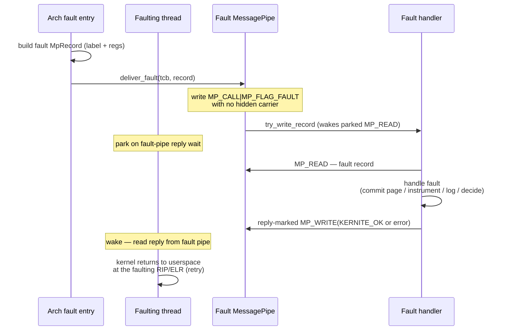

# IPC Design

This document describes the Inter-Process Communication system in
SaltyOS / kernite.

## Overview

kernite is a Fuchsia-style edge microkernel: every cross-process
communication primitive is a kernel object reached through the
single `KERNITE_SYS_INVOKE` syscall. There is no rendezvous-style
endpoint, no asynchronous notification bitmap, and no kernel-side
multiplexing primitive. Instead, the IPC surface is decomposed
along three planes:

| Plane | Primitives | Concern |
|-------|-----------|---------|
| **IPC plane** | `MessagePipe` (records + cap carriers + `MP_CALL` / reply-marked `MP_WRITE`), `DataPipe` (byte stream / datagram), per-task fault `MessagePipe`, `Futex` | Synchronous data + cap transfer between threads |
| **Event plane** | `EventQueue` (bounded record ring), `Watch` (state-mask registration on a watchable object), `Timer` (ns-precision deadline arm) | Asynchronous state-change delivery |
| **Wait / wake plane** | `deadline_queue` (`Sleep` / `FutexTimed` / `IpcTimeout` / `TimerFire`), `WakeTransition` plans | Bounded blocking + timeout enforcement |

Cross-cutting:

- All transport objects use the **Core + Side** split: a
  `MessagePipeCore` / `DataPipeCore` carries the cross-side state
  (rings, locks, waiter queues, watcher lists), and two lightweight
  side handles each reference the same core. Closing one side
  asserts `STATE_PEER_CLOSED` on the other; reaping the last side
  reaps the core. There is no peer pointer between sides — every
  cross-side interaction routes through the core under its own
  lock, eliminating refcount cycles and use-after-reap on a half-
  closed channel.
- Capability transfer rides on **`CapRef` move semantics**: at
  `MP_WRITE` the kernel validates each carrier's `TRANSFER` right,
  `take_ref`s it out of the sender's CNode (sender slot becomes
  empty), and stores the moved `CapRef` in the message's hidden
  carrier array. The underlying global slot's CDT linkage and
  object refcount are untouched. At `MP_READ` the receiver's
  install path `insert_ref`s each carrier into the receiver's
  CNode. On install failure the message stays at the head of the
  ring and the carriers are rolled back via the canonical
  `CDT::delete_capability` teardown if reinsertion races a sibling
  thread that filled the sender slot.
- Every blocking transport syscall honours an `IpcBuffer.timeout_ns`
  knob: `0` = non-blocking (`KERNITE_ERR_WOULD_BLOCK`), `u64::MAX`
  = wait forever, finite = arm an `IpcTimeout` deadline so the
  syscall returns `KERNITE_ERR_TIMED_OUT` if the wake doesn't
  arrive in time.

## Implementation Status

| Feature | Status |
|---------|--------|
| `MessagePipe` `MP_WRITE` / `MP_READ` / `MP_CLOSE` | Implemented |
| `MessagePipe` `MP_CALL` / reply-marked `MP_WRITE` | Implemented |
| `MessagePipe` cross-CPU `try_write_fast` (mailbox publish) | Implemented |
| `MessagePipeCore` / `DataPipeCore` retype + `MP_PAIR` / `DP_PAIR` | Implemented |
| `DataPipe` `DP_PRODUCE` / `DP_CONSUME` (peek-then-commit) / `DP_QUERY` / `DP_CLOSE` | Implemented |
| `DataPipe` datagram mode + RX/TX thresholds + half-close (`DP_SHUTDOWN`) | Implemented |
| `EventQueue` `EQ_WAIT` / `EQ_POLL` / `EQ_CANCEL` | Implemented |
| `Watch` `WATCH_REGISTER` / `WATCH_DISARM` (one-shot, lost-wakeup-free) | Implemented |
| `Timer` `TIMER_SET` / `TIMER_CANCEL` / `TIMER_QUERY` (one-shot + periodic) | Implemented |
| Per-task fault `MessagePipe` (`TCB_SET_FAULT_PIPE`) | Implemented |
| Capability transfer via IPC carrier array | Implemented |
| `IpcTimeout` deadline integration | Implemented |
| Futex (wait / wake / requeue, optional `IpcTimeout`) | Implemented |
| v1 IPC fastpath (`MP_WRITE` → mailbox publish to peer parked on `PipeRead`) | Implemented |
| Full assembly fastpath retarget (Send / Recv / Call / ReplyRecv) | Pending (`F` step) |

## Single Syscall — `KERNITE_SYS_INVOKE`

Every operation is a capability invocation. `KERNITE_SYS_INVOKE`
takes `(cap_ptr, msg_info, mr0, mr1, mr2, mr3)`. The `msg_info`
word packs the invoke label + register count + extra-cap count;
the per-object handler in `syscall/{pipe, event, mo, vspace, tcb,
cap, sc, ioport, system, misc}.rs` reads inline MR overflow from
the calling thread's IPC buffer.

Invoke labels are blocked into 0x20-stride hex regions per object
type (see `kernite/include/uapi/invoke.h`). Dispatch keys on
`(cap.obj_type, label)`; two object types may share a label hex
slot since dispatch is type-disambiguated.

## MessagePipe

`MessagePipe` is the synchronous record-passing channel. Userland
retypes one `MessagePipeCore` and two `MessagePipe` sides from an
untyped, then calls `MP_PAIR(core_cap, side_a_cap, side_b_cap)` to
wire them — each side bumps the core's refcount by one.

### Record layout

```rust
#[repr(C)]
pub struct MpRecord {
    pub label: u64,
    pub length: u64,
    pub cap_count: u64,
    pub flags: u64,    // KERNITE_MP_FLAG_* (CALL / REPLY / fault hint)
    pub badge: u64,
    pub words: [u64; MP_MSG_WORDS],
}
```

The wire layout matches `kernite_mp_record` in `uapi/ipc.h`. Each
ring slot pairs an `MpRecord` with a `[CapRef; MP_MSG_CAPS]`
carrier array; the pairing is invisible to userspace (the receiver
sees only the install slots' indices).

### Operations

- **`MP_WRITE`** — non-blocking enqueue per attempt; the syscall
  layer drives a retry loop with `block_writer_with_timeout` so
  `timeout_ns` can park the caller on the writer waiter queue with
  an `IpcTimeout` deadline. `TryWriteErr::PeerClosed` surfaces
  immediately as `KERNITE_ERR_PEER_CLOSED`; `TryWriteErr::WouldBlock`
  becomes `KERNITE_ERR_WOULD_BLOCK` (timeout=0) or parks the
  caller.
- **`MP_READ`** — fastpath drains the caller's `MpFastMailbox`
  first (5-state CAS protocol pinning the source via refcount).
  Otherwise `peek_and_claim` reserves the head ring slot under the
  core lock, the syscall layer runs the install closure
  **outside** the lock so it can take `CAP_LOCK` to walk the
  receiver CNode, and `pop_claimed` advances the head only if the
  install succeeded. Install failure writes the (possibly
  partially-rolled-back) carrier snapshot back via
  `release_claim_with_carriers` so the next reader sees the
  surviving `CapRef`s.
- **`MP_CLOSE`** — asserts `STATE_CLOSED` on this side and
  `STATE_PEER_CLOSED` on the other, drains both sides' waiter
  queues, and republishes state to any registered watches. The
  ring carriers are NOT cleaned here (CAP_LOCK ordering forbids
  taking it under the core lock); the `MessagePipeCore` finalizer
  drains them via `drain_carriers_via_cdt` when the core's
  refcount reaches zero.
- **`MP_CALL` / reply-marked `MP_WRITE`** — see the next section.

### Cross-CPU `try_write_fast`

When the peer side already has a thread parked on `PipeRead`, the
fastpath skips the bounded ring entirely: it pins the `MessagePipeCore`
via refcount, publishes the `MpRecord` into the parked thread's
`mp_fast_mailbox` (`MailboxKind::Message`) under a 5-state CAS
protocol, and dispatches the wake plan (which handles same- or
cross-CPU IPI). Bailouts: `record.cap_count != 0`,
`record.length > 4`, unpaired pipe, side closed, or no waiter
parked — in all cases the caller's record is untouched and the
slowpath retries.

## MP_CALL / reply-marked MP_WRITE

`MP_CALL` is a synchronous convenience over `MessagePipe`: the
caller writes a request record with `KERNITE_MP_FLAG_CALL` and a
kernel-generated transaction id, then blocks as a call waiter. A
server reads the request with `MP_READ`, captures `mp_txid`, and
answers with a reply-marked `MP_WRITE` carrying the same txid in the
IPC buffer metadata.

No separate reply object or reply syscall exists. The txid is only a
message-header correlation field: matching replies complete the
blocked caller directly, while unmatched reply-marked writes remain
ordinary queued records for the peer to read later. This follows the
Zircon channel-call shape more closely than a one-shot reply-cap
object.

Transaction-id ranges follow Zircon's split so sync and async traffic
share one pipe without collision: the kernel allocates `MP_CALL` txids
in the reserved **high** range (`KERNITE_MP_TXID_KERNEL_BIT`, bit 63
set), while userspace `MP_WRITE` request/reply correlation txids must
stay in the **low** range (bit clear). `txid == 0` is the
"no correlation" sentinel (also used by kernel fault delivery). A
userspace write that forges a high-range txid is rejected, so an async
write can never spoof a reply to a parked sync caller.

`MP_CALL` order of operations:

1. Validate per-message cap budget (`cap_count <= MP_MSG_CAPS`) and
   move outgoing carrier caps into kernel-owned carrier slots.
2. Mark the request record with `KERNITE_MP_FLAG_CALL` and the
   sender cap badge, allocate a non-zero txid, and register the
   caller as a waiter for that txid.
3. `try_call_write_record` retry loop. `PeerClosed` or timeout rolls
   the carriers back into the caller's CSpace.
4. Wait until a reply-marked write with the same txid arrives, then
   copy that reply record into the caller's IPC buffer.

`reply-marked MP_WRITE` order of operations:

1. Build an ordinary `MpRecord`.
2. Set `KERNITE_MP_FLAG_REPLY`, copy the saved txid into
   `ipc_buffer.mp_txid`, and send with `MP_WRITE`.
3. If the txid matches a blocked caller, complete that waiter
   directly. Otherwise enqueue the record on the peer side using the
   same carrier-transfer path as ordinary `MP_WRITE`.

## DataPipe

Bulk byte stream channel. Same Core + Side split as MessagePipe;
no carrier arrays.

Operations: `DP_PRODUCE` (byte/record append) / `DP_CONSUME`
(byte/record drain) / `DP_QUERY` (pending byte count + state) /
`DP_CLOSE` / `DP_SET_RX_THRESHOLD` / `DP_SET_TX_THRESHOLD` /
`DP_SHUTDOWN`. The transport mode (byte stream vs datagram) is fixed at
`DP_PAIR` time.

`DP_CONSUME` uses a **peek-then-commit** protocol so a userspace
copy fault (EFAULT) does not lose ring data:

1. `try_consume_chunk` copies bytes from the head into a kernel
   staging buffer **without** advancing the head.
2. Syscall layer copies staging → user buffer.
3. On user-copy success, `commit_consume(n)` advances the head and
   republishes `STATE_WRITABLE` to the peer.
4. On user-copy failure, the syscall returns `Ok(consumed_so_far)`
   or `BadAddress`; the head stays put and the next read attempt
   sees the same data.

Producer side (`DP_PRODUCE`) uses the simpler push model — bytes
go from a kernel staging buffer into the ring under the core
lock; `try_produce_chunk` returns the byte count actually written
and the syscall layer iterates with `block_dp_writer_with_timeout`
on `WouldBlock`.

DataPipe sides are designed for **single-reader-per-side**
semantics; the cap-mediated layout makes each side a single-
consumer endpoint, so peek-then-commit is race-free against the
producer (different ring) and against itself (single reader).

**Datagram mode** (`zx_socket` DATAGRAM parity) is selected at
`DP_PAIR` time. Each record is length-prefixed (`[u32 len][payload]`)
in the same ring: `DP_PRODUCE` writes one frame atomically
(`WouldBlock` if it does not fit — a datagram is never split) and
`DP_CONSUME` returns exactly one record, truncating to the caller's
buffer while still dropping the whole frame. Max payload is
`DATA_PIPE_MAX_DATAGRAM`.

**RX/TX thresholds** (`DP_SET_RX_THRESHOLD` / `DP_SET_TX_THRESHOLD`,
`0` disables) drive the watchable `STATE_READ_THRESHOLD` /
`STATE_WRITE_THRESHOLD` signals: read-threshold asserts while inbound
`used >= rx`, write-threshold while outbound `free >= tx` — Zircon
`ZX_SOCKET_*_THRESHOLD` parity for backpressure hints.

**Half-close** (`DP_SHUTDOWN`, `zx_socket_set_disposition` parity)
disables one direction: further produce on that side returns
`PeerClosed` and the peer reader drains the ring then sees EOF, while
the reverse direction stays open.

## EventQueue + Watch

`EventQueue` is a bounded record ring with a dropped-event counter.
Userland sizes it at retype time. `EQ_WAIT` / `EQ_POLL` drain the
ring (one record at a time); the queue's own state is itself
watchable, so a thread can wait on multiple EventQueues by
arming `Watch`es against them and waiting on a parent EQ.

`Watch` is a retypable kernel object that registers a `(state_mask,
EventQueue, cookie)` triple against a watchable target object.
When the target's `state_flags` transition asserts any bit in
`state_mask`, the kernel atomically (1) detaches the watch from
the target's `WatcherList` if `one_shot`, (2) bumps the watch's
`KernelObject` refcount across the fire dispatch, (3) enqueues an
`EVENT_TYPE_OBJECT_WATCH` record into the bound EventQueue. The
fire is **lost-wakeup-free**: the assert and the watch list walk
share the target's lock, so a watch registered while the bit was
already set fires immediately on registration.

Watchable objects (each with a `state_flags: AtomicU64` + a
`WatcherList`):

- `MessagePipe` (per-side): `READABLE / WRITABLE / PEER_CLOSED /
  CLOSED`.
- `DataPipe` (per-side): same.
- `EventQueue`: `READABLE` (records pending), `OVERRUN`.
- `IrqHandler`: `SIGNALED` (IRQ fired, awaiting `IRQ_ACK`).
- `Timer`: transient `SIGNALED` on each fire.

`IRQ_BIND_EQ` pins a refcount on the bound EventQueue so the
`dispatch_irq` path in interrupt context can dereference
`bound_eq` without locking. `IRQ_UNBIND_EQ` releases the pin.

## Timer

`Timer` arms an absolute monotonic ns deadline via `TIMER_SET`,
optionally with `period_ns` for periodic schedules (with missed-
period coalescing — if the dispatcher catches up `N` periods
behind, it advances to the next future deadline rather than tight-
looping). `TIMER_QUERY` reports the remaining ns to fire.

Fires enqueue an `EVENT_TYPE_TIMER` record into the bound
EventQueue and assert `STATE_SIGNALED` (transient — cleared at the
end of fire so the next periodic publish fires watchers again).

The timer object's deadline + `bound_eq` mutate under the timer's
own lock; the deadline queue's membership pin is bumped via
`KernelObject.ref_count` so a concurrent `cancel` on another CPU
cannot release the EventQueue ref while a fire is still using it.

## Fault delivery (reply-to-resume)

A thread can install a fault `MessagePipe` via
`TCB_SET_FAULT_PIPE`. When the thread takes a fault that the
kernel cannot service inline (page fault without an MO mapping,
illegal instruction, breakpoint trap, OOM during commit,
user-issued fault intent), the arch fault handler builds an
`MpRecord` carrying the fault label + diagnostic regs and hands
the faulting thread to `ipc::fault::deliver_fault`.

Fault delivery is **`MP_CALL`-shaped, not fire-and-forget**: the
kernel writes the fault record with `KERNITE_MP_FLAG_CALL |
KERNITE_MP_FLAG_FAULT`, parks the faulting thread on the bound
fault pipe, and waits for a reply record on the same pipe. A reply
with label `KERNITE_OK` resumes the faulting instruction; any
non-OK, malformed reply, or closed fault pipe escalates to thread
destroy.

### Delivery sequence



### Handler-side outcomes

The handler chooses the resumption policy by the reply it sends:

- **`reply-marked MP_WRITE` with `KERNITE_OK`** → caller resumes. The arch fault handler
  returns to userspace at the *original* faulting RIP/ELR with
  the original register state, so the same instruction is
  retried. The handler is expected to have made the retry safe
  before replying OK (e.g., committed the missing page via
  `VSPACE_MAP_MO`, set up CoW, mapped a stack-extension MO).
  Reply payload is currently informational only.
- **`reply-marked MP_WRITE` with any non-OK label** → kernel destroys the
  faulting thread.
- **No reply** (handler exits or the fault pipe closes) → kernel
  destroys the faulting thread. Same effect as an explicitly
  rejected fault reply.
- **`TCB_KILL` against the faulting thread** → handler kills the
  thread directly; the faulter never resumes.

### `deliver_fault` semantics

`deliver_fault(tcb, record)` runs in the arch fault entry path
(EL1 exception or x86 IDT vector) and is responsible for the
publish-and-wait dance the same way `MP_CALL` is in the syscall
path:

1. If `tcb.fault_pipe` is null, return `false` — the arch handler
   escalates to `begin_destroy` immediately.
2. Mark the fault record `MP_CALL | MP_FLAG_FAULT`, with no cap
   carriers.
3. `try_write_record` against the fault pipe. On `PeerClosed` or
   `WouldBlock`, return `false`.
4. Park `tcb` on the fault pipe's reader wait path and reschedule.

When the parked faulter wakes, the arch return path reads a reply
record:

- `reply-marked MP_WRITE` with label `KERNITE_OK` → return to userspace with
  original register state — instruction retry.
- Any other outcome → hand off to `begin_destroy`.

Fault label set lives in `kernite/include/uapi/fault.h`
(`KERNITE_FAULT_NONE / PAGE_FAULT / ILLEGAL_INSTRUCTION /
BREAKPOINT / USER_EXCEPTION / OOM / CAP`). Fault replies currently
use `KERNITE_OK` for resume and any non-OK label for abort.

## IPC timeout integration

Every blocking transport block path (`block_writer_with_timeout`,
`block_reader_with_timeout`, `block_dp_writer_with_timeout`,
`block_dp_reader_with_timeout`) follows the same template:

1. Read `timeout_ns` from the caller's IPC buffer.
   - `0` → return `WouldBlock` immediately.
   - `u64::MAX` → no deadline armed.
   - finite → arm `arm_thread_ipc_timeout(current, now + timeout)`.
2. Push the caller onto the pipe's writer / reader waiter queue
   via `enqueue_*_waiter` (which takes the queue's own
   `sched_ref` pin) — block path itself does NOT take an extra
   pin.
3. `reschedule()`.
4. After wake: `cancel_thread(current)` drops any unfired
   deadline-queue pin (no-op if the deadline already fired).
5. If `futex_wakeup_result == TimedOut`, the deadline fired —
   call `MessagePipeCore::detach_waiter` /
   `DataPipeCore::detach_waiter` to remove the (possibly stale)
   waiter from the pipe queue. Per
   `WakeTransition::PipeWait`'s contract, the deadline dispatch
   only runs the wake plan; the waiter unlink is the caller's
   responsibility.

`sched_ref` accounting: each queue (pipe waiter + deadline) takes
its own pin internally; the wake path that fires releases its
pin via `wake_thread` (pipe queue) or `sched_ref_release_may_destroy`
(deadline dispatch). Block helpers do not double-pin.

## Userland reactor: async cross-service queries

SaltyOS userland servers are single-threaded `EventQueue`-driven
reactors. A reactor handler that makes a blocking `MP_CALL` to a peer
**which can itself block on this reactor** deadlocks the pair. The
canonical instance is **init ↔ VFS**: init's reactor blocks on VFS
during `spawn` / `fork` / `exec`, so a VFS handler must never block on
init. The invariant:

> No VFS `EventLoop` handler may make a blocking `mp_call` to init.

A synchronous call to an *always-replying* peer that never depends on
the VFS reactor's progress is fine; only the cyclic edge is forbidden.

VFS `/proc`, `kern.proc.*`, and ctty reads need init-owned process-table
data, so they are **async-parked** (`core/vfs/src/owner/init_rpc.rs`):

1. The read VOP allocates a per-read **snapshot** in
   `VfsState.init_snapshots`, parks the client's reply-lease on it, and
   fires the first sub-query with a non-blocking `mp_write_request_ctx`
   carrying a low-range correlation `tx_id` (= the kernel `mp_txid`).
   The VOP returns `Parked`; the reactor keeps running.
2. init's reply rides the `KIND_INIT_REPLY` watch on VFS's init pipe and
   is demuxed by `tx_id` (the per-query `PendingOp`'s `Resume::Init`
   points back at the snapshot + plan stage) — **not** through the
   backend-session 5-tuple that saltyfs / netsrv replies use.
3. Each reply decodes into the snapshot; the chain issues the next plan
   step (or, for `kern.proc.*` listings, the next kinfo page) until the
   plan drains, then **re-enters the existing synchronous content
   generator** against the snapshot and emits via the parked lease.

Secondary attributes are joined from their own authorities during the
same decode pass, synchronously, because those peers are not in the
cycle: per-process memory from **mmsrv** (`MM_GET_CLIENT_VM_STATS`).

### Controlling-terminal join (dump-first)

A process's `tty_dev` (procfs `/proc/<pid>/stat` field 7, FreeBSD
`KinfoProc.tty_dev`, the `kern.proc.tty` filter) lives in the tty layer
— **posix_ttysrv** owns the session→pty binding — mirroring how a
monolithic kernel reads `signal->tty` during the proc-table walk. VFS
joins it, but posix_ttysrv delivers pty callbacks to VFS with a
*blocking* `mp_write`, so posix_ttysrv can block on VFS: a synchronous
VFS→ttysrv call would deadlock exactly like the init edge.

So tty-bearing reads are **dump-first**: before the init query runs, the
snapshot prefetches every active `(sid → tty_dev)` binding in one async
`POSIX_TTYSRV_CTTY_DUMP` round-trip (≤ `MAX_PTYS`, fits one record) and
caches them. `decode` then joins `tty_dev` locally per record from the
cache — so a filter keyed on it (`kern.proc.tty`) works in the same
pass, with no post-enrich fixup. The dump is best-effort: if
posix_ttysrv is unreachable the cache stays empty and records report
`tty_dev = 0` (honest "no controlling terminal"), never a hard failure.
The single-pid on-demand path (`VFS_GET_CTTY_DEV`, `open("/dev/tty")`)
keeps its own init→ttysrv async chain.

## Futex

Userspace futex on a `VSpace` cap (`VSPACE_FUTEX_WAIT` /
`VSPACE_FUTEX_WAKE` / `VSPACE_FUTEX_REQUEUE`). The wait key is the
`(VSpace, vaddr)` pair; the kernel hashes it to locate a wait bucket.
`BlockedReason` is `FutexBlocked` (no timeout) or `FutexTimedBlocked`
(timeout arm via `arm_thread_futex_timed`).

`VSPACE_FUTEX_REQUEUE` (`zx_futex_requeue` shape) wakes up to `N`
waiters on one futex and re-homes up to `M` of the remaining waiters
onto a second futex in the same `VSpace`, acquiring the two bucket
locks in ascending-index order to stay deadlock-free against an
opposing requeue.

Futexes are the building block for userspace mutexes, condition
variables, semaphores, and rwlocks in trona (see
`lib/trona/substrate/src/sync/`).

## Lock ordering

```
CAP_LOCK
  → mp_core.lock / dp_core.lock / eq.lock / tcb_lock   (per-object)
    → scheduler.lock_cpu                                (per-CPU)
      → VSpaceTracking.waiter_lock
        → VSpace.lock
          → MemoryObject.rmap_lock
            → MM_LOCK / FRAME_LOCK
```

Slowpath capture / install patterns nest the CAP_LOCK ↔ core lock
relationship deliberately:

- **`MP_WRITE` capture**: `read_current_ipc_word` (no lock) →
  `CAP_LOCK` → walk sender CNode + `take_ref` → release `CAP_LOCK`
  → `core.lock` for `try_write_record`.
- **`MP_READ` install**: `core.lock` for `peek_and_claim` →
  release → `CAP_LOCK` for `install_carriers_into_receiver` →
  release → `core.lock` for `pop_claimed` (or
  `release_claim_with_carriers` on install failure).
- **Drain on close**: `core.lock` (close / state mark / waiter
  drain) — carriers stay in the ring. The
  `MessagePipeCore` finalizer (refcount → 0, runs under
  `CAP_LOCK`) calls `drain_all_carriers` which walks both rings
  via the canonical `CDT::delete_capability` path.

## Performance Considerations

### v1 IPC fastpath

`MP_WRITE` against a `MessagePipe` whose peer is parked on
`PipeRead` skips the bounded ring entirely: the kernel pins the
`MessagePipeCore` via refcount, publishes the `MpRecord` into the
parked thread's `mp_fast_mailbox` under a 5-state CAS, and
dispatches the wake plan. Same- and cross-CPU wakes share the
plan — the wake helper handles IPI dispatch. Bailouts return the
caller's record untouched and the slowpath retries.

### Optimization techniques

1. **Connection-local replies** — `MP_CALL` publishes one request
   and immediately waits on the caller's side of the same
   `MessagePipe`; services use one connection per client or carry a
   transaction id in the payload for multiplexing.
2. **Register passing** — MR0..MR3 in CPU registers; MR4..MR19
   overflow through the IPC buffer.
3. **Per-thread mp_fast_mailbox** — 5-state CAS protocol pins the
   source via refcount across the publish-claim window, so the
   raw pointer is safe to dereference even if the source is
   reaped between publish and claim.
4. **No allocation in the hot path** — every per-call structure
   lives in pre-existing kernel storage (carrier rings, futex
   waiter slots, untyped-derived objects).
5. **Lost-wakeup-free Watch publication** — the assert and the
   watcher walk share the target's lock; a watch registered with
   `armed_state` already set fires on registration.

### Pending work

- Full IPC fastpath retarget at the assembly level (Send / Recv /
  Call / ReplyRecv) — currently only `MP_WRITE` has the
  cross-CPU mailbox fastpath; the legacy x86_64 `syscall.S`
  fastpath dispatch is being rewritten to route through the new
  primitives.
- `DataPipe` zero-copy (shared-memory backing via a separately
  retyped `MemoryObject`) — intentionally NOT a `DP_MAP` op on the
  DataPipe itself; the `MemoryObject` route keeps the byte-stream
  semantics decoupled from address-space mapping.
