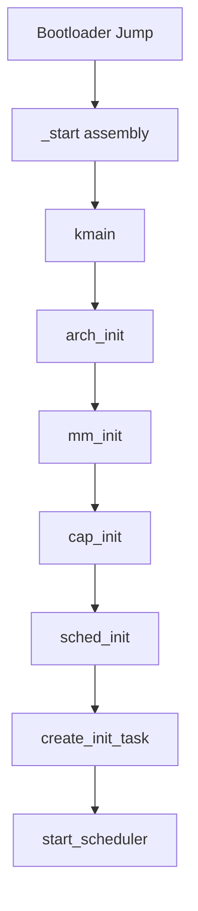

# Kernel Design

This document describes the SaltyOS microkernel architecture and implementation.

## Overview

The SaltyOS kernel is a capability-based microkernel written in Rust. It provides only the essential mechanisms required for a secure, multi-tasking system:

- Thread scheduling (4-class: Deadline, RT FIFO, Fair-EEVDF, Idle)
- Inter-process communication (MessagePipe, DataPipe, EventQueue, Watch)
- Memory management
- Capability-based access control
- Interrupt routing

All other services (filesystems, drivers, networking) run in userspace.
For POSIX compatibility, see [POSIX Compatibility Layer](posix.md).

## Design Principles

### Minimal Trusted Computing Base (TCB)

The kernel should be as small as possible while still providing necessary mechanisms:

| In Kernel | In Userspace |
|-----------|--------------|
| Thread/Scheduler | Service manager (init owns spawn/lifecycle) |
| IPC | Protocols/APIs |
| Memory mapping | Memory allocators |
| Capabilities | Access policies |
| IRQ delivery | Device drivers |
| Timer | Time services |

### No Dynamic Allocation

Following seL4's approach:
- All kernel objects are carved from untyped memory via `retype`
- No kernel heap, slab allocator, or `alloc` crate
- Objects are never freed (owned by parent untyped memory)
- No `Vec`, `Box`, `HashMap`, or `String` — only raw pointers, fixed-size arrays, and static storage
- Enables formal verification

### Bounded Execution Time

All system calls should have bounded worst-case execution time (WCET):
- No unbounded loops
- No dynamic allocation
- Predictable scheduling

## Kernel Components

### Module Structure

```
kernite/src/
├── lib.rs              # Crate root only: top-level module wiring
├── kernel/
│   ├── mod.rs          # Kernel-internal infrastructure plane
│   ├── printk.rs       # Serial / framebuffer printk and log macros
│   ├── panic.rs        # Unified panic, fatal exception, and state dump path
│   ├── bug.rs          # Always-on kernel BUG / assert macros
│   ├── build_info.rs   # Linked build identity and config hash
│   ├── kallsyms.rs     # In-kernel symbol lookup for text/data addresses
│   ├── stacktrace.rs   # Arch panic context capture and traceback printer
│   ├── unwind.rs       # Bounded DWARF CFI unwind helper with FP fallback
│   ├── time.rs         # Boot-time anchor and kernel time globals
│   └── random.rs       # Architecture-backed kernel random source
├── init/
│   ├── mod.rs          # Boot/init plane module entry
│   ├── main.rs         # kmain and init task bootstrap
│   ├── bootinfo.rs     # Boot info TLV parsing from bootloader
│   ├── cpio.rs         # CPIO archive parser for initrd
│   └── elf.rs          # ELF binary loader for init task
├── firmware/
│   ├── mod.rs          # Firmware table plumbing plane
│   └── acpi.rs         # ACPI table parsing shared above arch code
├── arch/
│   ├── mod.rs
│   ├── x86_64/
│   │   ├── mod.rs
│   │   ├── acpi.rs     # ACPI table parsing (MADT, FADT for shutdown)
│   │   ├── ap_boot.rs  # Application Processor startup
│   │   ├── ap_tramp.S  # AP trampoline (real → long mode)
│   │   ├── apic.rs     # Local APIC + I/O APIC + IPI messaging
│   │   ├── boot.rs     # BSP early boot (GDT/IDT/paging init)
│   │   ├── context.rs  # Context switch (save/restore x86_64 registers)
│   │   ├── cpu.rs      # CPU state, MSR access, per-CPU data
│   │   ├── cpuid.rs    # CPUID feature detection
│   │   ├── exceptions.S # IDT exception handlers
│   │   ├── fpu.rs      # FPU/SSE state save/restore (FXSAVE/FXRSTOR)
│   │   ├── gdt.rs      # GDT + TSS setup (per-CPU)
│   │   ├── idt.rs      # IDT setup + interrupt handlers
│   │   ├── paging.rs   # Page table manipulation (4-level)
│   │   ├── pit.rs      # PIT timer for APIC calibration
│   │   ├── smap.rs     # SMAP/SMEP enforcement
│   │   ├── syscall.S   # Syscall entry/exit, IPC fastpath
│   │   └── uaccess.rs  # User memory access helpers (SMAP-safe copy)
│   └── aarch64/
│       ├── mod.rs
│       ├── ap_boot.rs  # Application Processor startup (PSCI CPU_ON)
│       ├── boot.rs     # BSP early boot (EL2→EL1 drop, MMU setup)
│       ├── context.rs  # Context switch (save/restore aarch64 registers)
│       ├── cpu.rs      # CPU state, system registers, per-CPU data
│       ├── exceptions.rs # Exception vector table handlers
│       ├── fpsimd.S    # NEON/FP register save/restore assembly
│       ├── fpu.rs      # FPU/NEON lazy context switch (CPACR_EL1 trap)
│       ├── gic.rs      # GICv3 (distributor, redistributor, CPU interface)
│       ├── paging.rs   # Page table manipulation (TTBR0/TTBR1)
│       ├── pl011.rs    # PL011 UART driver for serial console
│       ├── psci.rs     # PSCI interface (CPU_ON, SYSTEM_OFF via HVC)
│       └── timer.rs    # Generic timer (CNTP, PPI 30, 10ms tick)
├── cap/
│   ├── mod.rs          # Capability struct (32-byte fat cap), CapRights
│   ├── cdt.rs          # Capability Derivation Tree
│   ├── cnode.rs        # CNode (capability table, 4-16 bit slots)
│   ├── ioport.rs       # I/O port range capabilities
│   ├── memory_object.rs # MemoryObject (radix tree pages, COW, reverse maps)
│   ├── object.rs       # ObjectType enum (25 types, gap at 22), KernelObject header
│   ├── refcount.rs     # Object reference counting
│   ├── slot.rs         # Slot allocation/access helpers
│   └── untyped.rs      # Untyped memory: per-object multi-class freelist
                        #   + watermark allocator + object-level children
                        #   registry (`child_head` on UntypedMemory plus
                        #   `parent_ut` + `hlist` sibling links on every
                        #   KernelObject). carve_block / release_block
                        #   primitives shared by cap retype and MO_COMMIT.
├── console/
│   ├── mod.rs          # Kernel console output multiplexer
│   ├── fb.rs           # Framebuffer console driver
│   └── font.rs         # Built-in 8x16 bitmap font
├── ipc/
│   ├── mod.rs          # IpcBuffer layout (shared user/kernel page)
│   ├── message_pipe.rs # MessagePipe Core+Side (records, cap carriers, MpFastMailbox)
│   ├── data_pipe.rs    # DataPipe Core+Side (byte ring, peek-then-commit)
│   ├── fault.rs        # Per-task fault MessagePipe (reply-to-resume: OK reply → retry, non-OK / close → destroy)
│   ├── transfer.rs     # Cap-transfer helpers (CapRef move semantics)
│   └── futex.rs        # Userspace futex (wait/wake/requeue, optional IpcTimeout)
├── event/
│   ├── mod.rs          # Event plane module entry
│   ├── event_queue.rs  # Bounded EventQueue with dropped counter
│   ├── watch.rs        # Watch object — one-shot state-mask registration
│   ├── watcher_list.rs # Per-watchable-object watcher list (lost-wakeup-free publish)
│   ├── timer.rs        # ns-precision Timer (one-shot or periodic)
│   ├── irq.rs          # IrqHandler, dispatch_irq → SIGNALED + EVENT_TYPE_IRQ
│   ├── record.rs       # EventRecord wire layout
│   └── state.rs        # State-flag publication helpers
├── mm/
│   ├── mod.rs          # Memory management globals, lock ordering, helpers
│   ├── frame.rs        # Bitmap-based physical frame allocator (PMM), FrameOwner
│   ├── maple_tree.rs   # Maple tree (generic B-tree for VA range tracking)
│   ├── node_alloc.rs   # NodeAllocator trait (page-granular allocator interface)
│   ├── radix_tree.rs   # 4-level radix tree (page storage for MemoryObject)
│   └── vspace.rs       # VSpace (page tables, COW, demand paging, MapleTree<VmArea>)
├── sched/
│   ├── mod.rs              # Scheduler module entry
│   ├── control.rs          # Wake plans, task-control follow-ups
│   ├── deadline_queue.rs   # ns-precision deadline queue (Sleep / FutexTimed / IpcTimeout / TimerFire)
│   ├── pip.rs              # Priority Inheritance Protocol
│   ├── scheduler.rs        # 4-class scheduler (Deadline / RT FIFO / Fair-EEVDF / Idle)
│   └── thread.rs           # TCB, SchedContext, ThreadState, BlockedReason
├── task/
│   ├── mod.rs              # Task control surface
│   ├── control.rs          # begin_destroy, prepare_blocked_reason_locked, ...
│   ├── quiesce.rs          # Quiesce helpers (drain in-flight IPC before destroy)
│   ├── state.rs            # Flat ThreadState transitions
│   ├── stop.rs             # SIGSTOP / SIGCONT analog (task suspension)
│   └── wait.rs             # Wait-list primitives used by blocked-reason teardown
├── object/
│   ├── mod.rs              # Object lifetime plane entry
│   └── reaper.rs           # Deferred-destruction reaper (drains after every syscall)
└── syscall/
    ├── mod.rs              # KERNITE_SYS_INVOKE (single syscall) — capability invocation dispatch
    ├── dispatch.rs         # Top-level Syscall::Invoke trampoline
    ├── invoke.rs           # InvokeTarget lookup
    ├── cspace.rs           # (ObjectType, label) match → handler
    └── pipe.rs / event.rs / mo.rs / vspace.rs / tcb.rs / cap.rs / sc.rs / ioport.rs / system.rs / misc.rs
                            # Per-object handlers
```

## Kernel Entry

### Boot Sequence



### Entry Point

`lib.rs` is intentionally not a dumping ground. It declares the crate-wide
planes only; entry, printk, panic, random, and firmware parsing live in their
own Linux-style source-tree responsibility boundaries. This is organization,
not Linux process semantics.

```rust
// kernite/src/lib.rs

#![no_std]
#![no_main]

mod arch;
mod cap;
mod console;
mod event;
mod firmware;
mod init;
mod ipc;
mod kernel;
mod mm;
mod object;
mod sched;
mod syscall;
mod task;
```

```rust
// kernite/src/init/main.rs

// Abridged: actual boot code includes early printk, framebuffer setup,
// AP bring-up, and boot-fatal handling.
//
/// Kernel entry point (called from bootloader with a BootInfo pointer).
#[unsafe(no_mangle)]
pub extern "C" fn kmain(raw_boot_info: *const u8) -> ! {
    let boot_info = unsafe { bootinfo::parse(raw_boot_info) };
    crate::arch::init(boot_info);
    crate::kernel::time::BOOT_TIME_NS.store(crate::arch::now_ns(), Ordering::Relaxed);
    crate::cap::init();
    crate::sched::init();
    crate::arch::start_timer();
    crate::arch::init_smp(boot_info);
    crate::arch::clear_boot_identity_map();
    bootstrap(boot_info);
    crate::sched::scheduler::scheduler().reschedule();
}
```

```rust
// kernite/src/kernel/panic.rs

#[panic_handler]
fn panic(info: &PanicInfo) -> ! {
    let location = info
        .location()
        .map(|loc| PanicLocation::new(loc.file(), loc.line(), loc.column()));
    panic_now(format_args!("{}", info.message()), location)
}
```

`kernel::panic` is the only fatal-report path. Rust panics, assembly
`kernel_panic`, x86 fatal exceptions, aarch64 EL1 exceptions, aarch64 SError,
always-on `kassert*`/`kbug*`, and spinlock hard timeouts all enter the same
reporter. The report deliberately combines Linux's `CPU/PID/RIP/Call Trace`
shape, FreeBSD-style trapframe fields, BSD traceback culture, and a
Windows-bugcheck-like structured reason code. This is a diagnostic style, not a
Linux task/process semantic model.

Canonical panic order:

```text
============================================================
KERNEL PANIC [#N]  SMP
============================================================
CPU: ...
PID: ...
panic_cpu: ...
panic_task: ...
uptime_ns: ...
invoke_seq: ...
source: ...
kernel: kernite git=<rev12><-dirty> config=<hash12> arch=<arch> rustc=<rustc> profile=<debug|release>
reason:
  code: ...
  kind: ...
  expr: ...
  message: ...
  location: ...
-- fault context -------------------------------------------
-- Call Trace ----------------------------------------------
-- current task --------------------------------------------
-- lock diagnostics ----------------------------------------
-- scheduler -----------------------------------------------
-- memory --------------------------------------------------
-- secondary CPUs ------------------------------------------
-- arch detail ---------------------------------------------
============================================================
```

Only the CPU that wins `PANIC_CPU` prints the full report. Other CPUs record a
bounded secondary event and halt, which prevents serial interleaving during SMP
panic storms. `KDEBUG_DUMP_STATE` reuses the same snapshot printers without
halting or claiming the panic CPU.

## Architecture Layer

### x86_64 Initialization

```rust
// kernite/src/arch/x86_64/mod.rs

pub mod acpi;
pub mod ap_boot;
pub mod apic;
pub mod boot;
pub mod context;
pub mod cpu;
pub mod cpuid;
pub mod fpu;
pub mod gdt;
pub mod idt;
pub mod paging;
pub mod pit;
pub mod smap;

/// Initialize x86_64 architecture (called from kmain)
///
/// Initialization order matters — GDT/IDT must be set up before APIC,
/// paging before SMP, and PIT calibration before APIC timer.
pub fn init(boot_info: &BootInfo) {
    // Per-CPU GDT + TSS setup
    gdt::init_bsp();

    // IDT with exception handlers and IRQ vectors
    idt::init();

    // Initialize paging (remap kernel, set up higher-half mappings)
    paging::init(boot_info);

    // CPUID feature detection (NX, SMEP, SMAP, RDRAND)
    cpuid::detect_features();

    // Enable SMAP/SMEP if available
    smap::init();

    // ACPI table parsing (MADT for CPU topology, FADT for shutdown)
    acpi::init(boot_info);

    // Local APIC + I/O APIC initialization
    apic::init();

    // PIT calibration for APIC timer frequency
    pit::calibrate_apic_timer();

    // Start Application Processors (SMP)
    ap_boot::start_aps();
}
```

### aarch64 Initialization

```rust
// kernite/src/arch/aarch64/mod.rs

pub mod ap_boot;
pub mod boot;
pub mod context;
pub mod cpu;
pub mod exceptions;
pub mod fpu;
pub mod gic;
pub mod paging;
pub mod pl011;
pub mod psci;
pub mod timer;

/// Initialize aarch64 architecture (called from kmain)
///
/// Entry at EL1 (boot.rs drops from EL2 via ERET before calling kmain).
/// x0 = BootInfo pointer.
pub fn init(boot_info: &BootInfo) {
    // PL011 UART for early serial output
    pl011::init(boot_info);

    // Exception vector table (EL1)
    exceptions::init();

    // Page tables (TTBR0 for user, TTBR1 for kernel)
    paging::init(boot_info);

    // GICv3: distributor (GICD), redistributor (GICR), CPU interface (ICC)
    gic::init(boot_info);

    // Generic timer: EL1 physical timer (CNTP), PPI 30, 10ms tick
    timer::init();

    // SMP: PSCI CPU_ON for each secondary CPU, mailbox handoff
    ap_boot::start_aps(boot_info);
}
```

Key aarch64 differences from x86_64:
- **SMP via PSCI**: `CPU_ON` HVC call with AP mailbox for stack/register handoff (vs ACPI MADT + AP trampoline)
- **Interrupt controller**: GICv3 with system register interface (ICC) (vs Local APIC + I/O APIC)
- **Timer**: Generic timer CNTP with PPI 30 (vs PIT + APIC timer)
- **FPU**: NEON Q0-Q31 (512 bytes) with lazy context switch via CPACR_EL1 trapping (vs XSAVE 832 bytes)
- **Syscall entry**: `svc #0` with x8=syscall number, x0-x5=args (vs `syscall` with RAX=number, RDI/RSI/RDX/R10/R8/R9=args)
- **Context switch**: x19-x28 callee-saved + SPSR_EL1/ELR_EL1 (vs rbx/rbp/r12-r15 + rflags)

### GDT Setup

Each CPU gets its own GDT and TSS. GDT/TSS storage is a per-CPU static array
(no heap allocation). Rust 2024 disallows `&mut` of `static mut`, so per-CPU
data is accessed via raw pointers (`core::ptr::addr_of_mut!`) or through
`SyncUnsafeCell`-based per-CPU storage.

```rust
// kernite/src/arch/x86_64/gdt.rs

use core::cell::SyncUnsafeCell;
use core::mem::size_of;

#[repr(C, packed)]
struct GdtEntry {
    limit_low: u16,
    base_low: u16,
    base_middle: u8,
    access: u8,
    granularity: u8,
    base_high: u8,
}

/// Per-CPU GDT + TSS storage (one per CPU, indexed by APIC ID)
/// No heap allocation — statically sized for MAX_CPUS.
static PER_CPU_GDT: [SyncUnsafeCell<Gdt>; MAX_CPUS] = /* zero-initialized */;
static PER_CPU_TSS: [SyncUnsafeCell<Tss>; MAX_CPUS] = /* zero-initialized */;

/// Initialize GDT and TSS for the bootstrap processor.
/// AP processors call init_ap() from the AP trampoline.
pub fn init_bsp() {
    let cpu_id = 0;
    // SAFETY: Single-threaded during BSP init, no concurrent access.
    unsafe {
        let gdt = &mut *PER_CPU_GDT[cpu_id].get();
        let tss = &mut *PER_CPU_TSS[cpu_id].get();

        // Set up TSS with kernel stack pointer
        tss.rsp0 = per_cpu_kernel_stack_top(cpu_id);

        // Encode TSS descriptor in GDT
        let tss_addr = tss as *const _ as u64;
        gdt.tss_low = make_tss_entry_low(tss_addr);
        gdt.tss_high = make_tss_entry_high(tss_addr);

        // Load GDT via lgdt
        let gdt_ptr = GdtPtr {
            limit: (size_of::<Gdt>() - 1) as u16,
            base: gdt as *const _ as u64,
        };
        unsafe { x86_gdt_lgdt(&gdt_ptr) };

        // Load TSS selector
        unsafe { x86_gdt_ltr(TSS_SELECTOR) };
    }
}
```

### Interrupt Handling

Exception and IRQ entry points are defined in assembly (`exceptions.S`) which
saves full register state, then calls Rust handler functions via `extern "C"`.
The IDT is a static 256-entry array accessed through raw pointers (Rust 2024
disallows `&mut` of `static mut`).

```rust
// kernite/src/arch/x86_64/idt.rs

#[repr(C, packed)]
struct IdtEntry {
    offset_low: u16,
    selector: u16,
    ist: u8,
    type_attr: u8,
    offset_mid: u16,
    offset_high: u32,
    reserved: u32,
}

/// Static IDT — 256 entries, accessed via raw pointer.
static IDT: SyncUnsafeCell<[IdtEntry; 256]> = /* zero-initialized */;

pub fn init() {
    // SAFETY: Single-threaded during BSP init.
    unsafe {
        let idt = &mut *IDT.get();

        // Exception handlers (assembly stubs in exceptions.S)
        idt[0].set_handler(asm_divide_error as u64);   // #DE
        idt[6].set_handler(asm_invalid_opcode as u64);  // #UD
        idt[13].set_handler(asm_general_protection as u64); // #GP
        idt[14].set_handler(asm_page_fault as u64);     // #PF

        // Timer interrupt (vector 32)
        idt[32].set_handler(asm_timer_handler as u64);

        // IPI vectors
        idt[0xFD].set_handler(asm_ipi_reschedule as u64);
        idt[0xFE].set_handler(asm_ipi_tlb_shootdown as u64);

        // Load IDT
        let idt_ptr = IdtPtr {
            limit: (core::mem::size_of::<[IdtEntry; 256]>() - 1) as u16,
            base: idt as *const _ as u64,
        };
        unsafe { x86_idt_lidt(&idt_ptr) };
    }
}

/// Page fault handler (called from exceptions.S after register save).
/// For user-mode faults: try kernel-internal recoveries (CoW
/// resolve, demand-page from a mapped MO) inline; on miss,
/// `deliver_fault` parks the thread on its bound fault MessagePipe
/// (reply-to-resume — see `docs/design/ipc.md`). For kernel faults,
/// panic.
///
/// IMPORTANT: EOI must be sent before any code that might trigger a
/// context switch.
#[unsafe(no_mangle)]
pub extern "C" fn handle_page_fault(error_code: u64, fault_addr: u64) {
    if error_code & 0x4 != 0 {
        // User-mode fault. Try inline recovery first.
        if try_inline_recover(fault_addr, error_code) {
            return; // CoW or demand-page satisfied — retry the
                    // faulting instruction by returning to userspace.
        }
        // Inline recovery missed. Build a fault record + ask the
        // task's fault handler to either rescue (reply-marked MP_WRITE KERNITE_OK
        // → instruction retries) or kill us (non-OK / closed pipe /
        // call TCB_KILL).
        let record = ipc::fault::page_fault_record(
            fault_addr,
            ipc_error_code(error_code),
            faulting_rip(),
            error_code & 0x10 != 0, // I/D bit
        );
        if !ipc::fault::deliver_fault(current_tcb(), record) {
            // No live fault pipe; escalate.
            task::control::begin_destroy(current_tcb());
        }
        // `deliver_fault` parked us waiting for a fault reply; the
        // arch return path either retries the instruction on OK or
        // hands off to `begin_destroy`.
    } else {
        panic!("KERNEL PAGE FAULT at {:#x}, error={:#x}", fault_addr, error_code);
    }
}
```

## Thread Management

### Thread Control Block

TCBs are kernel objects (carved from untyped memory via retype, never heap-allocated).
All references to other kernel objects are raw pointers, not smart pointers.

```rust
// kernite/src/sched/thread.rs

/// Thread state — flat enum, drives schedulability and destroy
/// transitions through `task::control` helpers.
#[derive(Clone, Copy, PartialEq, Eq)]
pub enum ThreadState {
    Created,                       // Retyped, not yet configured
    Configured,                    // VSpace + CSpace + entry installed
    Runnable,                      // In ready queue or running
    Blocked(BlockedReason),        // Blocked on the named primitive
    Stopped,                       // Halted (TCB_STOP); resumable
    Dying,                         // Destroy in flight
}

/// Reason a thread is `Blocked(...)`. Each variant maps to one
/// waiter queue + one wake plan in `sched/control.rs::WakeTransition`.
#[derive(Clone, Copy)]
pub enum BlockedReason {
    PipeRead,           // MessagePipe inbound
    PipeWrite,          // MessagePipe outbound ring full
    CallReply,          // MP_CALL parked waiting for reply
    PagerFaultBlocked,  // Pager-backed fault path parked on pager response
    DataPipeRead,       // DataPipe inbound ring empty
    DataPipeWrite,      // DataPipe outbound ring full
    EventQueueWait,     // EQ_WAIT on EventQueue
    VSpaceWait,         // VSpace teardown drain
    TimerBlocked,       // Sleep deadline (clock_nanosleep-style)
    FutexBlocked,       // Futex wait, untimed
    FutexTimedBlocked,  // Futex wait with deadline arm
}

/// Thread Control Block — kernel object retyped from untyped.
/// All cross-object references are raw pointers; refcount + sched_ref
/// pin discipline keeps them dangling-free.
#[repr(C)]
pub struct Tcb {
    pub header: KernelObject,            // Must be first field

    pub state: ThreadState,
    pub context: Context,                // Saved CPU registers

    // Capability space + address space + scheduling context (raw
    // refcount-pinned pointers).
    pub cspace_root: *mut CNode,
    pub vspace_root: *mut VSpace,
    pub sched_context: *mut SchedContext,

    // IPC inline storage.
    pub ipc_buffer: u64,                  // Virtual address of IPC buffer page
    pub mp_fast_mailbox: MpFastMailbox,   // 5-state CAS deposit slot
    pub fault_pipe: *mut MessagePipe,     // Bound fault MessagePipe (null if unbound)

    // Wait-state bookkeeping (read by `detach_thread_wait_queues`).
    pub blocked_reason: Option<BlockedReason>,
    pub wait_object: *mut core::ffi::c_void,  // pipe core / EQ / etc.
    pub wait_side: u8,                         // SIDE_A / SIDE_B for pipes
    pub wait_seq: u64,                         // bumped on every park

    // Deadline-queue node (Sleep / FutexTimed / IpcTimeout).
    pub deadline_node: DeadlineNode,
    pub futex_wakeup_result: u64,         // SyscallError::* set by deadline dispatch

    // Stack canary for kernel stack overflow detection
    pub stack_canary: u64,

    pub name: [u8; 32],                 // Debug name
}
```

### Context Switching

```rust
// kernite/src/arch/x86_64/context.rs

/// Saved CPU context for context switching
#[repr(C)]
pub struct Context {
    // Callee-saved registers
    pub rbx: u64,
    pub rbp: u64,
    pub r12: u64,
    pub r13: u64,
    pub r14: u64,
    pub r15: u64,
    
    // Stack pointer
    pub rsp: u64,
    
    // Instruction pointer (return address)
    pub rip: u64,
    
    // Flags
    pub rflags: u64,
    
    // Segment selectors
    pub cs: u64,
    pub ss: u64,
}

impl Context {
    pub const fn new() -> Self {
        Self {
            rbx: 0, rbp: 0, r12: 0, r13: 0, r14: 0, r15: 0,
            rsp: 0, rip: 0, rflags: 0x200, // IF set
            cs: 0x08, ss: 0x10,  // Kernel segments
        }
    }
    
    pub fn set_entry(&mut self, addr: VirtAddr) {
        self.rip = addr.as_u64();
    }
    
    pub fn set_stack(&mut self, addr: VirtAddr) {
        self.rsp = addr.as_u64();
    }
    
    pub fn set_user_mode(&mut self) {
        self.cs = 0x1B;  // User code segment + RPL 3
        self.ss = 0x23;  // User data segment + RPL 3
    }
}

/// Switch from one context to another. The register save/restore sequence
/// lives in `kernite/src/arch/<arch>/context.S`; Rust only declares the ABI.
///
/// # Safety
/// Both contexts must be valid and properly initialized.
unsafe extern "C" {
    fn context_switch(old: *mut Context, new: *const Context);
}
```

## System Calls

### Syscall Entry

Syscall entry is via the `syscall` instruction (x86_64) or `svc #0`
(aarch64). kernite exposes **a single syscall** —
`KERNITE_SYS_INVOKE`. There is no ambient kernel authority: every
operation routes through capability invocation against an explicit
cap target. Randomness, shutdown, clock reads, system accounting,
and debug output are reached through dedicated capability objects
(`KernelRng`, `SystemControl`, `Clock`, `SystemInfo`,
`KernelDebug`).

```rust
// kernite/src/syscall/types.rs

#[repr(u64)]
pub enum Syscall {
    Invoke = 0,
}

// kernite/src/syscall/dispatch.rs

pub(crate) fn handle(
    syscall: u64,
    cap_ptr: u64,
    msg_info: u64,
    mr0: u64,
    mr1: u64,
    mr2: u64,
    mr3: u64,
) -> SyscallResult {
    match Syscall::try_from(syscall) {
        Ok(Syscall::Invoke) => invoke::syscall_invoke(cap_ptr, msg_info, mr0, mr1, mr2, mr3),
        Err(e) => SyscallResult::err(e),
    }
}
```

The arch-specific entry stub saves user state, optionally hits the
v1 IPC fastpath (`MP_WRITE` against a `MessagePipe` whose peer is
already parked on `PipeRead` — see `try_mp_write_fastpath` in
`syscall/cspace.rs`), and otherwise falls through to
`syscall_invoke`. Every label / error code lives in
`kernite/include/uapi/{invoke,error}.h` and is consumed via bindgen
from Rust.

### Capability Invocation

`syscall_invoke` looks up the cap target via
`lookup_invoke_target_locked(cap_ptr)` and dispatches on
`(cap.obj_type, label)` to the per-object handler in
`syscall/{pipe, event, mo, vspace, tcb, cap, sc, ioport, system, misc}.rs`.
The invoke label (passed as the `msg_info` argument) identifies the
specific operation within each object type.

```rust
// kernite/src/syscall/dispatch.rs (top-level Syscall::Invoke trampoline)

/// Single kernel entry: KERNITE_SYS_INVOKE.
/// Resolves the capability, then routes to the per-object handler in
/// syscall/{pipe,event,mo,vspace,tcb,cap,sc,ioport,pager,system,misc}.rs
/// based on (ObjectType, invoke_label).
pub fn syscall_handle_rust(regs: &mut SyscallRegs) {
    let irq = save_irq_disable();

    CAP_LOCK.lock();
    let cap = match lookup_invoke_target_locked(regs.cap_slot) {
        Ok(c) => c,
        Err(e) => {
            CAP_LOCK.unlock();
            restore_irq(irq);
            regs.set_error(syscall_error_from_cap_error(e));
            drain_reaper();
            return;
        }
    };
    let cap_copy = *cap;
    CAP_LOCK.unlock();

    // Route by (obj_type, label) to per-object handler.
    let result = dispatch_invoke(&cap_copy, regs);

    restore_irq(irq);
    regs.set_result(result);

    // Deferred object destruction: drain the reaper after every syscall.
    drain_reaper();
}
```

## Kernel Objects

### Object Types

All kernel objects are carved from untyped memory via `retype` — there is no
kernel heap or slab allocator. Each kernel object struct has a `KernelObject`
header as its **first field**, which holds a reference count and object type.
Capabilities point to kernel objects via raw `*mut KernelObject` pointers;
the pointer can be cast to the concrete type since the header is at offset 0.

Objects are never freed — they are owned by their parent untyped memory
capability. Pointers to kernel objects remain valid for the lifetime of the
system.

```rust
// kernite/src/cap/object.rs

/// Object type discriminant — values pinned to `KERNITE_OBJ_*`
/// in `kernite/include/uapi/object.h` so the wire-visible retype
/// target and the kernel-internal enum share one integer.
#[repr(u8)]
pub enum ObjectType {
    Null = 0,
    Untyped,
    Tcb,
    CNode,
    VSpace,
    Frame,
    IrqHandler,
    IoPort,
    SchedContext,
    MemoryObject,
    EventQueue,
    Watch,
    MessagePipe,
    DataPipe,
    Timer,
    KernelRng,
    SystemControl,
    Clock,
    SystemInfo,
    KernelDebug,
    MessagePipeCore,
    DataPipeCore,
    // 22 is a gap (retired, not reused)
    Pager           = 23,
    DeviceControl   = 24,
    VmHierarchyState = 25,
}

/// Common header for all kernel objects (must be first field in every object struct).
#[repr(C)]
pub struct KernelObject {
    pub obj_type: ObjectType,
    pub size_bits: u8,
    pub ref_count: AtomicU32,
    pub reaper_link: u64,
    pub parent_ut: *mut UntypedMemory,
    pub ut_sibling_next: *mut KernelObject,
    pub ut_sibling_pprev: *mut *mut KernelObject,
}

// Example: MessagePipe side handle with KernelObject header.
#[repr(C)]
pub struct MessagePipe {
    pub header: KernelObject,
    pub core: *mut MessagePipeCore,   // Strong refcount-pinned pointer
    pub which_side: u8,                // SIDE_A or SIDE_B
    pub _pad: [u8; 7],
}

// Capabilities reference objects through raw pointers.
// The capability's obj_type field tells you how to cast:
//   let mp: *mut MessagePipe = cap.object as *mut MessagePipe;
```

### MemoryObject

MemoryObject (MO) is a kernel object that manages user data pages. It is created
via `untyped_retype(OBJ_MEMORY_OBJECT)` and provides page-level operations
(commit, decommit, clone, read, write) through invoke labels `0x90`-`0x97`.

Key properties:
- **Page storage**: 4-level radix tree (`radix_tree.rs`) with per-page PhysAddr entries
- **Dual-source commit**: `MO_COMMIT` borrows frames from untyped (primary, via `ut_cap` arg)
  or PMM (fallback, when `ut_cap == 0`)
- **COW clone**: `MO_CLONE` creates a snapshot child with cap-refcounted parent link
- **COW topology lock**: COW tree mutations are serialized per-tree by a
  `VmHierarchyState` object (type 25, RFC-0002, landed). While holding
  `VmHierarchyState.lock`, callers must not take `CAP_LOCK`, must not call
  `release_object()`, and must not wake or signal any waiter inline.
- **Reverse maps**: Tracks which VSpaces observe MO pages (inline 8 + overflow chain)
- **VSpace integration**: `VSPACE_MAP_MO` (0x97), tracking-aware
  `VSPACE_UNMAP` (0x51), `VSPACE_SHARE_RO_PAGE` (0x99),
  `VSPACE_FORK_RANGE` (0x9A)
- **Shallow release**: `release_object()` enqueues to the object reaper
  (`object/reaper.rs`) rather than destroying inline. The reaper drains
  after every `syscall_handle_rust` return, keeping destruction out of
  deep lock-holding contexts.

See [Memory Management](memory.md) for full design details.

## Kernel Configuration

### Compile-Time Configuration

Configuration is set via Meson build options (not a separate Rust config file).
Key constants are defined as `const` values in the relevant modules:

```rust
// Constants spread across kernel modules (set via Meson -D options or hardcoded)

/// Maximum number of CPUs supported (Meson: -Dmax_cpus=16)
pub const MAX_CPUS: usize = 16;

/// Kernel stack size per thread (Meson: -Dkernel_stack_size=16384)
pub const KERNEL_STACK_SIZE: usize = 16384;

/// IPC message registers passed in CPU registers (MR0-MR3)
pub const IPC_MR_REGS: usize = 4;

/// IPC buffer msg[] array size (label + length + MR0-MR19 = 22 words)
pub const IPC_MAX_MRS: usize = 22;

/// Kernel log level (Meson: -Dkernel_log_level=info)
/// Controlled at build time; levels: error, warn, info, debug, trace
```

The build also links a read-only `kernite_build_info` object. Panic reports and
`KDEBUG_DUMP_STATE` print:

```text
kernel: kernite git=<rev12><-dirty> config=<hash12> arch=<arch> rustc=<rustc> profile=<debug|release>
```

`git` is the short revision or `unknown`; `-dirty` means staged or unstaged
changes were present at build time. `config` is the first 12 hex digits of a
SHA-256 over kernel-affecting inputs such as architecture, rustc version,
kernel log/debug options, serial/debug-symbol options, CPU/stack limits, target
JSON, linker script, and Rust cfg list. The full hash and canonical summary are
kept in the linked build-info payload for `KDEBUG_DUMP_STATE`.

## Invariants and Safety

### Lock Ordering

Locks must be acquired in this order (outermost → innermost). Never hold a
lock and then acquire one higher in the chain.

```
CAP_LOCK
  → IRQ_LOCK                                                  (interrupt delivery)
  → mp_core.lock / dp_core.lock / eq.lock / tcb_lock / sc.lock  (per-object)
  → SLEEP_LOCK / FUTEX_LOCK                                   (independent globals)
  → sched.lock_cpu                                            (per-CPU)
  → VmHierarchyState.lock                                     (per-COW-tree)
  → VSpace.lock → ASID_LOCK
  → MO.commit_lock | MO.rmap_lock                             (disjoint, same level — never hold both)
  → ut.alloc_lock
  → FRAME_LOCK → SERIAL_LOCK                                  (global PMM, leaf)
```

Key constraints:
- `IRQ_LOCK` nests outside all per-object locks
- While holding `VmHierarchyState.lock`: must not take `CAP_LOCK`, must not
  call `release_object()`, must not wake/signal/enqueue any waiter inline
- `MO.commit_lock` and `MO.rmap_lock` are at the same level and disjoint —
  holding both simultaneously is forbidden
- production kernel runtime invariants must use `kassert!`, `kassert_eq!`,
  `kassert_ne!`, `kbug!`, or `kbug_on!`; new runtime paths must not depend on
  `debug_assert*` or `cfg(debug_assertions)` because panic diagnostics are part
  of the production failure contract
- `tcb_lock` sits with the per-object group — acquired outside `sched.lock_cpu`

### Key Invariants

1. **Capability Safety**: Only kernel can create/modify capabilities
2. **Memory Isolation**: VSpaces cannot access each other without explicit mapping
3. **No Dangling References**: Object destruction only after all caps revoked
4. **Scheduler Safety**: Only one thread runs per CPU at a time
5. **Interrupt Safety**: Critical sections disable interrupts

### Unsafe Blocks

Unsafe code is restricted to:
- Architecture-specific assembly
- Raw pointer manipulation in allocators
- Memory-mapped I/O
- Context switching

All unsafe blocks are documented with safety invariants.
