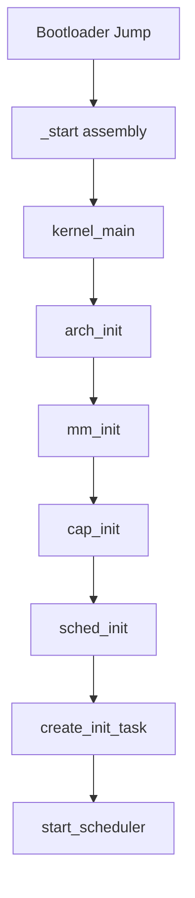

# Kernel Design

This document describes the SaltyOS microkernel architecture and implementation.

## Overview

The SaltyOS kernel is a capability-based microkernel written in Rust. It provides only the essential mechanisms required for a secure, multi-tasking system:

- Thread scheduling (EDF)
- Inter-process communication
- Memory management
- Capability-based access control
- Interrupt routing

All other services (filesystems, drivers, networking) run in userspace.
For POSIX compatibility, see [POSIX Compatibility Layer](posix.md).

## Design Principles

### Minimal Trusted Computing Base (TCB)

The kernel should be as small as possible while still providing necessary mechanisms:

| In Kernel | In Userspace |
|-----------|--------------|
| Thread/Scheduler | Process Manager |
| IPC | Protocols/APIs |
| Memory mapping | Memory allocators |
| Capabilities | Access policies |
| IRQ delivery | Device drivers |
| Timer | Time services |

### No Dynamic Allocation (Future Goal)

Following seL4's approach:
- All kernel memory is pre-allocated at boot
- Objects are created by "retyping" untyped memory
- No malloc/free in kernel paths
- Enables formal verification

### Bounded Execution Time

All system calls should have bounded worst-case execution time (WCET):
- No unbounded loops
- No dynamic allocation
- Predictable scheduling

## Kernel Components

### Module Structure

```
kernel/src/
├── lib.rs              # Entry point, panic handler
├── arch/               # Architecture-specific
│   ├── mod.rs
│   └── x86_64/
│       ├── mod.rs
│       ├── boot.rs     # Arch initialization
│       ├── gdt.rs      # Global Descriptor Table
│       ├── idt.rs      # Interrupt Descriptor Table
│       ├── paging.rs   # Page table management
│       ├── context.rs  # Context switching
│       ├── serial.rs   # Debug output
│       └── timer.rs    # APIC timer
├── cap/                # Capability system
│   ├── mod.rs
│   ├── cnode.rs        # CNode implementation
│   ├── object.rs       # Kernel object types
│   └── rights.rs       # Capability rights
├── ipc/                # IPC subsystem
│   ├── mod.rs
│   ├── endpoint.rs     # Synchronous IPC
│   └── notification.rs # Async signaling
├── mm/                 # Memory management
│   ├── mod.rs
│   ├── frame.rs        # Physical frame allocator
│   ├── vspace.rs       # Virtual address spaces
│   ├── slab.rs         # Kernel object allocator
│   └── untyped.rs      # Untyped memory management
├── sched/              # Scheduler
│   ├── mod.rs
│   ├── thread.rs       # Thread Control Block
│   ├── scheduler.rs    # EDF scheduler
│   └── context.rs      # Scheduling context
└── syscall/            # System calls
    ├── mod.rs
    ├── invoke.rs       # Capability invocation
    └── handlers.rs     # Syscall implementations
```

## Kernel Entry

### Boot Sequence



### Entry Point

```rust
// kernel/src/lib.rs

#![no_std]
#![no_main]
#![feature(naked_functions)]

mod arch;
mod cap;
mod ipc;
mod mm;
mod sched;
mod syscall;

use core::panic::PanicInfo;

/// Kernel entry point (called from bootloader)
#[unsafe(no_mangle)]
pub extern "C" fn kernel_main(boot_info: &'static BootInfo) -> ! {
    // Initialize serial for early debug output
    arch::serial::init();
    kprintln!("SaltyOS kernel starting...");
    
    // Architecture-specific initialization
    arch::init(boot_info);
    
    // Initialize memory management
    mm::init(boot_info);
    
    // Initialize capability system
    cap::init();
    
    // Initialize scheduler
    sched::init();
    
    // Create and run init task
    let init_tcb = create_init_task(boot_info);
    sched::add_thread(init_tcb);
    
    // Start the scheduler (never returns)
    sched::start();
}

#[panic_handler]
fn panic(info: &PanicInfo) -> ! {
    kprintln!("KERNEL PANIC: {}", info);
    loop {
        arch::halt();
    }
}
```

## Architecture Layer

### x86_64 Initialization

```rust
// kernel/src/arch/x86_64/mod.rs

pub mod boot;
pub mod gdt;
pub mod idt;
pub mod paging;
pub mod context;
pub mod serial;
pub mod timer;

use crate::BootInfo;

/// Initialize x86_64 architecture
pub fn init(boot_info: &BootInfo) {
    // Set up Global Descriptor Table
    gdt::init();
    kprintln!("  GDT initialized");
    
    // Set up Interrupt Descriptor Table
    idt::init();
    kprintln!("  IDT initialized");
    
    // Set up kernel page tables
    paging::init(boot_info);
    kprintln!("  Paging initialized");
    
    // Initialize APIC timer
    timer::init();
    kprintln!("  Timer initialized");
}

/// Halt the CPU
#[inline]
pub fn halt() {
    unsafe {
        core::arch::asm!("hlt");
    }
}

/// Disable interrupts
#[inline]
pub fn disable_interrupts() {
    unsafe {
        core::arch::asm!("cli");
    }
}

/// Enable interrupts
#[inline]
pub fn enable_interrupts() {
    unsafe {
        core::arch::asm!("sti");
    }
}
```

### GDT Setup

```rust
// kernel/src/arch/x86_64/gdt.rs

use core::mem::size_of;

#[repr(C, packed)]
struct GdtEntry {
    limit_low: u16,
    base_low: u16,
    base_middle: u8,
    access: u8,
    granularity: u8,
    base_high: u8,
}

#[repr(C, packed)]
struct TssEntry {
    // ... TSS fields for syscall stack
}

#[repr(C, packed)]
struct Gdt {
    null: GdtEntry,
    kernel_code: GdtEntry,
    kernel_data: GdtEntry,
    user_code: GdtEntry,
    user_data: GdtEntry,
    tss: [u64; 2],  // TSS is 16 bytes in long mode
}

static mut GDT: Gdt = Gdt::new();
static mut TSS: TssEntry = TssEntry::new();

pub fn init() {
    unsafe {
        // Set up TSS for syscall stack
        TSS.rsp0 = KERNEL_STACK_TOP;
        
        // Set TSS entry in GDT
        let tss_addr = &TSS as *const _ as u64;
        GDT.tss[0] = make_tss_entry_low(tss_addr);
        GDT.tss[1] = make_tss_entry_high(tss_addr);
        
        // Load GDT
        let gdt_ptr = GdtPtr {
            limit: (size_of::<Gdt>() - 1) as u16,
            base: &GDT as *const _ as u64,
        };
        
        core::arch::asm!(
            "lgdt [{}]",
            in(reg) &gdt_ptr,
            options(nostack)
        );
        
        // Load TSS
        core::arch::asm!(
            "ltr ax",
            in("ax") 0x28u16,  // TSS selector
            options(nostack)
        );
    }
}
```

### Interrupt Handling

```rust
// kernel/src/arch/x86_64/idt.rs

use core::mem::size_of;

#[repr(C, packed)]
struct IdtEntry {
    offset_low: u16,
    selector: u16,
    ist: u8,
    type_attr: u8,
    offset_mid: u16,
    offset_high: u32,
    reserved: u32,
}

static mut IDT: [IdtEntry; 256] = [IdtEntry::missing(); 256];

// Exception handlers
extern "x86-interrupt" fn divide_error_handler(frame: InterruptStackFrame) {
    kprintln!("EXCEPTION: Divide by zero\n{:#?}", frame);
    loop { crate::arch::halt(); }
}

extern "x86-interrupt" fn page_fault_handler(
    frame: InterruptStackFrame,
    error_code: u64,
) {
    let addr: u64;
    unsafe { core::arch::asm!("mov {}, cr2", out(reg) addr); }
    
    // Check if this is a user page fault
    if error_code & 0x4 != 0 {
        // User mode fault - deliver to handler via IPC
        handle_user_page_fault(addr, error_code);
    } else {
        // Kernel fault - panic
        kprintln!("KERNEL PAGE FAULT at {:#x}", addr);
        kprintln!("{:#?}", frame);
        loop { crate::arch::halt(); }
    }
}

// Timer interrupt for preemption
extern "x86-interrupt" fn timer_handler(frame: InterruptStackFrame) {
    // Acknowledge interrupt
    unsafe { LAPIC.eoi(); }
    
    // Trigger scheduler
    crate::sched::timer_tick();
}

pub fn init() {
    unsafe {
        // Set up exception handlers
        IDT[0].set_handler(divide_error_handler as u64);
        IDT[14].set_handler(page_fault_handler as u64);
        
        // Set up timer interrupt
        IDT[32].set_handler(timer_handler as u64);
        
        // Load IDT
        let idt_ptr = IdtPtr {
            limit: (size_of::<[IdtEntry; 256]>() - 1) as u16,
            base: &IDT as *const _ as u64,
        };
        
        core::arch::asm!(
            "lidt [{}]",
            in(reg) &idt_ptr,
            options(nostack)
        );
    }
}
```

## Thread Management

### Thread Control Block

```rust
// kernel/src/sched/thread.rs

use crate::arch::context::Context;
use crate::cap::{CNodeRef, VSpaceRef};

/// Thread state
#[derive(Clone, Copy, PartialEq, Eq)]
pub enum ThreadState {
    /// Ready to run
    Ready,
    /// Currently running
    Running,
    /// Blocked on IPC
    BlockedOnSend { endpoint: EndpointRef },
    /// Blocked on IPC
    BlockedOnReceive { endpoint: EndpointRef },
    /// Blocked on notification
    BlockedOnNotification { notification: NotificationRef },
    /// Suspended (not schedulable)
    Suspended,
}

/// Thread Control Block
pub struct Tcb {
    /// Unique thread ID
    pub id: ThreadId,
    
    /// Thread name (for debugging)
    pub name: [u8; 32],
    
    /// Current state
    pub state: ThreadState,
    
    /// Saved CPU context
    pub context: Context,
    
    /// Associated scheduling context
    pub sched_context: Option<SchedContextRef>,
    
    /// Thread's CSpace root
    pub cspace: CNodeRef,
    
    /// Thread's VSpace
    pub vspace: VSpaceRef,
    
    /// IPC buffer location
    pub ipc_buffer: VirtAddr,
    
    /// Fault handler endpoint
    pub fault_handler: Option<EndpointRef>,
    
    /// Bound notification (for combined wait)
    pub bound_notification: Option<NotificationRef>,
    
    /// Priority (used for tiebreaking in EDF)
    pub priority: u8,
}

impl Tcb {
    /// Create a new thread
    pub fn new(
        id: ThreadId,
        cspace: CNodeRef,
        vspace: VSpaceRef,
    ) -> Self {
        Self {
            id,
            name: [0; 32],
            state: ThreadState::Suspended,
            context: Context::new(),
            sched_context: None,
            cspace,
            vspace,
            ipc_buffer: VirtAddr::new(0),
            fault_handler: None,
            bound_notification: None,
            priority: 128,
        }
    }
    
    /// Configure thread entry point
    pub fn configure(
        &mut self,
        entry: VirtAddr,
        stack: VirtAddr,
        ipc_buffer: VirtAddr,
    ) {
        self.context.set_entry(entry);
        self.context.set_stack(stack);
        self.ipc_buffer = ipc_buffer;
    }
    
    /// Resume the thread (make schedulable)
    pub fn resume(&mut self) {
        if self.state == ThreadState::Suspended {
            self.state = ThreadState::Ready;
        }
    }
    
    /// Suspend the thread
    pub fn suspend(&mut self) {
        self.state = ThreadState::Suspended;
    }
}
```

### Context Switching

```rust
// kernel/src/arch/x86_64/context.rs

/// Saved CPU context for context switching
#[repr(C)]
pub struct Context {
    // Callee-saved registers
    pub rbx: u64,
    pub rbp: u64,
    pub r12: u64,
    pub r13: u64,
    pub r14: u64,
    pub r15: u64,
    
    // Stack pointer
    pub rsp: u64,
    
    // Instruction pointer (return address)
    pub rip: u64,
    
    // Flags
    pub rflags: u64,
    
    // Segment selectors
    pub cs: u64,
    pub ss: u64,
}

impl Context {
    pub const fn new() -> Self {
        Self {
            rbx: 0, rbp: 0, r12: 0, r13: 0, r14: 0, r15: 0,
            rsp: 0, rip: 0, rflags: 0x200, // IF set
            cs: 0x08, ss: 0x10,  // Kernel segments
        }
    }
    
    pub fn set_entry(&mut self, addr: VirtAddr) {
        self.rip = addr.as_u64();
    }
    
    pub fn set_stack(&mut self, addr: VirtAddr) {
        self.rsp = addr.as_u64();
    }
    
    pub fn set_user_mode(&mut self) {
        self.cs = 0x1B;  // User code segment + RPL 3
        self.ss = 0x23;  // User data segment + RPL 3
    }
}

/// Switch from one context to another
/// 
/// # Safety
/// Both contexts must be valid and properly initialized.
#[naked]
pub unsafe extern "C" fn switch_context(
    old: *mut Context,
    new: *const Context,
) {
    core::arch::asm!(
        // Save callee-saved registers to old context
        "mov [rdi + 0x00], rbx",
        "mov [rdi + 0x08], rbp",
        "mov [rdi + 0x10], r12",
        "mov [rdi + 0x18], r13",
        "mov [rdi + 0x20], r14",
        "mov [rdi + 0x28], r15",
        "mov [rdi + 0x30], rsp",
        
        // Save return address
        "lea rax, [rip + 1f]",
        "mov [rdi + 0x38], rax",
        
        // Load new context
        "mov rbx, [rsi + 0x00]",
        "mov rbp, [rsi + 0x08]",
        "mov r12, [rsi + 0x10]",
        "mov r13, [rsi + 0x18]",
        "mov r14, [rsi + 0x20]",
        "mov r15, [rsi + 0x28]",
        "mov rsp, [rsi + 0x30]",
        
        // Jump to new instruction pointer
        "jmp [rsi + 0x38]",
        
        "1:",
        "ret",
        options(noreturn)
    );
}
```

## System Calls

### Syscall Entry

```rust
// kernel/src/syscall/mod.rs

mod invoke;
mod handlers;

use crate::arch::Context;

/// System call numbers
#[repr(u64)]
pub enum Syscall {
    Send = 0,
    Recv = 1,
    Call = 2,
    ReplyRecv = 3,
    Yield = 4,
    DebugPutChar = 5,
}

/// System call handler entry point
#[unsafe(no_mangle)]
pub extern "C" fn syscall_handler(
    syscall: u64,
    arg1: u64,
    arg2: u64,
    arg3: u64,
    arg4: u64,
    arg5: u64,
    arg6: u64,
) -> u64 {
    let current = crate::sched::current_thread();
    
    match syscall {
        0 => handlers::sys_send(current, arg1, arg2, arg3),
        1 => handlers::sys_recv(current, arg1, arg2),
        2 => handlers::sys_call(current, arg1, arg2, arg3),
        3 => handlers::sys_reply_recv(current, arg1, arg2, arg3),
        4 => {
            crate::sched::yield_current();
            0
        }
        5 => {
            crate::arch::serial::putc(arg1 as u8 as char);
            0
        }
        _ => {
            // Unknown syscall
            u64::MAX
        }
    }
}

/// x86_64 syscall entry (from SYSCALL instruction)
#[naked]
#[unsafe(no_mangle)]
pub unsafe extern "C" fn syscall_entry() {
    core::arch::asm!(
        // Swap to kernel stack
        "swapgs",
        "mov gs:[0], rsp",       // Save user stack
        "mov rsp, gs:[8]",       // Load kernel stack
        
        // Save user context
        "push rcx",              // User RIP
        "push r11",              // User RFLAGS
        "push gs:[0]",           // User RSP
        
        // Call handler
        "mov rcx, r10",          // arg4 was in r10
        "call syscall_handler",
        
        // Restore user context
        "pop rsp",               // Restore through swapgs
        "mov gs:[0], rsp",
        "pop r11",
        "pop rcx",
        
        "swapgs",
        "sysretq",
        options(noreturn)
    );
}
```

### Capability Invocation

```rust
// kernel/src/syscall/invoke.rs

use crate::cap::{Capability, CapType, Rights};
use crate::sched::Tcb;

/// Result of capability invocation
pub enum InvokeResult {
    Success(u64),
    Error(SyscallError),
    Blocked,  // Thread is now blocked
}

/// Invoke a capability
pub fn invoke_capability(
    tcb: &mut Tcb,
    cap_ptr: u64,
    label: u64,
    msg: &IpcMessage,
) -> InvokeResult {
    // Look up capability in thread's CSpace
    let cap = match tcb.cspace.lookup(cap_ptr) {
        Some(c) => c,
        None => return InvokeResult::Error(SyscallError::InvalidCapability),
    };
    
    // Dispatch based on capability type
    match cap.cap_type {
        CapType::Endpoint => {
            invoke_endpoint(tcb, cap, label, msg)
        }
        CapType::Notification => {
            invoke_notification(tcb, cap, label)
        }
        CapType::Tcb => {
            invoke_tcb(tcb, cap, label, msg)
        }
        CapType::CNode => {
            invoke_cnode(tcb, cap, label, msg)
        }
        CapType::VSpace => {
            invoke_vspace(tcb, cap, label, msg)
        }
        CapType::Frame => {
            invoke_frame(tcb, cap, label, msg)
        }
        CapType::Untyped => {
            invoke_untyped(tcb, cap, label, msg)
        }
        CapType::IrqHandler => {
            invoke_irq_handler(tcb, cap, label, msg)
        }
        _ => InvokeResult::Error(SyscallError::InvalidCapability),
    }
}
```

## Kernel Objects

### Object Types

```rust
// kernel/src/cap/object.rs

/// All kernel object types
pub enum KernelObject {
    Endpoint(Endpoint),
    Notification(Notification),
    Tcb(Box<Tcb>),
    CNode(CNode),
    VSpace(VSpace),
    Frame(Frame),
    Untyped(Untyped),
    IrqHandler(IrqHandler),
    SchedContext(SchedContext),
}

/// Reference-counted pointer to kernel object
pub struct ObjectRef<T> {
    ptr: NonNull<T>,
}

impl<T> ObjectRef<T> {
    /// Get a reference to the object
    pub fn get(&self) -> &T {
        unsafe { self.ptr.as_ref() }
    }
    
    /// Get a mutable reference to the object
    pub fn get_mut(&mut self) -> &mut T {
        unsafe { self.ptr.as_mut() }
    }
}

/// Object sizes for allocation
pub const OBJECT_SIZES: &[(CapType, usize)] = &[
    (CapType::Endpoint, size_of::<Endpoint>()),
    (CapType::Notification, size_of::<Notification>()),
    (CapType::Tcb, size_of::<Tcb>()),
    (CapType::CNode, 0),  // Variable size
    (CapType::VSpace, size_of::<VSpace>()),
    (CapType::Frame, 0),  // 4KB page
    (CapType::SchedContext, size_of::<SchedContext>()),
];
```

## Kernel Configuration

### Compile-Time Configuration

```rust
// kernel/src/config.rs

/// Maximum number of CPUs supported
pub const MAX_CPUS: usize = 16;

/// Kernel stack size per thread
pub const KERNEL_STACK_SIZE: usize = 16384;

/// Maximum threads in the system
pub const MAX_THREADS: usize = 1024;

/// Timer tick interval (microseconds)
pub const TIMER_TICK_US: u64 = 1000;  // 1ms

/// IPC message registers
pub const IPC_MESSAGE_REGS: usize = 4;

/// Maximum IPC message length (bytes)
pub const IPC_MAX_LENGTH: usize = 120;

/// Kernel log level
#[cfg(debug_assertions)]
pub const LOG_LEVEL: LogLevel = LogLevel::Debug;

#[cfg(not(debug_assertions))]
pub const LOG_LEVEL: LogLevel = LogLevel::Info;
```

## Invariants and Safety

### Key Invariants

1. **Capability Safety**: Only kernel can create/modify capabilities
2. **Memory Isolation**: VSpaces cannot access each other without explicit mapping
3. **No Dangling References**: Object destruction only after all caps revoked
4. **Scheduler Safety**: Only one thread runs per CPU at a time
5. **Interrupt Safety**: Critical sections disable interrupts

### Unsafe Blocks

Unsafe code is restricted to:
- Architecture-specific assembly
- Raw pointer manipulation in allocators
- Memory-mapped I/O
- Context switching

All unsafe blocks are documented with safety invariants.
