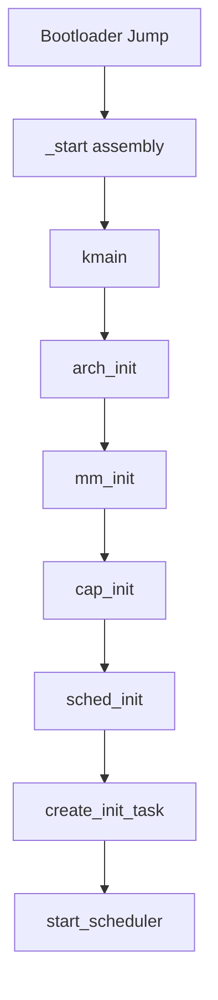

# Kernel Design

This document describes the SaltyOS microkernel architecture and implementation.

## Overview

The SaltyOS kernel is a capability-based microkernel written in Rust. It provides only the essential mechanisms required for a secure, multi-tasking system:

- Thread scheduling (EDF)
- Inter-process communication
- Memory management
- Capability-based access control
- Interrupt routing

All other services (filesystems, drivers, networking) run in userspace.
For POSIX compatibility, see [POSIX Compatibility Layer](posix.md).

## Design Principles

### Minimal Trusted Computing Base (TCB)

The kernel should be as small as possible while still providing necessary mechanisms:

| In Kernel | In Userspace |
|-----------|--------------|
| Thread/Scheduler | Process Manager |
| IPC | Protocols/APIs |
| Memory mapping | Memory allocators |
| Capabilities | Access policies |
| IRQ delivery | Device drivers |
| Timer | Time services |

### No Dynamic Allocation

Following seL4's approach:
- All kernel objects are carved from untyped memory via `retype`
- No kernel heap, slab allocator, or `alloc` crate
- Objects are never freed (owned by parent untyped memory)
- No `Vec`, `Box`, `HashMap`, or `String` — only raw pointers, fixed-size arrays, and static storage
- Enables formal verification

### Bounded Execution Time

All system calls should have bounded worst-case execution time (WCET):
- No unbounded loops
- No dynamic allocation
- Predictable scheduling

## Kernel Components

### Module Structure

```
kernite/src/
├── lib.rs              # Entry (kmain), serial I/O, panic handler
├── bootinfo.rs         # Boot info TLV parsing from bootloader
├── builtins.rs         # Compiler built-in function stubs (memcpy, memset, etc.)
├── cpio.rs             # CPIO archive parser for initrd
├── elf.rs              # ELF binary loader for init task
├── init.rs             # Init task bootstrap (CSpace setup, capability grants)
├── rng.rs              # RDRAND-based random number generator
├── arch/
│   ├── mod.rs
│   ├── x86_64/
│   │   ├── mod.rs
│   │   ├── acpi.rs     # ACPI table parsing (MADT, FADT for shutdown)
│   │   ├── ap_boot.rs  # Application Processor startup
│   │   ├── ap_tramp.S  # AP trampoline (real → long mode)
│   │   ├── apic.rs     # Local APIC + I/O APIC + IPI messaging
│   │   ├── boot.rs     # BSP early boot (GDT/IDT/paging init)
│   │   ├── context.rs  # Context switch (save/restore x86_64 registers)
│   │   ├── cpu.rs      # CPU state, MSR access, per-CPU data
│   │   ├── cpuid.rs    # CPUID feature detection
│   │   ├── exceptions.S # IDT exception handlers
│   │   ├── fpu.rs      # FPU/SSE state save/restore (FXSAVE/FXRSTOR)
│   │   ├── gdt.rs      # GDT + TSS setup (per-CPU)
│   │   ├── idt.rs      # IDT setup + interrupt handlers
│   │   ├── paging.rs   # Page table manipulation (4-level)
│   │   ├── pit.rs      # PIT timer for APIC calibration
│   │   ├── smap.rs     # SMAP/SMEP enforcement
│   │   ├── syscall.S   # Syscall entry/exit, IPC fastpath
│   │   └── uaccess.rs  # User memory access helpers (SMAP-safe copy)
│   └── aarch64/
│       ├── mod.rs
│       ├── ap_boot.rs  # Application Processor startup (PSCI CPU_ON)
│       ├── boot.rs     # BSP early boot (EL2→EL1 drop, MMU setup)
│       ├── context.rs  # Context switch (save/restore aarch64 registers)
│       ├── cpu.rs      # CPU state, system registers, per-CPU data
│       ├── exceptions.rs # Exception vector table handlers
│       ├── fpsimd.S    # NEON/FP register save/restore assembly
│       ├── fpu.rs      # FPU/NEON lazy context switch (CPACR_EL1 trap)
│       ├── gic.rs      # GICv3 (distributor, redistributor, CPU interface)
│       ├── paging.rs   # Page table manipulation (TTBR0/TTBR1)
│       ├── pl011.rs    # PL011 UART driver for serial console
│       ├── psci.rs     # PSCI interface (CPU_ON, SYSTEM_OFF via HVC)
│       └── timer.rs    # Generic timer (CNTP, PPI 30, 10ms tick)
├── cap/
│   ├── mod.rs          # Capability struct (32-byte fat cap), CapRights
│   ├── cdt.rs          # Capability Derivation Tree
│   ├── cnode.rs        # CNode (capability table, 4-16 bit slots)
│   ├── ioport.rs       # I/O port range capabilities
│   ├── memory_object.rs # MemoryObject (radix tree pages, COW, reverse maps)
│   ├── object.rs       # ObjectType enum (12 types), KernelObject header
│   ├── refcount.rs     # Object reference counting
│   ├── slot.rs         # Slot allocation/access helpers
│   └── untyped.rs      # Untyped memory retype
├── console/
│   ├── mod.rs          # Kernel console output multiplexer
│   ├── fb.rs           # Framebuffer console driver
│   └── font.rs         # Built-in 8x16 bitmap font
├── ipc/
│   ├── mod.rs          # IPC types (Message, IpcBuffer), fault types
│   ├── endpoint.rs     # Synchronous rendezvous endpoints
│   ├── futex.rs        # Userspace futex (wait/wake/requeue)
│   ├── irq.rs          # Hardware IRQ routing to notifications
│   ├── notification.rs # Asynchronous notification (bitmap signaling)
│   └── queue.rs        # IPC wait queue management
├── mm/
│   ├── mod.rs          # Memory management globals, lock ordering, helpers
│   ├── frame.rs        # Bitmap-based physical frame allocator (PMM), FrameOwner
│   ├── maple_tree.rs   # Maple tree (generic B-tree for VA range tracking)
│   ├── node_alloc.rs   # NodeAllocator trait (page-granular allocator interface)
│   ├── radix_tree.rs   # 4-level radix tree (page storage for MemoryObject)
│   └── vspace.rs       # VSpace (page tables, COW, demand paging, MapleTree<VmArea>)
├── sched/
│   ├── mod.rs          # Scheduler module entry
│   ├── pip.rs          # Priority Inheritance Protocol
│   ├── scheduler.rs    # EDF scheduler (global ready queue)
│   ├── sleep_queue.rs  # Timed sleep queue (NanoSleep, timed IPC)
│   └── thread.rs       # TCB, SchedContext, ThreadState, BlockedReason
└── syscall/
    ├── mod.rs          # 28 syscalls, capability invocation dispatch
    └── fastpath.rs     # IPC fastpath (Call/ReplyRecv optimization)
```

## Kernel Entry

### Boot Sequence



### Entry Point

```rust
// kernite/src/lib.rs

#![no_std]
#![no_main]

mod arch;
mod bootinfo;
mod builtins;
mod cap;
mod cpio;
mod elf;
mod init;
mod ipc;
mod mm;
mod rng;
mod sched;
mod syscall;

use core::panic::PanicInfo;

/// Kernel entry point (called from bootloader with BootInfo pointer in RDI/x0)
#[unsafe(no_mangle)]
pub extern "C" fn kmain(boot_info_addr: u64) -> ! {
    // Parse TLV-encoded boot info from bootloader
    let boot_info = bootinfo::parse(boot_info_addr);

    // Initialize serial for early debug output
    serial_init();
    kprintln!("SaltyOS kernel starting...");

    // Architecture-specific initialization (GDT, IDT, paging, APIC, SMP)
    arch::init(&boot_info);

    // Initialize physical frame allocator and memory management
    mm::init(&boot_info);

    // Initialize capability system
    cap::init();

    // Initialize scheduler
    sched::init();

    // Create init task: parse CPIO initrd, load ELF, set up CSpace
    init::create_init_task(&boot_info);

    // Start the scheduler (never returns)
    sched::start();
}

#[panic_handler]
fn panic(info: &PanicInfo) -> ! {
    kprintln!("KERNEL PANIC: {}", info);
    loop {
        arch::halt();
    }
}
```

## Architecture Layer

### x86_64 Initialization

```rust
// kernite/src/arch/x86_64/mod.rs

pub mod acpi;
pub mod ap_boot;
pub mod apic;
pub mod boot;
pub mod context;
pub mod cpu;
pub mod cpuid;
pub mod fpu;
pub mod gdt;
pub mod idt;
pub mod paging;
pub mod pit;
pub mod smap;

/// Initialize x86_64 architecture (called from kmain)
///
/// Initialization order matters — GDT/IDT must be set up before APIC,
/// paging before SMP, and PIT calibration before APIC timer.
pub fn init(boot_info: &BootInfo) {
    // Per-CPU GDT + TSS setup
    gdt::init_bsp();

    // IDT with exception handlers and IRQ vectors
    idt::init();

    // Initialize paging (remap kernel, set up higher-half mappings)
    paging::init(boot_info);

    // CPUID feature detection (NX, SMEP, SMAP, RDRAND)
    cpuid::detect_features();

    // Enable SMAP/SMEP if available
    smap::init();

    // ACPI table parsing (MADT for CPU topology, FADT for shutdown)
    acpi::init(boot_info);

    // Local APIC + I/O APIC initialization
    apic::init();

    // PIT calibration for APIC timer frequency
    pit::calibrate_apic_timer();

    // Start Application Processors (SMP)
    ap_boot::start_aps();
}
```

### aarch64 Initialization

```rust
// kernite/src/arch/aarch64/mod.rs

pub mod ap_boot;
pub mod boot;
pub mod context;
pub mod cpu;
pub mod exceptions;
pub mod fpu;
pub mod gic;
pub mod paging;
pub mod pl011;
pub mod psci;
pub mod timer;

/// Initialize aarch64 architecture (called from kmain)
///
/// Entry at EL1 (boot.rs drops from EL2 via ERET before calling kmain).
/// x0 = BootInfo pointer.
pub fn init(boot_info: &BootInfo) {
    // PL011 UART for early serial output
    pl011::init(boot_info);

    // Exception vector table (EL1)
    exceptions::init();

    // Page tables (TTBR0 for user, TTBR1 for kernel)
    paging::init(boot_info);

    // GICv3: distributor (GICD), redistributor (GICR), CPU interface (ICC)
    gic::init(boot_info);

    // Generic timer: EL1 physical timer (CNTP), PPI 30, 10ms tick
    timer::init();

    // SMP: PSCI CPU_ON for each secondary CPU, mailbox handoff
    ap_boot::start_aps(boot_info);
}
```

Key aarch64 differences from x86_64:
- **SMP via PSCI**: `CPU_ON` HVC call with AP mailbox for stack/register handoff (vs ACPI MADT + AP trampoline)
- **Interrupt controller**: GICv3 with system register interface (ICC) (vs Local APIC + I/O APIC)
- **Timer**: Generic timer CNTP with PPI 30 (vs PIT + APIC timer)
- **FPU**: NEON Q0-Q31 (512 bytes) with lazy context switch via CPACR_EL1 trapping (vs XSAVE 832 bytes)
- **Syscall entry**: `svc #0` with x8=syscall number, x0-x5=args (vs `syscall` with RAX=number, RDI/RSI/RDX/R10/R8/R9=args)
- **Context switch**: x19-x28 callee-saved + SPSR_EL1/ELR_EL1 (vs rbx/rbp/r12-r15 + rflags)

### GDT Setup

Each CPU gets its own GDT and TSS. GDT/TSS storage is a per-CPU static array
(no heap allocation). Rust 2024 disallows `&mut` of `static mut`, so per-CPU
data is accessed via raw pointers (`core::ptr::addr_of_mut!`) or through
`SyncUnsafeCell`-based per-CPU storage.

```rust
// kernite/src/arch/x86_64/gdt.rs

use core::cell::SyncUnsafeCell;
use core::mem::size_of;

#[repr(C, packed)]
struct GdtEntry {
    limit_low: u16,
    base_low: u16,
    base_middle: u8,
    access: u8,
    granularity: u8,
    base_high: u8,
}

/// Per-CPU GDT + TSS storage (one per CPU, indexed by APIC ID)
/// No heap allocation — statically sized for MAX_CPUS.
static PER_CPU_GDT: [SyncUnsafeCell<Gdt>; MAX_CPUS] = /* zero-initialized */;
static PER_CPU_TSS: [SyncUnsafeCell<Tss>; MAX_CPUS] = /* zero-initialized */;

/// Initialize GDT and TSS for the bootstrap processor.
/// AP processors call init_ap() from the AP trampoline.
pub fn init_bsp() {
    let cpu_id = 0;
    // SAFETY: Single-threaded during BSP init, no concurrent access.
    unsafe {
        let gdt = &mut *PER_CPU_GDT[cpu_id].get();
        let tss = &mut *PER_CPU_TSS[cpu_id].get();

        // Set up TSS with kernel stack pointer
        tss.rsp0 = per_cpu_kernel_stack_top(cpu_id);

        // Encode TSS descriptor in GDT
        let tss_addr = tss as *const _ as u64;
        gdt.tss_low = make_tss_entry_low(tss_addr);
        gdt.tss_high = make_tss_entry_high(tss_addr);

        // Load GDT via lgdt
        let gdt_ptr = GdtPtr {
            limit: (size_of::<Gdt>() - 1) as u16,
            base: gdt as *const _ as u64,
        };
        core::arch::asm!("lgdt [{}]", in(reg) &gdt_ptr, options(nostack));

        // Load TSS selector
        core::arch::asm!("ltr ax", in("ax") TSS_SELECTOR, options(nostack));
    }
}
```

### Interrupt Handling

Exception and IRQ entry points are defined in assembly (`exceptions.S`) which
saves full register state, then calls Rust handler functions via `extern "C"`.
The IDT is a static 256-entry array accessed through raw pointers (Rust 2024
disallows `&mut` of `static mut`).

```rust
// kernite/src/arch/x86_64/idt.rs

#[repr(C, packed)]
struct IdtEntry {
    offset_low: u16,
    selector: u16,
    ist: u8,
    type_attr: u8,
    offset_mid: u16,
    offset_high: u32,
    reserved: u32,
}

/// Static IDT — 256 entries, accessed via raw pointer.
static IDT: SyncUnsafeCell<[IdtEntry; 256]> = /* zero-initialized */;

pub fn init() {
    // SAFETY: Single-threaded during BSP init.
    unsafe {
        let idt = &mut *IDT.get();

        // Exception handlers (assembly stubs in exceptions.S)
        idt[0].set_handler(asm_divide_error as u64);   // #DE
        idt[6].set_handler(asm_invalid_opcode as u64);  // #UD
        idt[13].set_handler(asm_general_protection as u64); // #GP
        idt[14].set_handler(asm_page_fault as u64);     // #PF

        // Timer interrupt (vector 32)
        idt[32].set_handler(asm_timer_handler as u64);

        // IPI vectors
        idt[0xFD].set_handler(asm_ipi_reschedule as u64);
        idt[0xFE].set_handler(asm_ipi_tlb_shootdown as u64);

        // Load IDT
        let idt_ptr = IdtPtr {
            limit: (core::mem::size_of::<[IdtEntry; 256]>() - 1) as u16,
            base: idt as *const _ as u64,
        };
        core::arch::asm!("lidt [{}]", in(reg) &idt_ptr, options(nostack));
    }
}

/// Page fault handler (called from exceptions.S after register save).
/// For user-mode faults, delivers fault info via IPC to the thread's
/// fault handler endpoint. For kernel faults, panics.
///
/// IMPORTANT: EOI must be sent before any code that might trigger a
/// context switch.
#[unsafe(no_mangle)]
pub extern "C" fn handle_page_fault(error_code: u64, fault_addr: u64) {
    if error_code & 0x4 != 0 {
        // User mode fault — deliver via fault IPC or demand-page
        handle_user_page_fault(fault_addr, error_code);
    } else {
        panic!("KERNEL PAGE FAULT at {:#x}, error={:#x}", fault_addr, error_code);
    }
}
```

## Thread Management

### Thread Control Block

TCBs are kernel objects (carved from untyped memory via retype, never heap-allocated).
All references to other kernel objects are raw pointers, not smart pointers.

```rust
// kernite/src/sched/thread.rs

/// Thread state — determines schedulability
#[derive(Clone, Copy, PartialEq, Eq)]
pub enum ThreadState {
    Inactive,   // Not yet started or permanently stopped
    Ready,      // In ready queue, waiting for CPU
    Running,    // Currently executing on a CPU
    Blocked,    // Blocked (reason stored in BlockedReason)
    Waiting,    // Waiting on notification
}

/// Reason why a thread is in ThreadState::Blocked
#[derive(Clone, Copy)]
pub enum BlockedReason {
    SendBlocked { msg, badge },         // Blocked on synchronous send
    RecvBlocked,                        // Blocked on synchronous receive
    NotificationWait,                   // Blocked waiting on notification
    VSpaceWait,                         // Blocked on VSpace teardown
    ReplyWait { msg, badge },           // Blocked waiting for reply (after call())
    FaultBlocked { msg, badge },        // Blocked on fault delivery
    CallSendBlocked { msg, badge },     // Blocked on call() send phase
    TimerBlocked,                       // Blocked on nanosleep timer
    FutexBlocked,                       // Blocked on futex wait
    FutexTimedBlocked,                  // Blocked on futex wait with timeout
    SendTimedBlocked { msg, badge },    // Blocked on send with timeout
    RecvTimedBlocked,                   // Blocked on receive with timeout
}

/// Thread Control Block (kernel object, allocated from untyped memory)
#[repr(C)]
pub struct Tcb {
    pub header: KernelObject,            // Must be first field

    pub state: ThreadState,
    pub context: Context,                // Saved CPU registers

    // Capability space and address space (raw pointers to kernel objects)
    pub cspace: *mut CNode,              // Thread's CNode root
    pub vspace: *mut VSpace,             // Thread's page table root

    // IPC state
    pub ipc_buffer: u64,                 // Virtual address of IPC buffer page
    pub blocking_object: *mut KernelObject, // Endpoint/Notification we're blocked on
    pub fault_handler_ep: *mut Endpoint, // Null if no fault handler

    // Scheduling
    pub sched_context: *mut SchedContext, // EDF parameters (period, deadline, budget)
    pub priority: u8,                    // Tiebreaker for equal-deadline threads
    pub cpu_affinity: u8,                // Preferred CPU (0xFF = any)

    // Bound notification (bidirectional TCB <-> Notification link)
    pub bound_notification: *mut Notification, // Null if unbound

    // Linked list pointers for wait queues and ready queues
    pub queue_next: *mut Tcb,
    pub queue_prev: *mut Tcb,

    // Stack canary for kernel stack overflow detection
    pub stack_canary: u64,

    pub name: [u8; 32],                 // Debug name
}
```

### Context Switching

```rust
// kernite/src/arch/x86_64/context.rs

/// Saved CPU context for context switching
#[repr(C)]
pub struct Context {
    // Callee-saved registers
    pub rbx: u64,
    pub rbp: u64,
    pub r12: u64,
    pub r13: u64,
    pub r14: u64,
    pub r15: u64,
    
    // Stack pointer
    pub rsp: u64,
    
    // Instruction pointer (return address)
    pub rip: u64,
    
    // Flags
    pub rflags: u64,
    
    // Segment selectors
    pub cs: u64,
    pub ss: u64,
}

impl Context {
    pub const fn new() -> Self {
        Self {
            rbx: 0, rbp: 0, r12: 0, r13: 0, r14: 0, r15: 0,
            rsp: 0, rip: 0, rflags: 0x200, // IF set
            cs: 0x08, ss: 0x10,  // Kernel segments
        }
    }
    
    pub fn set_entry(&mut self, addr: VirtAddr) {
        self.rip = addr.as_u64();
    }
    
    pub fn set_stack(&mut self, addr: VirtAddr) {
        self.rsp = addr.as_u64();
    }
    
    pub fn set_user_mode(&mut self) {
        self.cs = 0x1B;  // User code segment + RPL 3
        self.ss = 0x23;  // User data segment + RPL 3
    }
}

/// Switch from one context to another
/// 
/// # Safety
/// Both contexts must be valid and properly initialized.
#[naked]
pub unsafe extern "C" fn switch_context(
    old: *mut Context,
    new: *const Context,
) {
    core::arch::asm!(
        // Save callee-saved registers to old context
        "mov [rdi + 0x00], rbx",
        "mov [rdi + 0x08], rbp",
        "mov [rdi + 0x10], r12",
        "mov [rdi + 0x18], r13",
        "mov [rdi + 0x20], r14",
        "mov [rdi + 0x28], r15",
        "mov [rdi + 0x30], rsp",
        
        // Save return address
        "lea rax, [rip + 1f]",
        "mov [rdi + 0x38], rax",
        
        // Load new context
        "mov rbx, [rsi + 0x00]",
        "mov rbp, [rsi + 0x08]",
        "mov r12, [rsi + 0x10]",
        "mov r13, [rsi + 0x18]",
        "mov r14, [rsi + 0x20]",
        "mov r15, [rsi + 0x28]",
        "mov rsp, [rsi + 0x30]",
        
        // Jump to new instruction pointer
        "jmp [rsi + 0x38]",
        
        "1:",
        "ret",
        options(noreturn)
    );
}
```

## System Calls

### Syscall Entry

Syscall entry is via the `syscall` instruction. The assembly stub in
`syscall.S` saves user RSP on the per-thread kernel stack (not per-CPU
`%gs:16`), checks for IPC fastpath (RAX==2 for Call, RAX==3 for ReplyRecv),
and falls through to the Rust slowpath handler for all other syscalls.

```rust
// kernite/src/syscall/mod.rs

mod fastpath;

/// System call numbers (28 total)
#[repr(u64)]
pub enum Syscall {
    Send = 0,
    Recv = 1,
    Call = 2,
    ReplyRecv = 3,
    NBSend = 4,
    Signal = 5,
    Wait = 6,
    Poll = 7,
    Yield = 8,
    Invoke = 9,
    DebugPutChar = 10,
    DebugDumpState = 11,
    ClockGetTime = 12,
    NanoSleep = 13,
    DebugPutStr = 14,
    DebugPutBuf = 15,
    DebugConsoleControl = 16,
    SetInvokeDepths = 17,
    Futex = 18,
    GetRandom = 19,
    Shutdown = 20,
    SendTimed = 21,
    RecvTimed = 22,
    RecvAny = 23,          // Multi-endpoint receive (any of N endpoints)
    ReplyRecvAny = 24,     // Reply + multi-endpoint receive
    RecvAnyTimed = 25,     // Multi-endpoint receive with timeout
    ReplyRecvAnyTimed = 26, // Reply + multi-endpoint receive with timeout
    NotifReturn = 27,      // Return from notification dispatch
}

/// Slowpath syscall handler (called from syscall.S assembly stub).
/// Returns error in RAX, value in RDX.
///
/// The assembly entry point saves user RSP on the per-thread kernel stack
/// and dispatches Call/ReplyRecv to the fastpath before reaching here.
#[unsafe(no_mangle)]
pub extern "C" fn syscall_handle_rust(
    syscall_nr: u64,
    arg1: u64,  // rdi
    arg2: u64,  // rsi
    arg3: u64,  // rdx
    arg4: u64,  // r10
    arg5: u64,  // r8
    arg6: u64,  // r9
) -> u64 {
    let nr = match Syscall::try_from(syscall_nr) {
        Ok(s) => s,
        Err(_) => return SyscallError::InvalidSyscall as u64,
    };

    match nr {
        Syscall::Send => handle_send(arg1, arg2, arg3),
        Syscall::Recv => handle_recv(arg1, arg2),
        Syscall::Call => handle_call(arg1, arg2, arg3),
        Syscall::ReplyRecv => handle_reply_recv(arg1, arg2, arg3),
        Syscall::Invoke => handle_invoke(arg1, arg2, arg3, arg4, arg5, arg6),
        Syscall::Yield => { sched::yield_current(); 0 }
        Syscall::Futex => handle_futex(arg1, arg2, arg3, arg4),
        Syscall::NanoSleep => handle_nanosleep(arg1, arg2),
        Syscall::ClockGetTime => handle_clock_gettime(arg1),
        Syscall::Shutdown => handle_shutdown(),
        // ... remaining syscalls dispatched similarly
        _ => SyscallError::InvalidSyscall as u64,
    }
}
```

### Capability Invocation

The Invoke syscall (number 9) dispatches to object-type-specific handlers
based on the capability's `obj_type` field. The invoke label (passed in the
message info) determines the specific operation within each type.

```rust
// kernite/src/syscall/mod.rs (handle_invoke function)

/// Invoke a capability. The cap slot is looked up in the thread's CSpace,
/// then dispatched based on ObjectType and invoke label.
fn handle_invoke(
    cap_slot: u64,
    msg_info: u64,
    mr0: u64,
    mr1: u64,
    mr2: u64,
    mr3: u64,
) -> u64 {
    let irq = save_irq_disable();

    // Look up capability in current thread's CSpace
    CAP_LOCK.lock();
    let cap = match cspace_lookup(current_thread(), cap_slot) {
        Ok(c) => c,
        Err(e) => {
            CAP_LOCK.unlock();
            restore_irq(irq);
            return syscall_error_from_cap_error(e) as u64;
        }
    };

    // Copy cap to stack, release CAP_LOCK before further operations
    let cap_copy = *cap;
    CAP_LOCK.unlock();

    let label = msg_info_label(msg_info);

    // Dispatch based on object type
    let result = match cap_copy.obj_type {
        ObjectType::CNode        => invoke_cnode(&cap_copy, label, mr0, mr1, mr2, mr3),
        ObjectType::Untyped      => invoke_untyped(&cap_copy, label, mr0, mr1, mr2, mr3),
        ObjectType::Tcb          => invoke_tcb(&cap_copy, label, mr0, mr1, mr2, mr3),
        ObjectType::VSpace       => invoke_vspace(&cap_copy, label, mr0, mr1, mr2),
        ObjectType::SchedContext  => invoke_sched_context(&cap_copy, label, mr0, mr1, mr2),
        ObjectType::MemoryObject => invoke_memory_object(&cap_copy, label, mr0, mr1, mr2, mr3),
        ObjectType::IrqHandler   => invoke_irq(&cap_copy, label, mr0, mr1),
        ObjectType::IoPort       => invoke_ioport(&cap_copy, label, mr0, mr1),
        _ => Err(SyscallError::InvalidCapability),
    };

    restore_irq(irq);
    match result {
        Ok(val) => val,
        Err(e) => e as u64,
    }
}
```

## Kernel Objects

### Object Types

All kernel objects are carved from untyped memory via `retype` — there is no
kernel heap or slab allocator. Each kernel object struct has a `KernelObject`
header as its **first field**, which holds a reference count and object type.
Capabilities point to kernel objects via raw `*mut KernelObject` pointers;
the pointer can be cast to the concrete type since the header is at offset 0.

Objects are never freed — they are owned by their parent untyped memory
capability. Pointers to kernel objects remain valid for the lifetime of the
system.

```rust
// kernite/src/cap/object.rs

/// Object type discriminant (stored in KernelObject header and Capability)
#[repr(u8)]
pub enum ObjectType {
    Null = 0,
    Untyped = 1,
    Endpoint = 2,
    Notification = 3,
    Tcb = 4,
    CNode = 5,
    VSpace = 6,
    Frame = 7,
    IrqHandler = 8,
    IoPort = 9,
    SchedContext = 10,
    MemoryObject = 11,
}

/// Common header for all kernel objects (must be first field in every object struct)
#[repr(C)]
pub struct KernelObject {
    pub obj_type: ObjectType,
    pub refcount: u32,
}

// Example: Endpoint struct with KernelObject header
#[repr(C)]
pub struct Endpoint {
    pub header: KernelObject,       // Must be first field
    pub send_queue: *mut Tcb,       // Linked list of senders (raw pointer, no Vec)
    pub recv_queue: *mut Tcb,       // Linked list of receivers
}

// Capabilities reference objects through raw pointers.
// The capability's obj_type field tells you how to cast:
//   let ep: *mut Endpoint = cap.object as *mut Endpoint;
```

### MemoryObject

MemoryObject (MO) is a kernel object that manages user data pages. It is created
via `untyped_retype(OBJ_MEMORY_OBJECT)` and provides page-level operations
(commit, decommit, clone, read, write) through invoke labels `0x90`-`0x97`.

Key properties:
- **Page storage**: 4-level radix tree (`radix_tree.rs`) with per-page PhysAddr entries
- **Dual-source commit**: `MO_COMMIT` borrows frames from untyped (primary, via `ut_cap` arg)
  or PMM (fallback, when `ut_cap == 0`)
- **COW clone**: `MO_CLONE` creates a snapshot child with cap-refcounted parent link
- **Reverse maps**: Tracks which VSpaces observe MO pages (inline 8 + overflow chain)
- **VSpace integration**: `VSPACE_MAP_MO` (0x97), `VSPACE_UNMAP_MO` (0x98),
  `VSPACE_SHARE_RO_PAGE` (0x99), `VSPACE_FORK_RANGE` (0x9A)

See [Memory Management](memory.md) for full design details.

## Kernel Configuration

### Compile-Time Configuration

Configuration is set via Meson build options (not a separate Rust config file).
Key constants are defined as `const` values in the relevant modules:

```rust
// Constants spread across kernel modules (set via Meson -D options or hardcoded)

/// Maximum number of CPUs supported (Meson: -Dmax_cpus=16)
pub const MAX_CPUS: usize = 16;

/// Kernel stack size per thread (Meson: -Dkernel_stack_size=16384)
pub const KERNEL_STACK_SIZE: usize = 16384;

/// IPC message registers passed in CPU registers (MR0-MR3)
pub const IPC_MR_REGS: usize = 4;

/// IPC buffer msg[] array size (label + length + MR0-MR19 = 22 words)
pub const IPC_MAX_MRS: usize = 22;

/// Kernel log level (Meson: -Dkernel_log_level=info)
/// Controlled at build time; levels: error, warn, info, debug, trace
```

## Invariants and Safety

### Key Invariants

1. **Capability Safety**: Only kernel can create/modify capabilities
2. **Memory Isolation**: VSpaces cannot access each other without explicit mapping
3. **No Dangling References**: Object destruction only after all caps revoked
4. **Scheduler Safety**: Only one thread runs per CPU at a time
5. **Interrupt Safety**: Critical sections disable interrupts

### Unsafe Blocks

Unsafe code is restricted to:
- Architecture-specific assembly
- Raw pointer manipulation in allocators
- Memory-mapped I/O
- Context switching

All unsafe blocks are documented with safety invariants.
