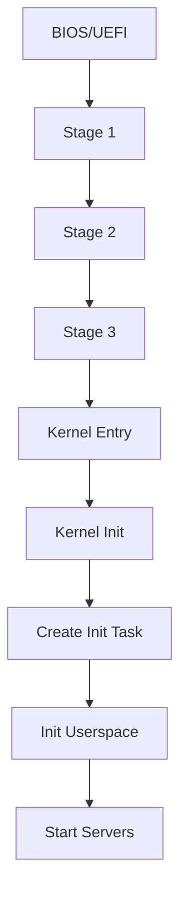

# SaltyOS Design Overview

This document describes the high-level design philosophy, goals, and architectural decisions of SaltyOS.

## Design Goals

### Primary Goals

1. **Security through Isolation**
   - Minimal trusted computing base (TCB)
   - All drivers and servers run in userspace
   - Capability-based access control for all resources

2. **Correctness over Performance**
   - Simple, auditable kernel code
   - Formal verification potential (seL4-inspired design)
   - No kernel memory allocation after boot (future goal)

3. **Real-Time Capability**
   - EDF scheduling with budget enforcement
   - Bounded worst-case execution time (WCET) for syscalls
   - Priority inheritance for capability operations

4. **Multi-Architecture Support**
   - Clean architecture abstraction layer
   - x86_64 and aarch64 fully supported

5. **Full POSIX compatibility**: SaltyOS provides a POSIX subset sufficient for
  modern applications (including GUI stacks like Wayland) while excluding legacy
  features that conflict with capability-based security. See
  [POSIX Compatibility](posix.md) for details.

6. **Multi-Personality Subsystem**: SaltyOS supports multiple OS personalities
   (POSIX and Win32) running concurrently. The process manager tracks per-process
   `PersonalityState` (Posix/Win32/None), and VFS dispatches to personality-specific
   handlers. This enables running both POSIX and Win32 applications on the same kernel.

### Non-Goals
- Maximum performance at cost of complexity
- Legacy hardware support

## Architectural Principles

### Microkernel Philosophy

The kernel provides only mechanisms, not policies:

| Kernel (Mechanism) | Userspace (Policy) |
|-------------------|-------------------|
| Thread scheduling | Process management |
| IPC transport | Protocol/API design |
| Memory mapping | Memory allocation strategy |
| Capability transfer | Access control decisions |
| IRQ delivery | Device drivers |

### Capability-Based Security

Every kernel object is accessed through capabilities:

```
┌─────────────────────────────────────────────────────────────┐
│                   Fat Capability (256 bits / 32 bytes)       │
├─────────────────┬───────────────┬───────────────┬───────────┤
│  Object Pointer │    Rights     │    Badge      │   Type    │
│     (64 bits)   │   (32 bits)   │  (64 bits)    │  (8 bits) │
└─────────────────┴───────────────┴───────────────┴───────────┘
```

Key properties:
- **Unforgeable**: Only kernel can create/modify capabilities
- **Delegatable**: Can be transferred via IPC
- **Revocable**: Parent can revoke derived capabilities
- **Attenuatable**: Rights can only be reduced, never increased

### IPC Model

Three-plane IPC design (Fuchsia-style edge):

1. **Transport plane** — `MessagePipe` (record + cap-carrier
   transfer) and `DataPipe` (byte stream). Each has a Core+Side
   split: a shared `*Core` carries cross-side state, two side
   handles each take a refcount on the core. Closing one side
   asserts `STATE_PEER_CLOSED` on the other; reaping the last
   side reaps the core.

2. **RPC plane** — `MP_CALL` / reply-marked `MP_WRITE` over `MessagePipe`.
   The caller writes a request and waits on its inbound side; the
   server responds with a reply record. Services use one connection
   per client or carry a transaction id in the payload when they
   multiplex.

3. **Event plane** — `EventQueue` (bounded record ring +
   dropped-event counter) + `Watch` (one-shot state-mask
   registration on a watchable kernel object) + `Timer`
   (ns-precision deadline). Watchable state lives on every
   transport object (`READABLE` / `WRITABLE` / `PEER_CLOSED` /
   `CLOSED` etc.) so a thread can multiplex over multiple pipes
   by arming watches against them.

Plus `Futex` on a `VSpace` cap (userspace synchronisation
primitive) and a per-task fault `MessagePipe` with **reply-to-resume**
semantics — the kernel sends a fault record with `MP_FLAG_FAULT` and
parks the faulter until the handler replies `KERNITE_OK` to retry the
faulting instruction or sends a non-OK reply / calls `TCB_KILL` to
tear the thread down.

```
┌──────────┐                 MP_CALL(req)              ┌──────────┐
│  Client  │──────────────────────────────────────────►│  Server  │
└────┬─────┘                                            └────┬─────┘
     │                                      MP_READ(req)      │
     │  ──── caller waits on its inbound MessagePipe side ─── │
     │                                                       │
     │                    reply-marked MP_WRITE(reply)                    │
     │◄──────────────────────────────────────────────────────┤
     │  reply arrives as an ordinary MessagePipe record       │
     │                                                       │
```

### Memory Model

Four-tier memory architecture with clear separation of concerns:

1. **PMM** (Physical Memory Manager): Kernel-internal frame allocator. Provides
   page table pages, radix/maple tree nodes, kernel stacks. Not for user data.
2. **Untyped Memory**: Raw physical memory. Source of kernel objects (via `retype`)
   and MO data pages (via `MO_COMMIT`).
3. **MemoryObject (MO)**: Borrows frames from untyped (primary) or PMM (fallback).
   Tracks pages via 4-level radix tree. Maintains reverse mappings to VSpaces.
   Supports COW clone for fork.
4. **VSpace**: Observer layer. Maps MO pages into hardware page tables via
   `VSPACE_MAP_MO`. Uses a Maple tree to track virtual address regions (`VmArea`).

```
┌─────────────────────────────────────────────────┐
│                  Userspace                      │
│  mmsrv · procmgr · application processes        │
├──────────────── capability boundary ────────────┤
│                                                 │
│   VSpace          MemoryObject       Untyped    │
│   (observer)      (page manager)     (objects)  │
│       │                │                 │      │
│       │    reverse     │    loan/return  │      │
│       └── maps ────────┤                 │      │
│                        │                 │      │
│   ┌────────────────────┴─────────────────┘      │
│   │              PMM                            │
│   │     (sole physical frame owner)             │
│   │     FrameOwner tags · bitmap allocator      │
│   └─────────────────────────────────────────────┤
└─────────────────────────────────────────────────┘
```

The userspace memory server (`mmsrv`) orchestrates MO lifecycle: creating MOs
from untyped, committing pages, mapping into client VSpaces, and handling
demand faults. COW write faults are resolved entirely in the kernel fast-path
without IPC to mmsrv. See [Memory Management](memory.md) for full details.

## Component Overview

### Kernel Components

| Component | Responsibility |
|-----------|---------------|
| `cap/` | Capability management, CNode operations, MemoryObject, untyped retype, IoPort cap |
| `event/` | EventQueue, Watch (lost-wakeup-free), Timer, IRQ handler, watcher list, state flag publication |
| `ipc/` | MessagePipe, DataPipe, fault pipe, Futex, transfer helpers |
| `sched/` | 4-class scheduler (Deadline / RT FIFO / Fair-EEVDF / Idle), priority inheritance, deadline queue (ns-precision Sleep / FutexTimed / IpcTimeout / TimerFire) |
| `task/` | Task control (`begin_destroy`, flat ThreadState transitions, blocked-reason management) |
| `mm/` | PMM (bitmap frame allocator), VSpace (page tables + Maple tree), radix tree, node allocator |
| `syscall/` | Single `KERNITE_SYS_INVOKE` syscall + capability invocation dispatch (per-object handlers) |
| `arch/x86_64/` | GDT, IDT, APIC, ACPI, paging, SMP, CPUID, FPU, PIT, SMAP/SMEP, uaccess, port I/O (8/16/32-bit) |
| `arch/aarch64/` | GICv3, PSCI, PL011 UART, paging (TTBR0/TTBR1), generic timer, FPU/NEON, SMP |

### Userspace Components

Organized in a domain-based layout under `userland/`:

| Component | Path | Responsibility | Status |
|-----------|------|---------------|--------|
| `init` | `core/init/` | System initialization, service-based multi-phase bootstrap | Implemented |
| `mmsrv` | `core/mmsrv/` | Memory manager server (MO lifecycle, demand paging, VSpace mapping) | Implemented |
| `procmgr` | `core/procmgr/` | Process manager (spawn/exit/waitpid/fork/exec, personality tracking) | Implemented |
| `namesrv` | `core/namesrv/` | Service discovery (endpoint lookup) | Implemented |
| `vfs` | `core/vfs/` | Virtual filesystem (ramfs + devfs + Unix sockets + shm + poll + procfs + pipes + inet) | Implemented |
| `console` | `servers/console/` | Serial console server (IoPort cap for COM1, keyboard input) | Implemented |
| `netsrv` | `servers/netsrv/` | Network stack server (TCP/UDP/ARP/ICMP/DNS/DHCP) | Implemented |
| `dnssrv` | `servers/dnssrv/` | Caching DNS resolver | Implemented |
| `posix_ttysrv` | `servers/posix/posix_ttysrv/` | POSIX PTY server (pseudo-terminal, line discipline) | Implemented |
| `posix_getty` | `servers/posix/posix_getty/` | POSIX terminal login service | Implemented |
| `win32_csrss` | `servers/win32/win32_csrss/` | Win32 Client/Server Runtime Subsystem | Implemented |
| `blkdrv` | `drivers/blkdrv/` | Block device driver (virtio-blk) | Implemented |
| `pcidrv` | `drivers/pcidrv/` | PCI enumeration driver (I/O port + ECAM) | Implemented |
| `dispdrv` | `drivers/dispdrv/` | Framebuffer display driver | Implemented |
| `netdrv` | `drivers/netdrv/` | Network device driver (virtio-net) | Implemented |
| `saltyfs` | `drivers/filesystems/saltyfs/` | SaltyFS filesystem server (on-disk filesystem) | Implemented |
| `test_runner` | `tests/test_runner/` | Automated test suite (14 modules) | Implemented |
| `hello_pe` | `tests/hello_pe/` | Win32 PE test program | Implemented |

Runtime dynamic linker (`rtld`) lives in `lib/trona/rtld/` — supports both ELF (`ldtrona-elf.so`) and PE (`ldtrona-pe.so`) formats.

## Boot Sequence



**x86_64 (BIOS or UEFI):**
1. **Stage 1**: MBR (BIOS) or UEFI PE/COFF entry
2. **Stage 2**: Protected/long mode setup
3. **Stage 3**: Mount SaltyFS, load kernel + initrd, build BootInfo, jump to kernel (RDI = BootInfo)
4. **Kernel**: Initialize memory, create root task
5. **Init**: Spawn system servers via `.service` files

**aarch64 (UEFI only):**
1. **Stage 1**: UEFI PE/COFF entry at EL2
2. **Stage 2**: Identity map setup, EL2→EL1 drop
3. **Stage 3**: Load kernel + initrd, PSCI AP bringup, jump to kernel (x0 = BootInfo)
4. **Kernel**: GICv3 init, generic timer, create root task
5. **Init**: Same service-based bootstrap as x86_64

## Design Decisions

### Why Fat Capabilities?

Standard L4/seL4 uses inline capabilities (single word). We chose fat capabilities for:

- **More metadata**: Extended rights, type info
- **Better debugging**: Self-describing objects
- **Simpler revocation**: Parent tracking in capability
- **Trade-off**: More memory per capability, but clearer semantics

### Why EDF Scheduler?

- **Real-time support**: Natural deadline handling
- **Temporal isolation**: Budget enforcement prevents starvation
- **MCS potential**: Mixed-criticality system extension possible
- **Trade-off**: More complex than priority-based, but more powerful

### Why 3-Stage Bootloader?

- **COW filesystem support**: Stage 3 can read SaltyFS
- **Configuration flexibility**: Boot config in filesystem
- **Snapshot boot**: Can boot from filesystem snapshots
- **Trade-off**: More complexity than Limine/GRUB, but full control

### Why Rust for Kernel?

- **Memory safety**: Prevents entire classes of bugs
- **Zero-cost abstractions**: No runtime overhead
- **No runtime**: `#![no_std]` freestanding support
- **Trade-off**: Steeper learning curve, some FFI complexity

## Current Status

### Implemented
- Capability system with fat capabilities (32 bytes), CDT, copy/mint/move/mutate/revoke/delete
- 24 kernel object types (Untyped, TCB, CNode, VSpace, Frame, IrqHandler, IoPort, SchedContext, MemoryObject, EventQueue, Watch, MessagePipe, MessagePipeCore, DataPipe, DataPipeCore, Timer, KernelRng, SystemControl, Clock, SystemInfo, KernelDebug, Pager, DeviceControl, VmHierarchyState)
- Single syscall (`KERNITE_SYS_INVOKE`); every operation is a capability invocation, no ambient kernel authority
- `MessagePipe` IPC: bounded record ring with hidden cap-carrier transfer (`CapRef` move semantics, CDT-stable global slots) and an `MpFastMailbox` cross-CPU fastpath
- `MP_CALL` / reply-marked `MP_WRITE` over `MessagePipe`: caller writes a request and waits on the same connection for a reply record
- `DataPipe` byte stream: lock-protected per-direction byte ring, peek-then-commit consume protocol so userspace EFAULT does not lose ring data
- IPC buffer with message overflow (MR4-MR19) and `KERNITE_MP_FLAG_*` wire flags (CALL / REPLY / fault hint)
- `EventQueue` + `Watch`: bounded event-record queue with dropped-event counter; `Watch` arms a (state-mask, EventQueue) registration on a watchable kernel object (lost-wakeup-free batched fire)
- `Timer` object: ns-precision arm via `KERNITE_INV_TIMER_SET` (one-shot or periodic with missed-period coalescing), bound `EventQueue` receives `EVENT_TYPE_TIMER` records
- IRQ handling via `IrqHandler` cap: `IRQ_BIND_EQ` pins a refcount on the bound `EventQueue` so dispatch in IRQ context can publish without locking; `IRQ_ACK` clears `STATE_SIGNALED` for the next fire
- Per-task fault `MessagePipe` (`TCB_SET_FAULT_PIPE`): the kernel emits page-fault / OOM / illegal-instruction / breakpoint / user-exception fault records into the bound pipe; reply-to-resume is the recovery path
- Unified ns-precision `deadline_queue` (intrusive treap): backs `Sleep` / `FutexTimed` / `IpcTimeout` / `TimerFire`; per-syscall `IpcTimeout` knob lives in `IpcBuffer.timeout_ns`
- Futex (wait/wake/requeue) on a VSpace cap, with optional `IpcTimeout` deadline arm
- 4-class scheduler (Deadline / RT FIFO / Fair-EEVDF / Idle) with budget enforcement and priority inheritance over `MP_CALL` chains
- MemoryObject-based memory management: 4-level radix tree, COW clone, reverse maps, dual-source commit (untyped + PMM fallback)
- VSpace with Maple tree region tracking, COW fast-path (kernel-internal, no IPC)
- PMM with per-frame FrameOwner tracking and emergency reserve
- I/O port capabilities (`KERNITE_INV_IOPORT_READ_8/16/32` / `WRITE_8/16/32` against an `IoPortRange` cap)
- Kernel-debug surface as a capability (`KernelDebug` cap with `KDEBUG_PUTCHAR` / `PUTSTR` / `PUTBUF` / `DUMP_STATE` / `CONSOLE_CONTROL`); RNG / shutdown / clock / sysinfo all reached through their own dedicated cap objects
- Multi-architecture: x86_64 (BIOS + UEFI) and aarch64 (UEFI-only) fully supported
- 3-stage bootloader for both architectures
- SMP support: x86_64 (ACPI MADT + AP trampoline), aarch64 (PSCI CPU_ON + GICv3 IPI)
- Init process with service-based multi-phase bootstrap
- Console server (serial I/O via IoPort caps)
- Runtime dynamic linker: ELF (`ldtrona-elf.so`) and PE (`ldtrona-pe.so`)
- Process manager (spawn, exit, waitpid, fork, exec) with personality tracking (POSIX/Win32)
- VFS server (ramfs + devfs + initrd + Unix domain sockets + shared memory + poll + procfs + pipes + inet)
- Name service (endpoint lookup)
- Network stack: netsrv (TCP/UDP/ARP/ICMP/DNS/DHCP), netdrv (virtio-net), dnssrv (caching resolver)
- Multi-personality subsystem: POSIX + Win32 personalities with win32_csrss
- SaltyFS filesystem (on-disk, with userspace driver)
- Memory manager server (mmsrv): MO lifecycle, demand paging, region tracking
- Userland and trona migrated from C to Rust (5-crate structure: substrate/posix/loader/uapi/win32)
- POSIX compatibility: Unix domain sockets, poll/select, shared memory, fd passing, signals, pipes, mmap
- C standard library (basaltc/libc.so) with 40 Rust modules
- Ports system: 16 ports including bash, FreeBSD utilities, nano, ncurses, nasm
- Self-hosting toolchain: patched LLVM/Clang/LLD and rustc for x86_64-unknown-saltyos and aarch64-unknown-saltyos

## Service Lifecycle and Name Brokering

The init process owns system lifecycle as a systemd-style supervisor.
Service activation flows through four unit types under `/services/`
in the initrd:

- `*.service` — runnable service unit (lifecycle + capabilities + dependencies).
- `*.cap` — policy/hardware capability source (`SourceSlot=N` names a slot init received from the bootloader).
- `*.socket` — provider's namesrv publish endpoint declaration.
- `*.target` — milestone unit aggregating dependencies (e.g., `rootfs.target`).

`init` parses every unit at boot, validates cross-references
(`UnitRef::{Cap, Socket, Target, Service, LocalAlias}`), runs a Kahn
topological sort over `After=`/`Before=` ordering edges, and feeds
the result to a readiness graph (`UnitGraph`). Each service node is
"ready" once its `NAMESRV_REGISTER` arrives; readiness propagates
along the dependency edges so consumers wake up the moment their
producers publish.

`namesrv` is a kernel-cap broker (D-Bus role): every service publishes
its master service-EP send via `NAMESRV_REGISTER` with
`ENTRY_FLAG_BADGE_AS_CALLER`, and consumers do lazy lookup through
substrate's `caps::*_ep()` getters. The bootstrap cap-table only
delivers a small handle set (init control, namespace root, reply
token, signal pipe, system caps, plus manifest-declared policy caps);
all other service endpoints are resolved on first use.

When a publisher's REGISTER succeeds, namesrv pushes a
`NAMESRV_REGISTER_EVENT` onto a subscribed MP that init's owner loop
watches. The supervisor calls `unit_mgr::on_namesrv_register(prefix)`,
re-runs `dispatch_ready`, and spawns every service whose dependencies
just became satisfied.

## Future Directions

1. **Formal Verification**: seL4-style proofs for critical paths
2. **Nested Virtualization**: Hypervisor mode for VMs
3. **GUI Compositor**: Wayland-like display server (POSIX socket/shm prerequisites done, framebuffer display driver available)
4. **File-backed MO**: Page cache integration via `MoKind::FileBacked` (enum exists, not yet implemented)
5. **Full self-hosting**: Build SaltyOS on SaltyOS (toolchain cross-compilation done, runtime support in progress)

## References

- [seL4 Reference Manual](https://sel4.systems/Info/Docs/seL4-manual-latest.pdf)
- [L4 Microkernel Family](https://os.inf.tu-dresden.de/L4/)
- [Capability-based Computer Systems](https://homes.cs.washington.edu/~levy/capabook/)
- [EDF Scheduling](https://en.wikipedia.org/wiki/Earliest_deadline_first_scheduling)
