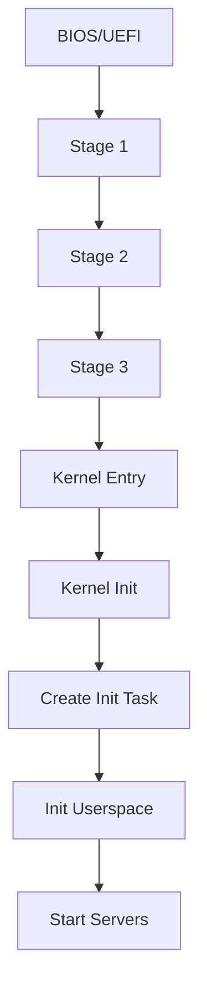

# SaltyOS Design Overview

This document describes the high-level design philosophy, goals, and architectural decisions of SaltyOS.

## Design Goals

### Primary Goals

1. **Security through Isolation**
   - Minimal trusted computing base (TCB)
   - All drivers and servers run in userspace
   - Capability-based access control for all resources

2. **Correctness over Performance**
   - Simple, auditable kernel code
   - Formal verification potential (seL4-inspired design)
   - No kernel memory allocation after boot (future goal)

3. **Real-Time Capability**
   - EDF scheduling with budget enforcement
   - Bounded worst-case execution time (WCET) for syscalls
   - Priority inheritance for capability operations

4. **Multi-Architecture Support**
   - Clean architecture abstraction layer
   - x86_64 as primary target
   - aarch64 as secondary target

5. **Full POSIX compatibility**: SaltyOS provides a POSIX subset sufficient for
  modern applications (including GUI stacks like Wayland) while excluding legacy
  features that conflict with capability-based security. See
  [POSIX Compatibility](posix.md) for details.

### Non-Goals
- Maximum performance at cost of complexity
- Legacy hardware support

## Architectural Principles

### Microkernel Philosophy

The kernel provides only mechanisms, not policies:

| Kernel (Mechanism) | Userspace (Policy) |
|-------------------|-------------------|
| Thread scheduling | Process management |
| IPC transport | Protocol/API design |
| Memory mapping | Memory allocation strategy |
| Capability transfer | Access control decisions |
| IRQ delivery | Device drivers |

### Capability-Based Security

Every kernel object is accessed through capabilities:

```
┌─────────────────────────────────────────────────────────────┐
│                    Fat Capability (128+ bits)               │
├─────────────────┬───────────────┬───────────────┬───────────┤
│  Object Pointer │    Rights     │    Badge      │   Type    │
│     (64 bits)   │   (32 bits)   │  (64 bits)    │  (8 bits) │
└─────────────────┴───────────────┴───────────────┴───────────┘
```

Key properties:
- **Unforgeable**: Only kernel can create/modify capabilities
- **Delegatable**: Can be transferred via IPC
- **Revocable**: Parent can revoke derived capabilities
- **Attenuatable**: Rights can only be reduced, never increased

### IPC Model

Dual IPC primitive design:

1. **Synchronous Endpoints** (message passing)
   - Rendezvous-style: sender blocks until receiver ready
   - Zero-copy for large transfers (page donation)
   - Badge identifies sender

2. **Notifications** (signaling)
   - Lightweight async signals (bitmap or counter)
   - Used for IRQ delivery
   - Combined with shared memory for async queues

```
┌──────────┐                              ┌──────────┐
│  Client  │                              │  Server  │
└────┬─────┘                              └────┬─────┘
     │                                         │
     │  call(endpoint, msg)                    │
     ├────────────────────────────────────────►│
     │                     recv(endpoint)      │
     │◄────────────────────────────────────────┤
     │                     reply(msg)          │
     │                                         │
```

### Memory Model

Three-level memory abstraction:

1. **Untyped Memory**: Raw physical frames, root task controls all
2. **Typed Objects**: Kernel objects (TCB, CNode, Endpoint, etc.)
3. **VSpace**: Virtual address space with page table hierarchy

```
                    ┌─────────────────┐
                    │  Untyped Memory │
                    │   (Physical)    │
                    └────────┬────────┘
                             │ retype
            ┌────────────────┼────────────────┐
            ▼                ▼                ▼
    ┌───────────────┐ ┌───────────────┐ ┌───────────────┐
    │     Frame     │ │      TCB      │ │   Endpoint    │
    └───────┬───────┘ └───────────────┘ └───────────────┘
            │ map
            ▼
    ┌───────────────┐
    │    VSpace     │
    │  (Page Table) │
    └───────────────┘
```

## Component Overview

### Kernel Components

| Component | Responsibility |
|-----------|---------------|
| `cap/` | Capability management, CNode operations |
| `ipc/` | Endpoints, Notifications, message transfer |
| `sched/` | EDF scheduler, thread management |
| `mm/` | VSpace, Frame allocation, Slab allocator |
| `syscall/` | System call dispatch and handling |
| `arch/` | Architecture-specific code (GDT, IDT, paging) |

### Userspace Components

| Component | Responsibility |
|-----------|---------------|
| `init` | System initialization, server spawning |
| `procmgr` | Process lifecycle, capability distribution |
| `vfs` | Virtual filesystem, SaltyFS driver |
| `nameserv` | Service discovery (endpoint lookup) |
| `drivers/` | Device drivers (PCI, NVMe, USB, etc.) |

## Boot Sequence



1. **Stage 1**: Load Stage 2 from fixed location
2. **Stage 2**: Enter long mode, load Stage 3 from partition
3. **Stage 3**: Read SaltyFS, load kernel + initrd
4. **Kernel**: Initialize memory, create root task
5. **Init**: Spawn system servers, mount filesystems

## Design Decisions

### Why Fat Capabilities?

Standard L4/seL4 uses inline capabilities (single word). We chose fat capabilities for:

- **More metadata**: Extended rights, type info
- **Better debugging**: Self-describing objects
- **Simpler revocation**: Parent tracking in capability
- **Trade-off**: More memory per capability, but clearer semantics

### Why EDF Scheduler?

- **Real-time support**: Natural deadline handling
- **Temporal isolation**: Budget enforcement prevents starvation
- **MCS potential**: Mixed-criticality system extension possible
- **Trade-off**: More complex than priority-based, but more powerful

### Why 3-Stage Bootloader?

- **COW filesystem support**: Stage 3 can read SaltyFS
- **Configuration flexibility**: Boot config in filesystem
- **Snapshot boot**: Can boot from filesystem snapshots
- **Trade-off**: More complexity than Limine/GRUB, but full control

### Why Rust for Kernel?

- **Memory safety**: Prevents entire classes of bugs
- **Zero-cost abstractions**: No runtime overhead
- **No runtime**: `#![no_std]` freestanding support
- **Trade-off**: Steeper learning curve, some FFI complexity

## Future Directions

1. **Formal Verification**: seL4-style proofs for critical paths
2. **SMP Support**: Per-CPU run queues, IPI-based migration
3. **Nested Virtualization**: Hypervisor mode for VMs
4. **Network Stack**: Userspace TCP/IP implementation
5. **GUI Compositor**: Wayland-like display server

## References

- [seL4 Reference Manual](https://sel4.systems/Info/Docs/seL4-manual-latest.pdf)
- [L4 Microkernel Family](https://os.inf.tu-dresden.de/L4/)
- [Capability-based Computer Systems](https://homes.cs.washington.edu/~levy/capabook/)
- [EDF Scheduling](https://en.wikipedia.org/wiki/Earliest_deadline_first_scheduling)
