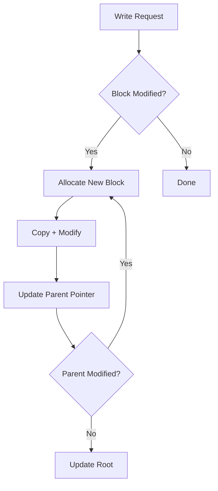
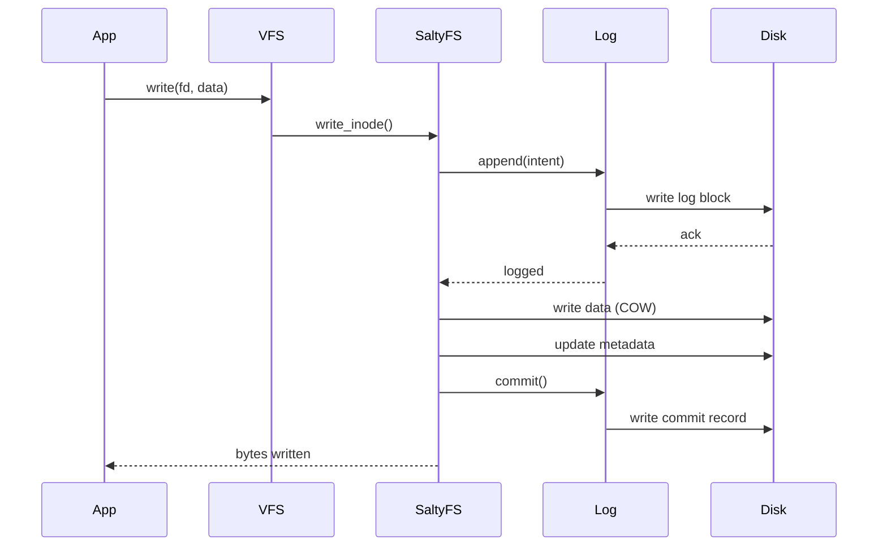

# SaltyFS Design

This document describes SaltyFS, the Copy-on-Write filesystem for SaltyOS.

## Overview

SaltyFS is a modern, COW (Copy-on-Write) filesystem designed for SaltyOS with the following goals:

- **Snapshots**: Instant, space-efficient filesystem snapshots
- **Data Integrity**: Checksums for all data and metadata
- **Crash Consistency**: Always consistent on-disk state
- **Efficient Writes**: Log-structured with COW semantics
- **Compression**: Transparent data compression (optional)
- **Boot Support**: Read-only driver in Stage 3 bootloader

## Design Influences

SaltyFS draws inspiration from:
- **Btrfs**: COW B-trees, snapshots, checksums
- **ZFS**: Transaction groups, intent log
- **F2FS**: Flash-friendly log structure
- **bcachefs**: Modern COW filesystem design

## On-Disk Layout

### Overall Structure

```
┌─────────────────────────────────────────────────────────────────┐
│ Superblock (Primary)          │ 4 KB (LBA 0)                    │
├─────────────────────────────────────────────────────────────────┤
│ Superblock (Backup)           │ 4 KB (LBA 1)                    │
├─────────────────────────────────────────────────────────────────┤
│ Allocation Bitmap             │ Variable size                   │
├─────────────────────────────────────────────────────────────────┤
│ Intent Log                    │ 64 MB (configurable)            │
├─────────────────────────────────────────────────────────────────┤
│                                                                 │
│                     Data + Metadata Blocks                      │
│                                                                 │
│  ┌─────────────────────────────────────────────────────────┐   │
│  │  Extent Trees                                           │   │
│  │  Directory Trees                                        │   │
│  │  Inode Tables                                           │   │
│  │  Data Extents                                           │   │
│  └─────────────────────────────────────────────────────────┘   │
│                                                                 │
├─────────────────────────────────────────────────────────────────┤
│ Superblock (Backup 2)         │ 4 KB (near end)                 │
└─────────────────────────────────────────────────────────────────┘
```

### Superblock

```c
// 4 KB Superblock structure
struct SaltySuperblock {
    // Identity (offset 0x000)
    uint8_t  magic[8];          // "SALTYFS\0"
    uint32_t version;           // Filesystem version
    uint32_t flags;             // Feature flags
    
    // UUIDs (offset 0x010)
    uint8_t  fs_uuid[16];       // Filesystem UUID
    uint8_t  device_uuid[16];   // Device UUID
    
    // Geometry (offset 0x030)
    uint64_t block_size;        // Block size (4KB default)
    uint64_t total_blocks;      // Total blocks in filesystem
    uint64_t used_blocks;       // Currently used blocks
    uint64_t reserved_blocks;   // Reserved for root
    
    // Tree roots (offset 0x050)
    uint64_t root_tree;         // Root of the tree of trees
    uint64_t extent_tree;       // Extent allocation tree
    uint64_t checksum_tree;     // Checksums tree
    uint64_t snapshot_tree;     // Snapshot tree root
    
    // Log (offset 0x070)
    uint64_t log_start;         // Intent log start block
    uint64_t log_size;          // Intent log size in blocks
    uint64_t log_head;          // Current log head
    uint64_t log_tail;          // Current log tail
    
    // State (offset 0x090)
    uint64_t generation;        // Transaction generation
    uint64_t last_mount_time;
    uint64_t last_write_time;
    uint64_t mount_count;
    
    // Root inode (offset 0x0B0)
    uint64_t root_inode;        // Root directory inode number
    
    // Checksums (offset 0x0B8)
    uint32_t checksum_type;     // CRC32, xxHash, etc.
    uint32_t reserved1;
    
    // Label (offset 0x0C0)
    char     label[64];         // Volume label
    
    // Padding and checksum
    uint8_t  reserved[3904];
    uint32_t checksum;          // Superblock checksum
};
```

### B-Tree Structure

All metadata uses COW B-trees:

```c
// B-tree node header (64 bytes)
struct BTreeNodeHeader {
    uint8_t  magic[4];          // "BTND"
    uint32_t checksum;          // Node checksum
    
    uint64_t owner;             // Owning tree ID
    uint64_t generation;        // Transaction generation
    uint64_t block_nr;          // This block number
    
    uint32_t num_items;         // Number of items
    uint16_t level;             // 0 = leaf, >0 = internal
    uint16_t flags;             // Node flags
    
    uint8_t  reserved[24];
};

// B-tree key
struct BTreeKey {
    uint64_t object_id;         // Inode number or tree ID
    uint8_t  type;              // Item type
    uint64_t offset;            // Offset within object
} __attribute__((packed));

// B-tree item (in leaf nodes)
struct BTreeItem {
    struct BTreeKey key;
    uint32_t offset;            // Offset to data in node
    uint32_t size;              // Size of data
};

// B-tree pointer (in internal nodes)  
struct BTreePointer {
    struct BTreeKey key;        // First key in child
    uint64_t block_nr;          // Child block number
    uint64_t generation;        // Child generation
};
```

### Inode Structure

```c
// Item type constants
#define SALTY_INODE_ITEM     0x01
#define SALTY_INODE_REF      0x02  // Name reference
#define SALTY_DIR_ITEM       0x03
#define SALTY_DIR_INDEX      0x04
#define SALTY_EXTENT_DATA    0x05
#define SALTY_EXTENT_REF     0x06
#define SALTY_XATTR_ITEM     0x07

// Inode item (embedded in B-tree leaf)
struct SaltyInode {
    uint64_t generation;
    uint64_t size;              // File size in bytes
    uint64_t blocks;            // Allocated blocks
    uint64_t block_group;       // Allocation hint
    
    uint32_t nlink;             // Hard link count
    uint32_t uid;
    uint32_t gid;
    uint32_t mode;              // Permissions
    
    uint64_t atime;             // Access time (ns since epoch)
    uint64_t mtime;             // Modify time
    uint64_t ctime;             // Change time
    uint64_t crtime;            // Creation time
    
    uint32_t flags;             // Inode flags
    uint32_t sequence;          // NFS generation
    
    uint8_t  reserved[32];
};
```

### Extent Tree

File data is stored in extents:

```c
// Extent data item
struct ExtentData {
    uint64_t generation;
    uint64_t ram_bytes;         // Uncompressed size
    uint8_t  compression;       // Compression type
    uint8_t  encryption;        // Encryption type
    uint16_t other_encoding;    // Other encoding
    uint8_t  type;              // Inline, regular, prealloc
    uint8_t  reserved[3];
    
    // For non-inline extents:
    uint64_t disk_bytenr;       // On-disk location
    uint64_t disk_num_bytes;    // On-disk size
    uint64_t offset;            // Offset within extent
    uint64_t num_bytes;         // Bytes from this extent
};

// Extent types
#define EXTENT_INLINE       0   // Data inline in B-tree
#define EXTENT_REGULAR      1   // Normal extent
#define EXTENT_PREALLOC     2   // Preallocated, unwritten
```

## Copy-on-Write Semantics

### Write Operation



### COW B-Tree Update

```
Before Write:                    After Write:
                                
    [Root A]                        [Root B] (new)
       |                               |
   [Node A]                        [Node B] (new)
   /      \                        /      \
[Leaf A] [Leaf B]             [Leaf A] [Leaf C] (new)
                                         ↑
                              Modified data here
```

### Implementation

```rust
/// COW write to filesystem
fn cow_write(
    fs: &mut SaltyFs,
    inode: InodeRef,
    offset: u64,
    data: &[u8],
) -> Result<usize, FsError> {
    let block_size = fs.superblock.block_size;
    let mut written = 0;
    
    while written < data.len() {
        let block_offset = (offset + written as u64) / block_size;
        let in_block_offset = (offset + written as u64) % block_size;
        let to_write = min(
            data.len() - written,
            block_size as usize - in_block_offset as usize,
        );
        
        // Allocate new block
        let new_block = fs.alloc_block()?;
        
        // If partial write, copy existing data first
        if in_block_offset > 0 || to_write < block_size as usize {
            if let Some(old_extent) = inode.find_extent(block_offset)? {
                fs.copy_block(old_extent.disk_bytenr, new_block)?;
            } else {
                fs.zero_block(new_block)?;
            }
        }
        
        // Write new data
        fs.write_block_partial(
            new_block,
            in_block_offset,
            &data[written..written + to_write],
        )?;
        
        // Update extent tree (this triggers COW up the tree)
        inode.update_extent(block_offset, new_block)?;
        
        written += to_write;
    }
    
    Ok(written)
}
```

## Snapshots

### Snapshot Creation

Snapshots are instant and space-efficient:

```rust
/// Create a snapshot of the filesystem
fn create_snapshot(
    fs: &mut SaltyFs,
    name: &str,
) -> Result<SnapshotId, FsError> {
    // Start transaction
    let txn = fs.begin_transaction()?;
    
    // Create snapshot entry
    let snapshot = Snapshot {
        id: fs.next_snapshot_id(),
        name: name.to_string(),
        root_tree: fs.superblock.root_tree,  // Just copy pointer!
        generation: fs.superblock.generation,
        creation_time: now(),
    };
    
    // Insert into snapshot tree
    fs.snapshot_tree.insert(snapshot.id, snapshot)?;
    
    // Commit transaction
    txn.commit()?;
    
    Ok(snapshot.id)
}
```

### Space Sharing

Snapshots share blocks with current filesystem:

```
Snapshot 1 Root ───┐       Current Root ───┐
                   │                       │
                   ▼                       ▼
              [Shared Node]           [New Node]
                   │                 /          \
                   │                /            \
                   ▼               ▼              ▼
              [Shared Leaf]   [Shared Leaf]   [New Leaf]
```

### Reference Counting

Blocks are reference-counted for snapshot management:

```c
// Extent reference item
struct ExtentRef {
    uint64_t owner;         // Tree owning this reference
    uint64_t offset;        // Offset in owner
    uint32_t count;         // Reference count
};
```

## Intent Log

For crash consistency, writes go to the intent log first:

### Log Structure

```c
// Log entry header
struct LogEntryHeader {
    uint32_t magic;         // "SLOG"
    uint32_t checksum;
    uint64_t generation;
    uint32_t type;          // Log entry type
    uint32_t length;        // Data length
};

// Log entry types
#define LOG_INODE_UPDATE    1
#define LOG_EXTENT_ALLOC    2
#define LOG_EXTENT_FREE     3
#define LOG_DIR_INSERT      4
#define LOG_DIR_DELETE      5
#define LOG_TREE_UPDATE     6
```

### Write Path



### Crash Recovery

```rust
/// Recover filesystem after crash
fn recover(fs: &mut SaltyFs) -> Result<(), FsError> {
    // Read log from head to tail
    let log = read_intent_log(fs)?;
    
    for entry in log.iter() {
        match entry.entry_type {
            LOG_INODE_UPDATE => {
                // Check if update was committed
                if !is_committed(fs, &entry) {
                    // Replay the update
                    replay_inode_update(fs, &entry)?;
                }
            }
            // ... handle other entry types
            _ => {}
        }
    }
    
    // Clear log after recovery
    clear_intent_log(fs)?;
    
    Ok(())
}
```

## Checksums

All data and metadata blocks have checksums:

### Checksum Types

```rust
#[repr(u32)]
pub enum ChecksumType {
    Crc32c = 0,
    Xxhash64 = 1,
    Sha256 = 2,  // For paranoid mode
}
```

### Checksum Tree

Checksums are stored in a separate B-tree:

```c
// Checksum item
struct ChecksumItem {
    uint64_t block_nr;      // Block number
    uint32_t checksum;      // Checksum value
    uint32_t reserved;
};
```

### Verification

```rust
/// Read block with checksum verification
fn read_block_verified(
    fs: &SaltyFs,
    block_nr: u64,
) -> Result<Block, FsError> {
    let block = fs.read_block(block_nr)?;
    
    // Look up expected checksum
    let expected = fs.checksum_tree.lookup(block_nr)?;
    
    // Calculate actual checksum
    let actual = calculate_checksum(&block, fs.checksum_type);
    
    if actual != expected {
        return Err(FsError::ChecksumMismatch {
            block: block_nr,
            expected,
            actual,
        });
    }
    
    Ok(block)
}
```

## Compression

Optional transparent compression:

### Compression Types

```rust
#[repr(u8)]
pub enum CompressionType {
    None = 0,
    Lz4 = 1,      // Fast, good ratio
    Zstd = 2,     // Better ratio, still fast
    Zlib = 3,     // Maximum compatibility
}
```

### Compressed Extent

```
┌─────────────────────────────────────────────────────────────┐
│  Extent Data Item                                           │
├─────────────────────────────────────────────────────────────┤
│  ram_bytes: 65536      (uncompressed size)                  │
│  compression: Zstd                                          │
│  disk_num_bytes: 24576 (compressed size on disk)            │
└─────────────────────────────────────────────────────────────┘
```

## Boot Support

### Read-Only Driver

The Stage 3 bootloader includes a minimal SaltyFS driver:

```c
// boot/stage3/fs/saltyfs.c

struct SaltyFsContext {
    uint64_t partition_lba;
    struct SaltySuperblock sb;
    uint64_t snapshot_root;  // Current snapshot or main root
};

// Mount filesystem (read-only)
int saltyfs_mount(struct SaltyFsContext *ctx, uint64_t partition_lba) {
    ctx->partition_lba = partition_lba;
    
    // Read primary superblock
    if (read_block(partition_lba, &ctx->sb) != 0) {
        return -1;
    }
    
    // Verify magic
    if (memcmp(ctx->sb.magic, "SALTYFS\0", 8) != 0) {
        // Try backup superblock
        if (read_block(partition_lba + 1, &ctx->sb) != 0) {
            return -1;
        }
    }
    
    // Verify checksum
    if (!verify_superblock_checksum(&ctx->sb)) {
        return -1;
    }
    
    ctx->snapshot_root = ctx->sb.root_tree;
    return 0;
}

// Read file from filesystem
int saltyfs_read_file(
    struct SaltyFsContext *ctx,
    const char *path,
    void *buffer,
    size_t *size
) {
    // 1. Parse path and walk directory tree
    uint64_t inode = resolve_path(ctx, path);
    if (inode == 0) return -1;
    
    // 2. Read inode item
    struct SaltyInode inode_item;
    if (read_inode(ctx, inode, &inode_item) != 0) return -1;
    
    // 3. Read extent data
    return read_extents(ctx, inode, buffer, size);
}
```

### Snapshot Boot

Boot from a filesystem snapshot:

```ini
# /boot/saltyos.cfg
[snapshot-recovery]
title = SaltyOS (Recovery Snapshot)
snapshot = 42
kernel = /boot/kernel.elf
initrd = /boot/initrd.img
```

```c
// Set snapshot for boot
int saltyfs_set_snapshot(struct SaltyFsContext *ctx, uint64_t snapshot_id) {
    // Look up snapshot in snapshot tree
    struct Snapshot snap;
    if (lookup_snapshot(ctx, snapshot_id, &snap) != 0) {
        return -1;
    }
    
    // Use snapshot's root tree
    ctx->snapshot_root = snap.root_tree;
    return 0;
}
```

## Userspace Driver

The full read-write driver runs in userspace:

### VFS Interface

```rust
// userland/vfs/saltyfs/mod.rs

pub struct SaltyFsDriver {
    device: BlockDevice,
    superblock: Superblock,
    // Caches
    block_cache: LruCache<u64, Block>,
    inode_cache: LruCache<u64, Inode>,
}

impl FsDriver for SaltyFsDriver {
    fn mount(&mut self, device: &str) -> Result<(), FsError>;
    fn unmount(&mut self) -> Result<(), FsError>;
    
    fn lookup(&self, parent: InodeId, name: &str) -> Result<InodeId, FsError>;
    fn read(&self, inode: InodeId, offset: u64, buf: &mut [u8]) -> Result<usize, FsError>;
    fn write(&mut self, inode: InodeId, offset: u64, buf: &[u8]) -> Result<usize, FsError>;
    
    fn create(&mut self, parent: InodeId, name: &str, mode: u32) -> Result<InodeId, FsError>;
    fn unlink(&mut self, parent: InodeId, name: &str) -> Result<(), FsError>;
    fn mkdir(&mut self, parent: InodeId, name: &str, mode: u32) -> Result<InodeId, FsError>;
    fn rmdir(&mut self, parent: InodeId, name: &str) -> Result<(), FsError>;
    
    // Snapshot operations
    fn create_snapshot(&mut self, name: &str) -> Result<SnapshotId, FsError>;
    fn delete_snapshot(&mut self, id: SnapshotId) -> Result<(), FsError>;
    fn list_snapshots(&self) -> Result<Vec<Snapshot>, FsError>;
}
```

## Performance Considerations

### Write Amplification

COW can cause write amplification (modifying one block updates whole path to root).

Mitigations:
- **Delayed allocation**: Batch writes before COW
- **Intent log**: Absorb small writes
- **B-tree node size**: Larger nodes = shallower trees

### Fragmentation

Log-structured writes can fragment files over time.

Mitigations:
- **Online defragmentation**: Background task
- **Extent preallocation**: Reserve contiguous space
- **Auto-defrag option**: Defrag on read if too fragmented

### Memory Usage

Large filesystems need significant metadata cache.

Recommendations:
- **Minimum RAM**: 256 MB for basic operation
- **Recommended**: 1+ GB for good performance
- **Server**: Cache size proportional to filesystem size

## Future Enhancements

1. **RAID support**: Built-in mirroring and striping
2. **Encryption**: Per-file and full-disk encryption
3. **Deduplication**: Block-level dedup with reflinks
4. **Send/Receive**: Efficient snapshot streaming
5. **Quotas**: Per-user and per-project quotas
6. **Scrubbing**: Background integrity checking
