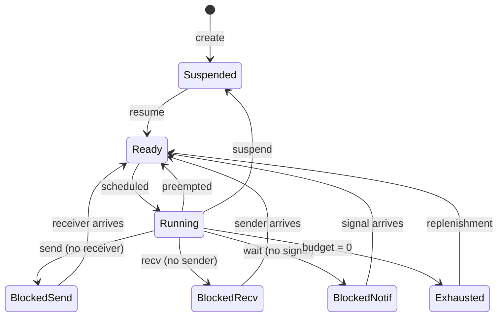

# Scheduler Design

This document describes the Earliest Deadline First (EDF) scheduler in SaltyOS.

## Overview

SaltyOS uses EDF scheduling with budget enforcement, inspired by seL4's MCS (Mixed Criticality Systems) extensions. This provides:

- **Real-time support**: Threads can meet hard deadlines
- **Temporal isolation**: Budget limits prevent starvation
- **Flexibility**: Both real-time and best-effort workloads

## Source Modules

| File | Purpose |
|------|---------|
| `sched/mod.rs` | Module entry, re-exports |
| `sched/scheduler.rs` | EDF scheduler, global ready queue, context switch |
| `sched/thread.rs` | TCB, SchedContext, ThreadState definitions |
| `sched/pip.rs` | Priority Inheritance Protocol (prevents priority inversion in IPC) |
| `sched/sleep_queue.rs` | Timed sleep queue (NanoSleep, timed IPC timeouts) |

## Scheduling Model

### Scheduling Context

A **Scheduling Context (SC)** is a kernel object that provides scheduling parameters:

```rust
/// Scheduling Context - provides CPU time to threads
pub struct SchedContext {
    /// Unique identifier
    id: SchedContextId,
    
    /// Time budget per period (microseconds)
    budget: u64,
    
    /// Remaining budget in current period
    remaining: u64,
    
    /// Period length (microseconds) - 0 for sporadic
    period: u64,
    
    /// Absolute deadline for current period
    deadline: u64,
    
    /// Thread bound to this SC (raw pointer; null if unbound)
    bound_tcb: *mut Tcb,
    
    /// Priority (for tiebreaking)
    priority: u8,
    
    /// State
    state: ScState,
}

#[derive(Clone, Copy, PartialEq)]
pub enum ScState {
    /// Currently running
    Running,
    /// Ready but not running
    Ready,
    /// Budget exhausted, waiting for replenishment
    Exhausted,
    /// Not in scheduler (inactive)
    Inactive,
}
```

### Thread-SC Binding

Threads consume CPU time through bound Scheduling Contexts:

```
┌─────────────────┐     ┌─────────────────────┐
│     Thread      │────►│  Scheduling Context │
│                 │     │                     │
│  - Entry point  │     │  - Budget: 5ms      │
│  - Stack        │     │  - Period: 20ms     │
│  - CSpace       │     │  - Deadline: abs    │
│  - VSpace       │     │  - Priority: 10     │
└─────────────────┘     └─────────────────────┘
```

Benefits of separation:
- Threads can share SCs (time partitioning)
- SCs can be migrated between threads
- Clear accounting of CPU time

## EDF Algorithm

### Basic EDF

Earliest Deadline First:
- Always run the thread with the earliest deadline
- Optimal for uniprocessor systems (can schedule any feasible workload)

```rust
/// EDF scheduler (single global ready queue, no heap allocation).
/// Implemented in sched/scheduler.rs.
pub struct Scheduler {
    /// Global ready queue head, sorted by deadline.
    /// Intrusive linked list threaded through TCB fields
    /// (no BinaryHeap/Vec -- raw pointers in #![no_std] kernel).
    ready_head: *mut Tcb,

    /// Currently running thread per CPU
    current: [*mut Tcb; MAX_CPUS],

    /// Per-CPU idle thread
    idle: [*mut Tcb; MAX_CPUS],
}

impl Scheduler {
    /// Get next thread to run on the given CPU.
    /// Walks the global ready list to find the earliest-deadline
    /// thread whose affinity allows running on this CPU.
    /// Returns a raw pointer to the TCB (null if no runnable thread).
    pub fn pick_next(&mut self, cpu: usize) -> *mut Tcb {
        // Walk global ready list, find first TCB eligible for this CPU
        let tcb = self.dequeue_for_cpu_unlocked(cpu);
        if tcb.is_null() {
            return core::ptr::null_mut();
        }

        self.current[cpu] = tcb;
        // SAFETY: tcb is a valid pointer from the ready queue
        unsafe { (*tcb).state = ThreadState::Running; }

        tcb
    }
}
```

### Deadline Ordering

```rust
/// Comparison for deadline ordering
impl Ord for SchedContextRef {
    fn cmp(&self, other: &Self) -> Ordering {
        // Earlier deadline = higher priority
        let deadline_cmp = self.deadline.cmp(&other.deadline).reverse();
        
        if deadline_cmp == Ordering::Equal {
            // Tiebreak by priority (higher = first)
            self.priority.cmp(&other.priority).reverse()
        } else {
            deadline_cmp
        }
    }
}
```

## Budget Management

### Budget Consumption

```rust
/// Timer tick handler - called every TICK_US microseconds
pub fn timer_tick() {
    let cpu = current_cpu();
    let now = timer::now_us();
    
    if let Some(sc) = &mut current[cpu] {
        // Deduct time from budget
        let elapsed = now - sc.last_tick;
        sc.last_tick = now;
        
        if elapsed >= sc.remaining {
            // Budget exhausted
            handle_budget_exhausted(cpu, sc);
        } else {
            sc.remaining -= elapsed;
            
            // Check preemption
            if should_preempt(cpu, sc) {
                schedule(cpu);
            }
        }
    }
}
```

### Budget Exhaustion

```rust
fn handle_budget_exhausted(cpu: usize, sc: *mut SchedContext) {
    // SAFETY: sc is the current CPU's running SC, guaranteed valid
    unsafe {
        (*sc).remaining = 0;
        (*sc).state = ScState::Exhausted;

        // Calculate replenishment time
        if (*sc).period > 0 {
            // Periodic: replenish at next period boundary
            (*sc).replenish_time = (*sc).deadline;
            (*sc).deadline += (*sc).period;
        } else {
            // Sporadic: replenish after cooldown
            (*sc).replenish_time = timer::now_us() + SPORADIC_COOLDOWN;
        }
    }

    // Add to replenishment queue (sorted by replenish_time)
    replenish_queue.insert(sc);

    // Remove from current
    current[cpu] = core::ptr::null_mut();

    // Reschedule
    schedule(cpu);
}
```

### Budget Replenishment

```rust
/// Check for SCs ready for replenishment.
/// The replenish queue is sorted by replenish_time (earliest first).
pub fn check_replenishments() {
    let now = timer::now_us();

    // Pop all SCs whose replenish_time has passed
    while let Some(sc) = replenish_queue.peek_earliest() {
        // SAFETY: sc is a valid pointer from the replenish queue
        if unsafe { (*sc).replenish_time } > now {
            break;  // Remaining entries are in the future
        }

        let sc = replenish_queue.pop_earliest();
        // Restore budget and re-enqueue
        unsafe {
            (*sc).remaining = (*sc).budget;
            (*sc).state = ScState::Ready;
        }

        // Insert back into the global ready queue
        enqueue_unlocked(sc);
    }
}
```

## Preemption

### When to Preempt

```rust
fn should_preempt(cpu: usize, current: &SchedContext) -> bool {
    // Check if there's a higher priority (earlier deadline) SC ready
    if let Some(next) = ready_queue.peek() {
        return next.deadline < current.deadline;
    }
    false
}
```

### Context Switch

```rust
/// Perform a context switch.
/// Called with SCHED_IPC_LOCK held; releases it before the actual
/// switch and reacquires on resume (see lock ordering in mm/mod.rs).
pub fn schedule(cpu: usize) {
    let old = current[cpu];
    let new_tcb = pick_next(cpu);  // sets current[cpu]

    // If same thread, no switch needed
    if !old.is_null() && !new_tcb.is_null() {
        // SAFETY: both pointers were just validated as non-null
        unsafe {
            if (*old).bound_tcb == new_tcb {
                current[cpu] = old;
                return;
            }
        }
    }

    // Put old thread back in global ready queue if still runnable
    if !old.is_null() {
        unsafe {
            if (*old).state == ScState::Running && (*old).remaining > 0 {
                (*old).state = ScState::Ready;
                enqueue_unlocked(old);
            }
        }
    }

    // Switch to new thread
    if !new_tcb.is_null() {
        let old_tcb = if !old.is_null() {
            unsafe { (*old).bound_tcb }
        } else {
            core::ptr::null_mut()
        };

        if !old_tcb.is_null() {
            // SAFETY: both TCB pointers are valid kernel objects
            unsafe {
                arch::switch_context(&mut (*old_tcb).context, &(*new_tcb).context);
            }
        } else {
            unsafe { arch::switch_to(&(*new_tcb).context); }
        }
    } else {
        // No runnable thread - idle
        arch::idle();
    }
}
```

## Thread States



## Priority Inversion Handling

### Problem

Priority inversion occurs when a high-priority thread waits for a low-priority thread:

```
Thread A (high priority) wants endpoint that
Thread B (low priority) is receiving on, but
Thread C (medium priority) is running, starving B
```

### Solution: Priority Inheritance

When Thread A blocks on Thread B:
1. B temporarily inherits A's priority (deadline)
2. B runs ahead of C
3. B completes, A resumes
4. B's priority reverts

The implementation in `sched/pip.rs` handles priority inheritance during IPC
blocking. When a sender with an earlier deadline blocks on an endpoint whose
receiver has a later deadline, the receiver's effective deadline is temporarily
lowered:

```rust
/// Called when sender blocks on endpoint (simplified from sched/pip.rs)
fn do_send_blocking(sender: *mut Tcb, endpoint: *mut Endpoint) {
    // SAFETY: sender and endpoint are valid kernel object pointers
    unsafe {
        (*sender).state = ThreadState::BlockedOnSend;
        (*endpoint).send_queue.enqueue(sender);

        // Priority inheritance (pip.rs):
        // If the receiver's SC has a later deadline than the sender's SC,
        // temporarily inherit the sender's deadline.
        let receiver = (*endpoint).recv_queue.peek();
        if !receiver.is_null() {
            pip::maybe_inherit_priority(sender, receiver);
            // Re-sort receiver in ready queue if deadline changed
        }
    }

    schedule(current_cpu());
}

// In sched/pip.rs:
// - Inheritance is transitive across IPC chains
// - Reverted automatically on reply/ReplyRecv completion
```

### Priority Inheritance Protocol (sched/pip.rs)

The priority inheritance logic is implemented in `sched/pip.rs`. When a
high-priority thread blocks on an endpoint (Send) and a lower-priority thread
is the receiver, the kernel temporarily elevates the receiver's effective
deadline to match the sender's. This prevents unbounded priority inversion where
a medium-priority thread could starve the low-priority receiver and transitively
block the high-priority sender.

Key behaviors:
- Inheritance is transitive: if thread A waits on B which waits on C, C inherits A's deadline
- Inheritance is automatically reverted when the IPC completes (reply or ReplyRecv)
- The ready queue is re-sorted after inheritance changes

### Sleep Queue (sched/sleep_queue.rs)

The sleep queue (`sched/sleep_queue.rs`) manages threads that are sleeping for
a bounded duration. It is used by:

- **NanoSleep** (syscall 13) -- sleep for a specified number of nanoseconds
- **SendTimed** (syscall 21) -- blocking send with timeout
- **RecvTimed** (syscall 22) -- blocking receive with timeout

The sleep queue is a sorted intrusive linked list ordered by absolute wakeup
time. On each timer tick, the kernel checks the head of the queue and wakes
all threads whose deadline has passed. Woken threads are moved to the
`ThreadState::Ready` state and enqueued on the global ready queue.

For timed IPC, the thread is simultaneously on both the endpoint's wait queue
and the sleep queue. Whichever fires first (partner arrival or timeout) removes
the thread from the other queue.

## Sporadic Servers

For sporadic (aperiodic) tasks:

```rust
/// Create a sporadic scheduling context
pub fn create_sporadic_sc(budget: u64, cooldown: u64) -> SchedContext {
    SchedContext {
        budget,
        remaining: budget,
        period: 0,  // 0 = sporadic
        deadline: u64::MAX,  // No fixed deadline
        sporadic_cooldown: cooldown,
        ..Default::default()
    }
}
```

Sporadic servers:
- Get budget immediately when scheduled
- After exhaustion, must wait for cooldown before replenishment
- Good for best-effort tasks

## SMP Considerations

### Global Ready Queue with Affinity-Aware Dequeue

The scheduler uses a **single global ready queue** (`ready_head`), not
per-CPU queues. CPU affinity is stored in each TCB (as a `u8` CPU ID,
`0xFF` = any CPU). When a CPU needs work, `dequeue_for_cpu_unlocked(cpu)`
walks the global list and picks the earliest-deadline thread whose affinity
matches:

```rust
/// In Tcb:
pub cpu_affinity: u8,    // Preferred CPU (0xFF = any CPU)
```

### Load Balancing

```rust
fn balance_load() {
    // Find most loaded and least loaded CPUs
    let max_cpu = find_max_loaded_cpu();
    let min_cpu = find_min_loaded_cpu();
    
    // Migrate SCs if imbalance is significant
    if load[max_cpu] > load[min_cpu] * BALANCE_THRESHOLD {
        migrate_sc(max_cpu, min_cpu);
    }
}
```

### IPI for Cross-CPU Wakeup

```rust
/// Wake a thread on another CPU
fn cross_cpu_wakeup(tcb: TcbRef, target_cpu: usize) {
    // Add to global ready queue
    enqueue_unlocked(tcb);

    // Send IPI to trigger reschedule on target CPU
    // x86_64: Local APIC ICR write (vector 0xFD)
    // aarch64: GICv3 SGI (Software Generated Interrupt) via ICC_SGI1R_EL1
    arch::send_ipi(target_cpu, IPI_RESCHEDULE);
}
```

### Multi-Architecture SMP

| Aspect | x86_64 | aarch64 |
|--------|--------|---------|
| CPU discovery | ACPI MADT table | Device tree / ACPI |
| AP bringup | AP trampoline (real→long mode) | PSCI CPU_ON (HVC call) + mailbox handoff |
| IPI mechanism | Local APIC ICR | GICv3 SGI (ICC_SGI1R_EL1) |
| Timer | APIC timer (PIT-calibrated) | Generic timer CNTP (PPI 30, 10ms tick) |
| Per-CPU data | `%gs:offset` via MSR | TPIDR_EL1 system register |

## Configuration

### Kernel Options

```rust
/// Scheduler configuration
pub struct SchedConfig {
    /// Timer tick interval (microseconds)
    pub tick_us: u64,
    
    /// Minimum SC budget
    pub min_budget: u64,
    
    /// Maximum SC period
    pub max_period: u64,
    
    /// Default priority
    pub default_priority: u8,
    
    /// Enable priority inheritance
    pub priority_inheritance: bool,
    
    /// Load balancing interval (ticks)
    pub balance_interval: u64,
}

pub const DEFAULT_SCHED_CONFIG: SchedConfig = SchedConfig {
    tick_us: 1000,          // 1ms tick
    min_budget: 100,        // 100us minimum
    max_period: 1_000_000,  // 1s maximum
    default_priority: 128,
    priority_inheritance: true,
    balance_interval: 100,  // 100ms
};
```

## System Calls

### SC Operations

SchedContext has five invoke labels (0x30-0x34):

| Label | Name | Description |
|-------|------|-------------|
| 0x30 | SC_CONFIGURE | Set budget, period, and priority |
| 0x31 | SC_BIND | Bind SC to a TCB |
| 0x32 | SC_UNBIND | Unbind SC from its TCB |
| 0x33 | SC_YIELD_TO | Yield current timeslice to target SC |
| 0x34 | SC_CONSUMED | Query consumed CPU time |

```rust
/// Scheduling context invocation dispatch
pub fn invoke_sched_context(
    tcb: &mut Tcb,
    cap: &Capability,
    label: u64,
    msg: &IpcMessage,
) -> InvokeResult {
    // SAFETY: cap.object points to a SchedContext allocated via untyped retype
    let sc = unsafe { &mut *(cap.object as *mut SchedContext) };

    match label {
        // Configure SC parameters
        SC_CONFIGURE => {
            let budget = msg.get_word(0);
            let period = msg.get_word(1);
            let priority = msg.get_word(2) as u8;
            sc_configure(sc, budget, period, priority)
        }

        // Bind SC to a TCB
        SC_BIND => {
            let tcb_cap = msg.get_cap(0);
            sc_bind(sc, tcb_cap)
        }

        // Unbind SC from its current TCB
        SC_UNBIND => {
            sc_unbind(sc)
        }

        // Yield current timeslice to the target SC
        SC_YIELD_TO => {
            let target_sc_cap = msg.get_cap(0);
            sc_yield_to(sc, target_sc_cap)
        }

        // Query consumed CPU time
        SC_CONSUMED => {
            sc_consumed(sc)
        }

        _ => InvokeResult::Error(SyscallError::InvalidOperation),
    }
}
```

### Yield

```rust
/// Yield CPU time (syscall 8)
pub fn sys_yield() {
    let cpu = current_cpu();
    let sc = current[cpu];

    if !sc.is_null() {
        // SAFETY: sc is the current CPU's running SC
        unsafe {
            (*sc).state = ScState::Ready;
            enqueue_unlocked(sc);
        }
        current[cpu] = core::ptr::null_mut();
    }

    schedule(cpu);
}
```

## Idle Thread

Each CPU has an idle thread:

```rust
fn idle_thread() -> ! {
    let cpu = current_cpu();
    loop {
        // Enable interrupts and halt until next interrupt
        arch::enable_interrupts();
        arch::halt();

        // Woken by interrupt (timer tick, IPI, etc.) - check for work
        arch::disable_interrupts();

        if !ready_head.is_null() {
            schedule(cpu);
        }
    }
}
```

## Timing Analysis

### WCET Guarantees

For hard real-time, scheduler operations must have bounded WCET:

| Operation | WCET (cycles) |
|-----------|---------------|
| `pick_next()` | O(1)* |
| `insert()` | O(log n) |
| `timer_tick()` | O(1) |
| `schedule()` | O(log n) |

*With optimized priority queue

### Schedulability Analysis

EDF schedulability test:
```
U = Σ(Ci/Ti) ≤ 1
```

Where:
- Ci = worst-case execution time of task i
- Ti = period of task i
- U = total utilization

If U ≤ 1, the task set is schedulable by EDF.

## Example Configuration

### Periodic Task

```rust
// Create SC with 5ms budget every 20ms
let sc = sys_retype(untyped, CapType::SchedContext, 0)?;
sys_invoke(sc, SC_CONFIGURE, &[
    5_000,   // budget: 5ms
    20_000,  // period: 20ms
    10,      // priority
])?;

// Bind to thread
sys_invoke(sc, SC_BIND, &[thread_cap])?;

// Thread will run for up to 5ms every 20ms
// Deadline is period end
```

### Best-Effort Task

```rust
// Create sporadic SC
let sc = sys_retype(untyped, CapType::SchedContext, 0)?;
sys_invoke(sc, SC_CONFIGURE, &[
    10_000,  // budget: 10ms
    0,       // period: 0 (sporadic)
    255,     // priority: lowest
])?;

// This task runs when no deadline-constrained tasks need CPU
```
