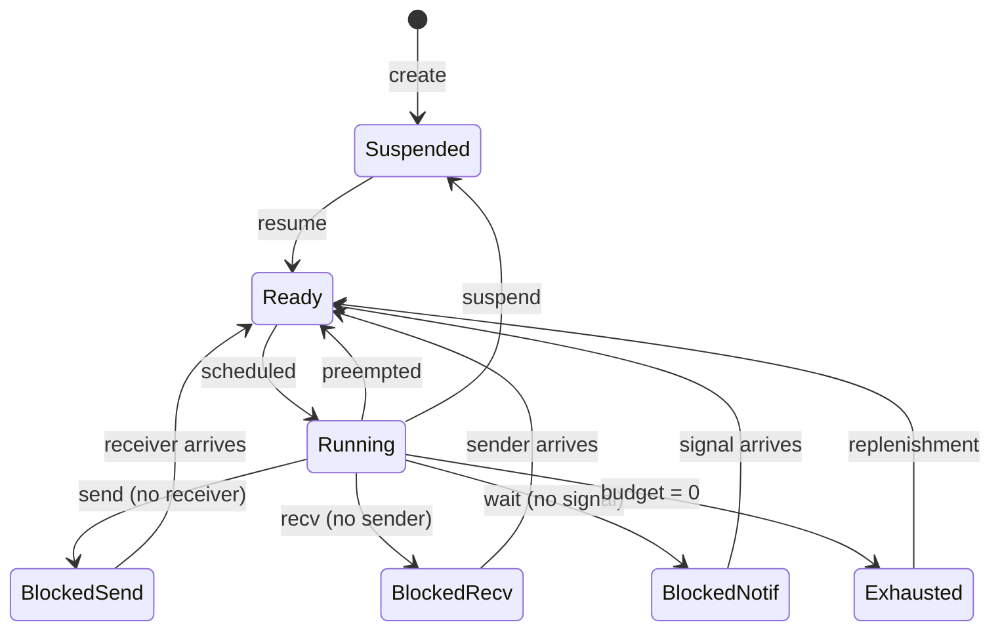

# Scheduler Design

This document describes the Earliest Deadline First (EDF) scheduler in SaltyOS.

## Overview

SaltyOS uses EDF scheduling with budget enforcement, inspired by seL4's MCS (Mixed Criticality Systems) extensions. This provides:

- **Real-time support**: Threads can meet hard deadlines
- **Temporal isolation**: Budget limits prevent starvation
- **Flexibility**: Both real-time and best-effort workloads

## Scheduling Model

### Scheduling Context

A **Scheduling Context (SC)** is a kernel object that provides scheduling parameters:

```rust
/// Scheduling Context - provides CPU time to threads
pub struct SchedContext {
    /// Unique identifier
    id: SchedContextId,
    
    /// Time budget per period (microseconds)
    budget: u64,
    
    /// Remaining budget in current period
    remaining: u64,
    
    /// Period length (microseconds) - 0 for sporadic
    period: u64,
    
    /// Absolute deadline for current period
    deadline: u64,
    
    /// Thread bound to this SC
    bound_tcb: Option<TcbRef>,
    
    /// Priority (for tiebreaking)
    priority: u8,
    
    /// State
    state: ScState,
}

#[derive(Clone, Copy, PartialEq)]
pub enum ScState {
    /// Currently running
    Running,
    /// Ready but not running
    Ready,
    /// Budget exhausted, waiting for replenishment
    Exhausted,
    /// Not in scheduler (inactive)
    Inactive,
}
```

### Thread-SC Binding

Threads consume CPU time through bound Scheduling Contexts:

```
┌─────────────────┐     ┌─────────────────────┐
│     Thread      │────►│  Scheduling Context │
│                 │     │                     │
│  - Entry point  │     │  - Budget: 5ms      │
│  - Stack        │     │  - Period: 20ms     │
│  - CSpace       │     │  - Deadline: abs    │
│  - VSpace       │     │  - Priority: 10     │
└─────────────────┘     └─────────────────────┘
```

Benefits of separation:
- Threads can share SCs (time partitioning)
- SCs can be migrated between threads
- Clear accounting of CPU time

## EDF Algorithm

### Basic EDF

Earliest Deadline First:
- Always run the thread with the earliest deadline
- Optimal for uniprocessor systems (can schedule any feasible workload)

```rust
/// EDF scheduler
pub struct Scheduler {
    /// Ready queue ordered by deadline
    ready_queue: BinaryHeap<SchedContextRef, DeadlineOrder>,
    
    /// Currently running SC per CPU
    current: [Option<SchedContextRef>; MAX_CPUS],
    
    /// Exhausted SCs waiting for replenishment
    replenish_queue: VecDeque<SchedContextRef>,
}

impl Scheduler {
    /// Get next thread to run
    pub fn pick_next(&mut self, cpu: usize) -> Option<TcbRef> {
        // Get SC with earliest deadline
        let sc = self.ready_queue.pop()?;
        
        self.current[cpu] = Some(sc.clone());
        sc.state = ScState::Running;
        
        // Return bound thread
        sc.bound_tcb
    }
}
```

### Deadline Ordering

```rust
/// Comparison for deadline ordering
impl Ord for SchedContextRef {
    fn cmp(&self, other: &Self) -> Ordering {
        // Earlier deadline = higher priority
        let deadline_cmp = self.deadline.cmp(&other.deadline).reverse();
        
        if deadline_cmp == Ordering::Equal {
            // Tiebreak by priority (higher = first)
            self.priority.cmp(&other.priority).reverse()
        } else {
            deadline_cmp
        }
    }
}
```

## Budget Management

### Budget Consumption

```rust
/// Timer tick handler - called every TICK_US microseconds
pub fn timer_tick() {
    let cpu = current_cpu();
    let now = timer::now_us();
    
    if let Some(sc) = &mut current[cpu] {
        // Deduct time from budget
        let elapsed = now - sc.last_tick;
        sc.last_tick = now;
        
        if elapsed >= sc.remaining {
            // Budget exhausted
            handle_budget_exhausted(cpu, sc);
        } else {
            sc.remaining -= elapsed;
            
            // Check preemption
            if should_preempt(cpu, sc) {
                schedule(cpu);
            }
        }
    }
}
```

### Budget Exhaustion

```rust
fn handle_budget_exhausted(cpu: usize, sc: &mut SchedContext) {
    sc.remaining = 0;
    sc.state = ScState::Exhausted;
    
    // Calculate replenishment time
    if sc.period > 0 {
        // Periodic: replenish at next period boundary
        sc.replenish_time = sc.deadline;
        sc.deadline += sc.period;
    } else {
        // Sporadic: replenish after cooldown
        sc.replenish_time = timer::now_us() + SPORADIC_COOLDOWN;
    }
    
    // Add to replenishment queue
    replenish_queue.push(sc.clone());
    
    // Remove from current
    current[cpu] = None;
    
    // Reschedule
    schedule(cpu);
}
```

### Budget Replenishment

```rust
/// Check for SCs ready for replenishment
pub fn check_replenishments() {
    let now = timer::now_us();
    
    while let Some(sc) = replenish_queue.front() {
        if sc.replenish_time <= now {
            let sc = replenish_queue.pop_front().unwrap();
            
            // Restore budget
            sc.remaining = sc.budget;
            sc.state = ScState::Ready;
            
            // Add back to ready queue
            ready_queue.push(sc);
        } else {
            break;  // Queue is ordered by replenish time
        }
    }
}
```

## Preemption

### When to Preempt

```rust
fn should_preempt(cpu: usize, current: &SchedContext) -> bool {
    // Check if there's a higher priority (earlier deadline) SC ready
    if let Some(next) = ready_queue.peek() {
        return next.deadline < current.deadline;
    }
    false
}
```

### Context Switch

```rust
/// Perform a context switch
pub fn schedule(cpu: usize) {
    let old = current[cpu].take();
    let new = pick_next(cpu);
    
    if let (Some(old), Some(new)) = (&old, &new) {
        if old.id == new.id {
            // Same SC, no switch needed
            current[cpu] = old.clone();
            return;
        }
    }
    
    // Put old SC back in ready queue if still runnable
    if let Some(old) = old {
        if old.state == ScState::Running && old.remaining > 0 {
            old.state = ScState::Ready;
            ready_queue.push(old);
        }
    }
    
    // Switch to new thread
    if let Some(new) = new {
        let old_tcb = old.and_then(|sc| sc.bound_tcb);
        let new_tcb = new.bound_tcb.unwrap();
        
        if let Some(old_tcb) = old_tcb {
            arch::switch_context(&mut old_tcb.context, &new_tcb.context);
        } else {
            arch::switch_to(&new_tcb.context);
        }
    } else {
        // No runnable thread - idle
        arch::idle();
    }
}
```

## Thread States



## Priority Inversion Handling

### Problem

Priority inversion occurs when a high-priority thread waits for a low-priority thread:

```
Thread A (high priority) wants endpoint that
Thread B (low priority) is receiving on, but
Thread C (medium priority) is running, starving B
```

### Solution: Priority Inheritance

When Thread A blocks on Thread B:
1. B temporarily inherits A's priority (deadline)
2. B runs ahead of C
3. B completes, A resumes
4. B's priority reverts

```rust
fn do_send_blocking(
    sender: &mut Tcb,
    endpoint: &mut Endpoint,
) {
    // Block sender
    sender.state = ThreadState::BlockedOnSend { endpoint };
    endpoint.send_queue.push(sender);
    
    // Priority inheritance: if receiver has later deadline
    if let Some(receiver_sc) = get_receiver_sc(endpoint) {
        if let Some(sender_sc) = sender.sched_context {
            if sender_sc.deadline < receiver_sc.deadline {
                // Inherit sender's deadline temporarily
                receiver_sc.inherited_deadline = Some(sender_sc.deadline);
                // Re-sort in ready queue
                ready_queue.update(receiver_sc);
            }
        }
    }
    
    schedule();
}
```

## Sporadic Servers

For sporadic (aperiodic) tasks:

```rust
/// Create a sporadic scheduling context
pub fn create_sporadic_sc(budget: u64, cooldown: u64) -> SchedContext {
    SchedContext {
        budget,
        remaining: budget,
        period: 0,  // 0 = sporadic
        deadline: u64::MAX,  // No fixed deadline
        sporadic_cooldown: cooldown,
        ..Default::default()
    }
}
```

Sporadic servers:
- Get budget immediately when scheduled
- After exhaustion, must wait for cooldown before replenishment
- Good for best-effort tasks

## SMP Considerations

### Per-CPU Run Queues

```rust
pub struct PerCpuScheduler {
    /// Per-CPU ready queues
    ready_queues: [ReadyQueue; MAX_CPUS],
    
    /// Global ready queue for unbound threads
    global_queue: ReadyQueue,
    
    /// CPU affinity masks
    affinity: HashMap<SchedContextId, CpuSet>,
}
```

### Load Balancing

```rust
fn balance_load() {
    // Find most loaded and least loaded CPUs
    let max_cpu = find_max_loaded_cpu();
    let min_cpu = find_min_loaded_cpu();
    
    // Migrate SCs if imbalance is significant
    if load[max_cpu] > load[min_cpu] * BALANCE_THRESHOLD {
        migrate_sc(max_cpu, min_cpu);
    }
}
```

### IPI for Cross-CPU Wakeup

```rust
/// Wake a thread on another CPU
fn cross_cpu_wakeup(tcb: TcbRef, target_cpu: usize) {
    // Add to target CPU's ready queue
    ready_queues[target_cpu].push(tcb);
    
    // Send IPI to trigger reschedule
    arch::send_ipi(target_cpu, IPI_RESCHEDULE);
}
```

## Configuration

### Kernel Options

```rust
/// Scheduler configuration
pub struct SchedConfig {
    /// Timer tick interval (microseconds)
    pub tick_us: u64,
    
    /// Minimum SC budget
    pub min_budget: u64,
    
    /// Maximum SC period
    pub max_period: u64,
    
    /// Default priority
    pub default_priority: u8,
    
    /// Enable priority inheritance
    pub priority_inheritance: bool,
    
    /// Load balancing interval (ticks)
    pub balance_interval: u64,
}

pub const DEFAULT_SCHED_CONFIG: SchedConfig = SchedConfig {
    tick_us: 1000,          // 1ms tick
    min_budget: 100,        // 100us minimum
    max_period: 1_000_000,  // 1s maximum
    default_priority: 128,
    priority_inheritance: true,
    balance_interval: 100,  // 100ms
};
```

## System Calls

### SC Operations

```rust
/// Scheduling context system calls
pub fn invoke_sched_context(
    tcb: &mut Tcb,
    cap: &Capability,
    label: u64,
    msg: &IpcMessage,
) -> InvokeResult {
    let sc = unsafe { &mut *(cap.object as *mut SchedContext) };
    
    match label {
        // Configure SC parameters
        SC_CONFIGURE => {
            let budget = msg.get_word(0);
            let period = msg.get_word(1);
            let priority = msg.get_word(2) as u8;
            
            sc_configure(sc, budget, period, priority)
        }
        
        // Bind SC to a TCB
        SC_BIND => {
            let tcb_cap = msg.get_cap(0);
            sc_bind(sc, tcb_cap)
        }
        
        // Unbind SC from TCB
        SC_UNBIND => {
            sc_unbind(sc)
        }
        
        // Yield remaining budget
        SC_YIELD_TO => {
            let target_cap = msg.get_cap(0);
            sc_yield_to(sc, target_cap)
        }
        
        _ => InvokeResult::Error(SyscallError::InvalidOperation),
    }
}
```

### Yield

```rust
/// Yield CPU time
pub fn sys_yield() {
    let current = current_thread();
    
    if let Some(sc) = &current.sched_context {
        sc.state = ScState::Ready;
        ready_queue.push(sc.clone());
        current[current_cpu()] = None;
    }
    
    schedule();
}
```

## Idle Thread

Each CPU has an idle thread:

```rust
fn idle_thread() -> ! {
    loop {
        // Enable interrupts and halt
        arch::enable_interrupts();
        arch::halt();
        
        // Woken by interrupt - check for work
        arch::disable_interrupts();
        
        if !ready_queue.is_empty() {
            schedule();
        }
    }
}
```

## Timing Analysis

### WCET Guarantees

For hard real-time, scheduler operations must have bounded WCET:

| Operation | WCET (cycles) |
|-----------|---------------|
| `pick_next()` | O(1)* |
| `insert()` | O(log n) |
| `timer_tick()` | O(1) |
| `schedule()` | O(log n) |

*With optimized priority queue

### Schedulability Analysis

EDF schedulability test:
```
U = Σ(Ci/Ti) ≤ 1
```

Where:
- Ci = worst-case execution time of task i
- Ti = period of task i
- U = total utilization

If U ≤ 1, the task set is schedulable by EDF.

## Example Configuration

### Periodic Task

```rust
// Create SC with 5ms budget every 20ms
let sc = sys_retype(untyped, CapType::SchedContext, 0)?;
sys_invoke(sc, SC_CONFIGURE, &[
    5_000,   // budget: 5ms
    20_000,  // period: 20ms
    10,      // priority
])?;

// Bind to thread
sys_invoke(sc, SC_BIND, &[thread_cap])?;

// Thread will run for up to 5ms every 20ms
// Deadline is period end
```

### Best-Effort Task

```rust
// Create sporadic SC
let sc = sys_retype(untyped, CapType::SchedContext, 0)?;
sys_invoke(sc, SC_CONFIGURE, &[
    10_000,  // budget: 10ms
    0,       // period: 0 (sporadic)
    255,     // priority: lowest
])?;

// This task runs when no deadline-constrained tasks need CPU
```
