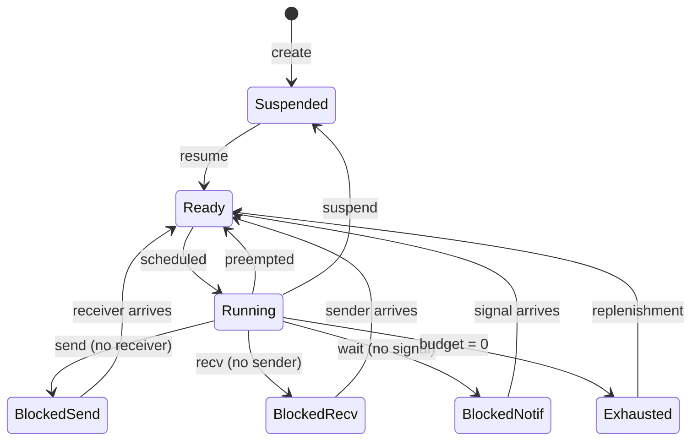

# Scheduler Design

This document describes SaltyOS's multi-class scheduler and the constraints
it enforces on thread lifetime, preemption, and priority donation.

## Overview

The scheduler is **class-based**: every runnable thread belongs to one of
four classes, and strict class ordering governs preemption. Each per-CPU
ready queue is really four queues keyed by class; `pick_next` scans them
in class order.

| Class | `SCHED_CLASS_*` id | Queue shape | Key | Used for |
|-------|---------------------|-------------|-----|----------|
| Deadline | 0 | per-CPU linked list, sorted by deadline | absolute deadline | Hard real-time, budgeted workloads (seL4-MCS-inspired) |
| RT FIFO | 1 | per-CPU linked list, sorted by priority | static priority (0..=99) | Soft real-time / driver threads |
| Fair | 2 | per-CPU EEVDF-style treap | `(vruntime, lag)` weighted by `FAIR_DEFAULT_WEIGHT = 1024` | General-purpose threads |
| Idle | 3 | one per CPU (pinned idle TCB) | — | Runs when nothing else is runnable |

The Fair treap reuses intrusive TCB pointers (`sleep_next` / `futex_next`
/ `vspace_wait_next`) as `left` / `right` / `parent`; any transition
between queue types must reset these via `fair_tree_reset_node` (see
`sched/scheduler.rs`).

## Source Modules

| File | Purpose |
|------|---------|
| `sched/mod.rs` | Module entry, re-exports, bootstrap TCB + idle-thread setup |
| `sched/scheduler.rs` + `sched/scheduler/` | Class-based scheduler, per-CPU ready queues, context switch, VSpace waiter drain |
| `sched/thread.rs` | TCB, SchedContext, ThreadState definitions, `tcb_lock`, sched_ref / cap_ref surfaces |
| `sched/control.rs` | Wake-plan transitions (`PipeWait` / `Futex` / `EventQueueWait` / `VSpaceWait`), task-control follow-ups |
| `sched/pip.rs` | Priority Inheritance Protocol (prevents priority inversion in IPC) |
| `sched/deadline_queue.rs` | Unified ns-precision deadline queue (intrusive treap) — fires `DeadlineKind::{Sleep, FutexTimed, IpcTimeout, TimerFire}` with `Tcb` / `Timer` membership pins |

## TCB Reference-Count Invariants

Each TCB carries two independent reference counts:

- `KernelObject.ref_count` (**cap_ref**) — capabilities pointing at the
  TCB. Incremented on capability copy, decremented on capability delete.
  Reaching 0 means "no userspace / CNode path can ever reach this TCB
  again"; destruction may then fire.
- `Tcb.sched_ref` — scheduler-owned pointer slots that hold a raw
  `*mut Tcb`. Incremented when a pointer enters a scheduler slot
  (`current[]`, ready-queue insertion, `pending_enqueue` slot,
  VSpace-waiter-list membership); decremented after the slot is cleared
  (typically deferred to `flush_deferred_sched_release` outside the
  scheduler lock to respect lock ordering).

Destruction rule (`cap/refcount.rs::release_object`):

1. `fetch_sub(cap_ref)` returning `1` ⇒ last capability gone.
2. If the object is a TCB, re-check `sched_ref`:
   - `sched_ref > 0` ⇒ set `pending_destroy`, defer; the scheduler
     destroys when its last slot releases (`sched_ref_release_may_destroy`).
   - `sched_ref == 0` ⇒ destroy immediately.

**Invariant**: every path that parks a `*mut Tcb` in a location the
scheduler owns MUST bump `sched_ref` BEFORE publishing the pointer, and
MUST release `sched_ref` AFTER clearing the pointer. Ready-queue
transfers (`enqueue_unlocked`) follow "inc destination before dec source"
so the count is never transiently zero across the move.

**VSpace waiter membership is a scheduler-owned slot.** A thread blocked
on `VSpaceTracking.waiter_head` sits on a pointer the scheduler owns (it
is drained and woken by `drain_vspace_waiters_batch_locked` /
`wake_drained_batch`). `block_current_on_vspace` therefore increments
`sched_ref` before enqueuing, and the drain path decrements it after the
pointer has been transferred into the wake batch / ready queue. This is
what prevents a concurrent last-`cap_ref` drop from destroying the TCB
out from under the drain.

## Deferred sched_ref releases: `DeferredReleaseList`

The `CAP_LOCK` lock ordering (outermost) forbids taking `CAP_LOCK` while a
per-CPU scheduler lock is held. But many `sched_ref` decrements happen
*inside* a scheduler lock (stale ready-queue skips, `pending_enqueue`
displacements, ready-queue exits) and a decrement that reaches zero with
`pending_destroy` set must fire `destroy_object_deferred` under
`CAP_LOCK`.

The reconciliation: each top-level scheduler API that acquires a per-CPU
lock also creates a **stack-local** `DeferredReleaseList`, threads it
through inner helpers (`schedule_unlocked`, `set_pending_enqueue`,
`track_pending_switch_out`, `process_pending_enqueue`,
`enqueue_unlocked`, `publish_outgoing_before_current_flip_locked`),
and drains it via `Scheduler::drain_release` *after* releasing the
lock. Each drained entry calls `sched_ref_release_may_destroy`, which
acquires `CAP_LOCK` cleanly at the outermost layer.

The list uses an intrusive `Tcb.deferred_release_next` link, so it has
**no fixed capacity** and no separate per-CPU storage — all state lives
on the top-level caller's kernel stack for the duration of one API
call. There is no "deferred release overflow" failure mode; under any
workload the list is bounded by the number of TCB transitions the
scheduler actually performs within that one critical section.
Context-switch paths (`context_switch_local`, `reschedule`,
`yield_current`, `block_current_*`) drain the list BEFORE the register
swap so destroy cannot be arbitrarily delayed by the switched-away
thread never being re-scheduled.

## Scheduling Model

### Scheduling Context

A **Scheduling Context (SC)** is a kernel object that provides scheduling parameters:

```rust
/// Scheduling Context - provides CPU time to threads
pub struct SchedContext {
    /// Unique identifier
    id: SchedContextId,
    
    /// Time budget per period (microseconds)
    budget: u64,
    
    /// Remaining budget in current period
    remaining: u64,
    
    /// Period length (microseconds) - 0 for sporadic
    period: u64,
    
    /// Absolute deadline for current period
    deadline: u64,
    
    /// Thread bound to this SC (raw pointer; null if unbound)
    bound_tcb: *mut Tcb,
    
    /// Priority (for tiebreaking)
    priority: u8,
    
    /// State
    state: ScState,
}

#[derive(Clone, Copy, PartialEq)]
pub enum ScState {
    /// Currently running
    Running,
    /// Ready but not running
    Ready,
    /// Budget exhausted, waiting for replenishment
    Exhausted,
    /// Not in scheduler (inactive)
    Inactive,
}
```

### Thread-SC Binding

Threads consume CPU time through bound Scheduling Contexts:

```
┌─────────────────┐     ┌─────────────────────┐
│     Thread      │────►│  Scheduling Context │
│                 │     │                     │
│  - Entry point  │     │  - Budget: 5ms      │
│  - Stack        │     │  - Period: 20ms     │
│  - CSpace       │     │  - Deadline: abs    │
│  - VSpace       │     │  - Priority: 10     │
└─────────────────┘     └─────────────────────┘
```

Benefits of separation:
- Threads can share SCs (time partitioning)
- SCs can be migrated between threads
- Clear accounting of CPU time

## EDF Algorithm

### Basic EDF

Earliest Deadline First:
- Always run the thread with the earliest deadline
- Optimal for uniprocessor systems (can schedule any feasible workload)

```rust
/// EDF scheduler (per-CPU ready queues, no heap allocation).
/// Implemented in sched/scheduler.rs.
pub struct Scheduler {
    /// Per-CPU ready queue head, sorted by deadline within each class.
    /// Intrusive linked list threaded through TCB fields
    /// (no BinaryHeap/Vec -- raw pointers in #![no_std] kernel).
    ready_head: *mut Tcb,

    /// Currently running thread per CPU
    current: [*mut Tcb; MAX_CPUS],

    /// Per-CPU idle thread
    idle: [*mut Tcb; MAX_CPUS],
}

impl Scheduler {
    /// Get next thread to run on the given CPU.
    /// Scans this CPU's per-class ready queues in class order to find
    /// the earliest-deadline thread eligible to run on this CPU.
    /// Returns a raw pointer to the TCB (null if no runnable thread).
    pub fn pick_next(&mut self, cpu: usize) -> *mut Tcb {
        // Scan per-CPU class queues for first TCB eligible for this CPU
        let tcb = self.dequeue_for_cpu_unlocked(cpu);
        if tcb.is_null() {
            return core::ptr::null_mut();
        }

        self.current[cpu] = tcb;
        // SAFETY: tcb is a valid pointer from the ready queue
        unsafe { (*tcb).state = ThreadState::Running; }

        tcb
    }
}
```

### Deadline Ordering

```rust
/// Comparison for deadline ordering
impl Ord for SchedContextRef {
    fn cmp(&self, other: &Self) -> Ordering {
        // Earlier deadline = higher priority
        let deadline_cmp = self.deadline.cmp(&other.deadline).reverse();
        
        if deadline_cmp == Ordering::Equal {
            // Tiebreak by priority (higher = first)
            self.priority.cmp(&other.priority).reverse()
        } else {
            deadline_cmp
        }
    }
}
```

## Budget Management

### Budget Consumption

```rust
/// Timer tick handler - called every TICK_US microseconds
pub fn timer_tick() {
    let cpu = current_cpu();
    let now = timer::now_us();
    
    if let Some(sc) = &mut current[cpu] {
        // Deduct time from budget
        let elapsed = now - sc.last_tick;
        sc.last_tick = now;
        
        if elapsed >= sc.remaining {
            // Budget exhausted
            handle_budget_exhausted(cpu, sc);
        } else {
            sc.remaining -= elapsed;
            
            // Check preemption
            if should_preempt(cpu, sc) {
                schedule(cpu);
            }
        }
    }
}
```

### Budget Exhaustion

```rust
fn handle_budget_exhausted(cpu: usize, sc: *mut SchedContext) {
    // SAFETY: sc is the current CPU's running SC, guaranteed valid
    unsafe {
        (*sc).remaining = 0;
        (*sc).state = ScState::Exhausted;

        // Calculate replenishment time
        if (*sc).period > 0 {
            // Periodic: replenish at next period boundary
            (*sc).replenish_time = (*sc).deadline;
            (*sc).deadline += (*sc).period;
        } else {
            // Sporadic: replenish after cooldown
            (*sc).replenish_time = timer::now_us() + SPORADIC_COOLDOWN;
        }
    }

    // Add to replenishment queue (sorted by replenish_time)
    replenish_queue.insert(sc);

    // Remove from current
    current[cpu] = core::ptr::null_mut();

    // Reschedule
    schedule(cpu);
}
```

### Budget Replenishment

```rust
/// Check for SCs ready for replenishment.
/// The replenish queue is sorted by replenish_time (earliest first).
pub fn check_replenishments() {
    let now = timer::now_us();

    // Pop all SCs whose replenish_time has passed
    while let Some(sc) = replenish_queue.peek_earliest() {
        // SAFETY: sc is a valid pointer from the replenish queue
        if unsafe { (*sc).replenish_time } > now {
            break;  // Remaining entries are in the future
        }

        let sc = replenish_queue.pop_earliest();
        // Restore budget and re-enqueue
        unsafe {
            (*sc).remaining = (*sc).budget;
            (*sc).state = ScState::Ready;
        }

        // Re-enqueue onto the appropriate per-CPU ready queue
        enqueue_unlocked(sc);
    }
}
```

## Preemption

### When to Preempt

```rust
fn should_preempt(cpu: usize, current: &SchedContext) -> bool {
    // Check if there's a higher priority (earlier deadline) SC ready
    if let Some(next) = ready_queue.peek() {
        return next.deadline < current.deadline;
    }
    false
}
```

### Context Switch

```rust
/// Perform a context switch.
/// Called with SCHED_IPC_LOCK held; releases it before the actual
/// switch and reacquires on resume (see lock ordering in mm/mod.rs).
pub fn schedule(cpu: usize) {
    let old = current[cpu];
    let new_tcb = pick_next(cpu);  // sets current[cpu]

    // If same thread, no switch needed
    if !old.is_null() && !new_tcb.is_null() {
        // SAFETY: both pointers were just validated as non-null
        unsafe {
            if (*old).bound_tcb == new_tcb {
                current[cpu] = old;
                return;
            }
        }
    }

    // Return old thread to its per-CPU ready queue if still runnable
    if !old.is_null() {
        unsafe {
            if (*old).state == ScState::Running && (*old).remaining > 0 {
                (*old).state = ScState::Ready;
                enqueue_unlocked(old);
            }
        }
    }

    // Switch to new thread
    if !new_tcb.is_null() {
        let old_tcb = if !old.is_null() {
            unsafe { (*old).bound_tcb }
        } else {
            core::ptr::null_mut()
        };

        if !old_tcb.is_null() {
            // SAFETY: both TCB pointers are valid kernel objects
            unsafe {
                arch::switch_context(&mut (*old_tcb).context, &(*new_tcb).context);
            }
        } else {
            unsafe { arch::switch_to(&(*new_tcb).context); }
        }
    } else {
        // No runnable thread - idle
        arch::idle();
    }
}
```

## Thread States



## TCB Lifetime & `sched_ref`

Each `Tcb` carries a `sched_ref: AtomicU32` counter tracking how many
scheduler-owned raw pointer slots currently reference it:

- `current[cpu]` on each CPU running the thread
- entry in a per-CPU ready queue (Fair tree / RT FIFO / Deadline)
- per-CPU `pending_enqueue` deferred-wake slot

When the capability system's refcount drops to zero, `release_object`
consults `sched_ref`: if non-zero, it sets `pending_destroy` and defers
`cleanup()` until the scheduler releases the last slot. Transitions
between slots preserve the invariant that `sched_ref > 0` whenever *any*
scheduler pointer exists — increments on the destination slot happen
**before** the source slot is released — so a concurrent
`release_object` on another CPU never observes a transient zero during
a transfer (dequeue → `set_current`, pending-slot swap, steal, etc.).

Release points whose dec may hit zero with `pending_destroy` set
(ready-queue exit from `remove_from_ready_queue_unlocked`, pending-slot
drop from `cancel_pending_enqueue` / `yield_current` CAS,
`prepare_switch_target_full` idle fallback) stage the decrement through
`queue_deferred_sched_release` while the scheduler lock is held; the
actual dec and any `destroy_object_deferred` call run in
`flush_deferred_sched_release()` after the lock is released, keeping
the `CAP_LOCK → scheduler.lock_state` ordering intact.

## Priority Inversion Handling

### Problem

Priority inversion occurs when a high-priority thread waits for a low-priority thread:

```
Thread A (high priority) wants endpoint that
Thread B (low priority) is receiving on, but
Thread C (medium priority) is running, starving B
```

### Solution: Priority Inheritance

When Thread A blocks on Thread B:
1. B temporarily inherits A's priority (deadline)
2. B runs ahead of C
3. B completes, A resumes
4. B's priority reverts

The implementation in `sched/pip.rs` handles priority inheritance during
`MP_CALL` chains. When a caller with an earlier deadline blocks waiting
for a server reply, the server temporarily inherits the caller's
deadline:

```rust
/// Called when MP_CALL parks waiting for a reply (simplified from
/// `sched/pip.rs`).
fn pip_donate_call(caller: *mut Tcb, server: *mut Tcb) {
    // SAFETY: both pointers are sched_ref-pinned for the duration of
    // the call — the caller pin lives on the waiter state, the server
    // pin lives on whichever waiter queue surfaced the server.
    unsafe {
        if !server.is_null() {
            pip::maybe_inherit_priority(caller, server);
            // Re-sort server in its ready queue if effective deadline
            // moved earlier.
        }
    }
    schedule(current_cpu());
}

// In sched/pip.rs:
// - Inheritance is transitive across MP_CALL chains.
// - Reverted automatically when the caller leaves the reply wait path.
```

### Priority Inheritance Protocol (sched/pip.rs)

The priority inheritance logic is implemented in `sched/pip.rs`. When a
high-priority caller blocks on `MP_CALL` and the server has a later
effective deadline, the kernel temporarily elevates the server's
deadline to match the caller's. This prevents unbounded priority
inversion where a medium-priority thread could starve the low-priority
server and transitively block the high-priority caller.

Key behaviors:
- Inheritance is transitive: if thread A waits on B which waits on C, C inherits A's deadline
- Inheritance is automatically reverted when the IPC completes (reply or ReplyRecv)
- The ready queue is re-sorted after inheritance changes

### Deadline Queue (sched/deadline_queue.rs)

`sched/deadline_queue.rs` is the single ns-precision deadline source for
the kernel. It replaces the older split between a per-tick sleep list and
a hierarchical timer wheel — both jiffy-resolution structures jittered
above the precision EDF and POSIX `clock_nanosleep` need.

The queue is an **intrusive treap** keyed on `(deadline_ns, insert_seq)`:
the same data structure already used by the EEVDF fair class for
`vruntime` ordering, so the implementation cost was zero. Each entry is a
`DeadlineNode` embedded inside the owning object — TCBs carry one for
`Sleep` / `FutexTimed` / `IpcTimeout` waits, `Timer` objects carry one
for `TimerFire` arms — so insert / cancel / pop never allocate.

`DeadlineKind` variants:

- **Sleep** — armed by `arm_thread_sleep` from `clock_nanosleep`-style
  paths. Wake plan: `WakeTransition::Futex` against the sleeping thread
  (the thread parked itself with `BlockedReason::TimerBlocked`).
- **FutexTimed** — armed alongside a futex bucket wait. Wake fires
  `KERNITE_ERR_TIMED_OUT` into the thread's `futex_wakeup_result` so the
  syscall return path distinguishes timeout from a real wake.
- **IpcTimeout** — armed alongside a `MessagePipe` / `DataPipe` waiter
  push. Wake plan is `WakeTransition::PipeWait`; the **caller is
  responsible for unlinking** the thread from the pipe waiter queue
  before issuing the wake plan, so the syscall layer's
  `block_*_with_timeout` helpers call `MessagePipeCore::detach_waiter` /
  `DataPipeCore::detach_waiter` after a timeout return.
- **TimerFire** — armed by `arm_timer` when userland calls
  `KERNITE_INV_TIMER_SET`. Fire dispatch enqueues an `EVENT_TYPE_TIMER`
  record into the bound `EventQueue`, optionally re-arms the timer for a
  periodic schedule with missed-period coalescing, and clears the
  transient `STATE_SIGNALED` bit on the timer object.

Membership pinning: `arm_thread_*` bumps the TCB's `sched_ref`; `arm_timer`
bumps the `Timer.KernelObject.ref_count`. Both pins are released either
by `cancel_thread` / `cancel_timer` (no-fire branch) or by the
`check_wakeups` dispatch (fire branch). `NEXT_DEADLINE_NS` is an
`AtomicU64` hint set at every insert so the timer ISR can `peek_expired`
without taking the queue lock — only when the hint says "due now" does
the dispatch acquire the lock and walk.

A thread waiting on a `MessagePipe` with a finite `timeout_ns` is
simultaneously on (1) the pipe's per-side waiter queue and (2) the
deadline queue under `IpcTimeout`. Whichever fires first detaches the
other: producer pop → `wake_thread` in the pipe path, or deadline
dispatch → `cancel_thread` + `detach_waiter` in the syscall layer's
post-reschedule cleanup.

## Sporadic Servers

For sporadic (aperiodic) tasks:

```rust
/// Create a sporadic scheduling context
pub fn create_sporadic_sc(budget: u64, cooldown: u64) -> SchedContext {
    SchedContext {
        budget,
        remaining: budget,
        period: 0,  // 0 = sporadic
        deadline: u64::MAX,  // No fixed deadline
        sporadic_cooldown: cooldown,
        ..Default::default()
    }
}
```

Sporadic servers:
- Get budget immediately when scheduled
- After exhaustion, must wait for cooldown before replenishment
- Good for best-effort tasks

## SMP Considerations

### Per-CPU Ready Queues with IPI-Driven Reschedule

The scheduler maintains **per-CPU ready queues**, one set of four class
queues per CPU. CPU affinity is stored in each TCB (as a `u8` CPU ID,
`0xFF` = any CPU). When a thread becomes runnable on a remote CPU,
`dequeue_for_cpu_unlocked(cpu)` selects from that CPU's own class queues
and an IPI triggers reschedule on the target CPU:

```rust
/// In Tcb:
pub cpu_affinity: u8,    // Preferred CPU (0xFF = any CPU)
```

### Load Balancing

```rust
fn balance_load() {
    // Find most loaded and least loaded CPUs
    let max_cpu = find_max_loaded_cpu();
    let min_cpu = find_min_loaded_cpu();
    
    // Migrate SCs if imbalance is significant
    if load[max_cpu] > load[min_cpu] * BALANCE_THRESHOLD {
        migrate_sc(max_cpu, min_cpu);
    }
}
```

### IPI for Cross-CPU Wakeup

```rust
/// Wake a thread on another CPU
fn cross_cpu_wakeup(tcb: TcbRef, target_cpu: usize) {
    // Enqueue onto the target CPU's ready queue
    enqueue_unlocked(tcb);

    // Send IPI to trigger reschedule on target CPU
    // x86_64: Local APIC ICR write (vector 0xFD)
    // aarch64: GICv3 SGI (Software Generated Interrupt) via ICC_SGI1R_EL1
    arch::send_ipi(target_cpu, IPI_RESCHEDULE);
}
```

### Multi-Architecture SMP

| Aspect | x86_64 | aarch64 |
|--------|--------|---------|
| CPU discovery | ACPI MADT table | Device tree / ACPI |
| AP bringup | AP trampoline (real→long mode) | PSCI CPU_ON (HVC call) + mailbox handoff |
| IPI mechanism | Local APIC ICR | GICv3 SGI (ICC_SGI1R_EL1) |
| Timer | APIC timer (PIT-calibrated) | Generic timer CNTP (PPI 30, 10ms tick) |
| Per-CPU data | `%gs:offset` via MSR | TPIDR_EL1 system register |

## Configuration

### Kernel Options

```rust
/// Scheduler configuration
pub struct SchedConfig {
    /// Timer tick interval (microseconds)
    pub tick_us: u64,
    
    /// Minimum SC budget
    pub min_budget: u64,
    
    /// Maximum SC period
    pub max_period: u64,
    
    /// Default priority
    pub default_priority: u8,
    
    /// Enable priority inheritance
    pub priority_inheritance: bool,
    
    /// Load balancing interval (ticks)
    pub balance_interval: u64,
}

pub const DEFAULT_SCHED_CONFIG: SchedConfig = SchedConfig {
    tick_us: 1000,          // 1ms tick
    min_budget: 100,        // 100us minimum
    max_period: 1_000_000,  // 1s maximum
    default_priority: 128,
    priority_inheritance: true,
    balance_interval: 100,  // 100ms
};
```

## System Calls

### SC Operations

SchedContext has five invoke labels (0x30-0x34):

| Label | Name | Description |
|-------|------|-------------|
| 0x30 | SC_CONFIGURE | Set budget, period, and priority |
| 0x31 | SC_BIND | Bind SC to a TCB |
| 0x32 | SC_UNBIND | Unbind SC from its TCB |
| 0x33 | SC_YIELD_TO | Yield current timeslice to target SC |
| 0x34 | SC_CONSUMED | Query consumed CPU time |

```rust
/// Scheduling context invocation dispatch
pub fn invoke_sched_context(
    tcb: &mut Tcb,
    cap: &Capability,
    label: u64,
    msg: &IpcMessage,
) -> InvokeResult {
    // SAFETY: cap.object points to a SchedContext allocated via untyped retype
    let sc = unsafe { &mut *(cap.object as *mut SchedContext) };

    match label {
        // Configure SC parameters
        SC_CONFIGURE => {
            let budget = msg.get_word(0);
            let period = msg.get_word(1);
            let priority = msg.get_word(2) as u8;
            sc_configure(sc, budget, period, priority)
        }

        // Bind SC to a TCB
        SC_BIND => {
            let tcb_cap = msg.get_cap(0);
            sc_bind(sc, tcb_cap)
        }

        // Unbind SC from its current TCB
        SC_UNBIND => {
            sc_unbind(sc)
        }

        // Yield current timeslice to the target SC
        SC_YIELD_TO => {
            let target_sc_cap = msg.get_cap(0);
            sc_yield_to(sc, target_sc_cap)
        }

        // Query consumed CPU time
        SC_CONSUMED => {
            sc_consumed(sc)
        }

        _ => InvokeResult::Error(SyscallError::InvalidOperation),
    }
}
```

### Yield

```rust
/// Yield CPU time (syscall 8)
pub fn sys_yield() {
    let cpu = current_cpu();
    let sc = current[cpu];

    if !sc.is_null() {
        // SAFETY: sc is the current CPU's running SC
        unsafe {
            (*sc).state = ScState::Ready;
            enqueue_unlocked(sc);
        }
        current[cpu] = core::ptr::null_mut();
    }

    schedule(cpu);
}
```

## Idle Thread

Each CPU has an idle thread:

```rust
fn idle_thread() -> ! {
    let cpu = current_cpu();
    loop {
        // Enable interrupts and halt until next interrupt
        arch::enable_interrupts();
        arch::halt();

        // Woken by interrupt (timer tick, IPI, etc.) - check for work
        arch::disable_interrupts();

        if !ready_head.is_null() {
            schedule(cpu);
        }
    }
}
```

## Timing Analysis

### WCET Guarantees

For hard real-time, scheduler operations must have bounded WCET:

| Operation | WCET (cycles) |
|-----------|---------------|
| `pick_next()` | O(1)* |
| `insert()` | O(log n) |
| `timer_tick()` | O(1) |
| `schedule()` | O(log n) |

*With optimized priority queue

### Schedulability Analysis

EDF schedulability test:
```
U = Σ(Ci/Ti) ≤ 1
```

Where:
- Ci = worst-case execution time of task i
- Ti = period of task i
- U = total utilization

If U ≤ 1, the task set is schedulable by EDF.

## Example Configuration

### Periodic Task

```rust
// Create SC with 5ms budget every 20ms
let sc = sys_retype(untyped, CapType::SchedContext, 0)?;
sys_invoke(sc, SC_CONFIGURE, &[
    5_000,   // budget: 5ms
    20_000,  // period: 20ms
    10,      // priority
])?;

// Bind to thread
sys_invoke(sc, SC_BIND, &[thread_cap])?;

// Thread will run for up to 5ms every 20ms
// Deadline is period end
```

### Best-Effort Task

```rust
// Create sporadic SC
let sc = sys_retype(untyped, CapType::SchedContext, 0)?;
sys_invoke(sc, SC_CONFIGURE, &[
    10_000,  // budget: 10ms
    0,       // period: 0 (sporadic)
    255,     // priority: lowest
])?;

// This task runs when no deadline-constrained tasks need CPU
```
